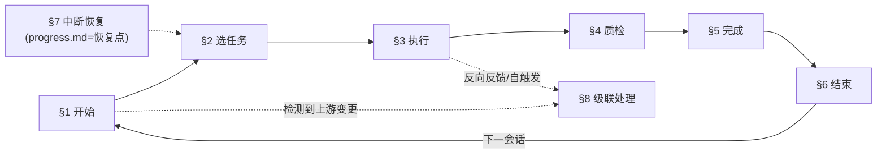

# devpace 开发工作流规则

> **职责**：定义开发 devpace 本身时 Claude 必须遵循的会话生命周期规则。覆盖会话启动、任务执行、质量检查、跨会话连续性和文档级联。

## §0 速查卡片

### 会话生命周期



### 级联系统速查

**权威链**：`vision.md(WHY) → design.md(HOW) → reqs.md(WHAT) → roadmap.md(WHEN=终点)` — 只能向下级联，不可反向。多文件变更按此顺序依次处理。

| 场景 | 触发源 | 检查范围 | 动作 |
|------|--------|---------|------|
| A: vision 变 | OBJ 增删改 | design + reqs + progress | 更新下游或标记 REVIEW |
| B: design 变 | UX/状态机/流程 | reqs + 已实现 Skill + progress | 更新 reqs + 新增任务 |
| C: reqs 变 | 场景/验收/功能 | progress + 已实现 Skill | 更新任务 + 调整 roadmap |
| D: 自触发/反向反馈 | Claude 改上游 | 同 A/B/C 对应维度 | 直接评估 + 备注受影响任务 |
| E: roadmap 变 | 里程碑调整 | progress 任务 | 更新任务（终点，不再级联） |

通用清单：识别范围 → 沿链追踪 → 逐文档更新 → 记入变更记录 → 备注进行中任务
陈旧标记：`<!-- REVIEW: [source] changed [date], may affect this section -->`

### 各章节速查

| 阶段 | 操作 | 流程 |
|------|------|------|
| §1 开始 | 读 progress.md | 快照+当前任务 → 上游变更检测 → 1 句话报告 → 等指令 |
| §2 选任务 | 最高优先级待做 | 强制追溯验证(关联条目非空) → 加载关联文档 → 开始实现 |
| §3 执行 | 按 design.md | 实现 → 上游问题? → 反向反馈(§3.3) → 自触发级联(§8.5) |
| §4 质检 | 自动+手动 | `bash dev-scripts/validate-all.sh` → 修复失败 → 手动验收 |
| §5 完成 | 更新 progress | 里程碑全完成? → 回顾+更新 roadmap → 新增任务? → 填关联条目 |
| §6 结束 | 更新 progress | 快照+任务状态+会话记录+变更记录 → 3 行摘要 → git commit |
| §7 恢复 | progress.md | 唯一恢复点 → 快照 → 当前任务(继续/已完成/涉及) → 近期会话 |

## §1 会话开始协议

1. 读 `docs/planning/progress.md`：先看"快照"定位阶段，再看"当前任务"表识别"进行中"和"待做"任务
2. 上游变更检测：取 progress.md "变更记录"最后一条的日期作为基准，执行：
   ```
   git log --since="<基准日期>" --name-only --pretty=format:"%H %s" -- docs/design/vision.md docs/design/design.md docs/planning/requirements.md
   ```
   - 有输出 → 逐文件提示："注意：[文件] 在上次会话后有 N 次提交（[commit 摘要]），建议先评估影响"
   - 无输出 → 正常推进
   - 多文件同时变更 → 按权威链顺序处理（先 vision.md → 再 design.md → 最后 requirements.md），见 §8.1
3. 用 1 句话报告：当前进度 + 下一步建议
4. 等待用户指令

## §2 任务选取与准备

1. 从 progress.md "当前任务"表选取最高优先级的"待做"任务
2. **强制追溯验证**：检查"关联条目"列是否非空。若为空，先根据任务内容和 roadmap.md 里程碑定义补填对应的 OBJ/S/F 编号，再继续
3. 按"关联条目"列的编号加载对应文档章节：OBJ-X → vision.md、S/F-X → requirements.md、design.md §N → design.md
4. 加载必要参考文档（仅加载本次任务所需的章节，不全量读取）
5. 更新 progress.md 中任务状态为"🔄 进行中"

**参考加载表**（按任务类型）：

| 任务类型 | 必读 | 按需 |
|---------|------|------|
| Skill 开发 | design.md 对应 Phase 章节、requirements.md 对应 S/F 条目、相关 _schema/ | theory.md 对应章节 |
| Rules 更新 | design.md 对应章节、devpace-rules.md 已有规则 | requirements.md NF 条目 |
| Schema 修改 | design.md §3/§5 概念模型、现有 schema 文件 | 相关 Skill 的 SKILL.md |
| 模板更新 | 对应 schema、design.md 相关章节 | 现有模板文件 |

## §3 开发执行

1. 按 design.md 规格和 requirements.md 验收标准实现
2. 遵循开发守则（CLAUDE.md "开发守则"章节）
3. **反向反馈**：实现过程中若发现上游文档（vision.md/design.md/requirements.md）有歧义、缺失或不可行之处：
   - **触发条件**（满足任一）：design.md 的设计规格不可行或有矛盾、requirements.md 的验收标准存在歧义或无法满足、vision.md 的 OBJ/MoS 定义与实际不匹配
   - **处理步骤**：
     1. 暂停当前实现，向用户描述问题和建议修正方案
     2. 获得用户确认后，修改上游文档并 git commit
     3. 执行 §8.5（自触发级联），评估修正对其他任务的影响
     4. 在 progress.md "变更记录"添加条目，原因列标注"反向反馈：实现 [任务名] 时发现 [问题简述]"
     5. 继续当前任务（基于修正后的上游文档）
   - **原则**：反向反馈不是"反向级联"，而是"修正上游 → 正向级联"的闭环。下游实现永远不能直接改变上游设计意图，只能报告问题、等待确认、修正上游后再正向级联
4. 每完成一个有意义的工作单元，git commit（遵循 common.md 提交规范）
5. **自触发级联**：若当前任务涉及修改上游文档（vision.md / design.md / requirements.md），完成修改并 commit 后，立即执行 §8.5（自触发级联），评估对其他任务的影响，再继续后续工作

## §4 完成质量检查

任务完成前必须通过以下检查：

### 自动检查（必须先通过）

运行 `bash dev-scripts/validate-all.sh`（或 `pytest tests/static/ -v`），修复所有失败后再进行后续手动检查。

自动检查覆盖项（无需手动重复）：
- 分层完整性（`test_layer_separation.py`）
- plugin.json 同步（`test_plugin_json_sync.py`）
- Schema 结构合规（`test_schema_compliance.py`）
- §0 速查卡片（`test_markdown_structure.py`）
- 模板占位符（`test_template_placeholders.py`）
- Frontmatter 合规（`test_frontmatter.py`）
- Skill 分拆启发（`test_markdown_structure.py`）
- 交叉引用完整性（`test_cross_references.py`）
- 命名规范（`test_naming_conventions.py`）
- 状态机一致性（`test_state_machine.py`）

### plugin-dev 验证（推荐，自动检查通过后执行）

安装 Anthropic 官方 plugin-dev Plugin 后可使用以下验证（安装方式见 CONTRIBUTING.md）：

- [ ] **Plugin 结构验证**：调用 plugin-validator Agent（10 步综合验证：Manifest + 目录 + Commands + Agents + Skills + Hooks + MCP + 安全检查 → PASS/FAIL 报告）
- [ ] **Skill 质量审查**（Skill 开发/修改时）：调用 skill-reviewer Agent（description 质量 + 内容评估 + 渐进披露 + 改进建议 → Rating 报告）
- [ ] **基础验证**：`/plugin validate`（内置命令，验证 plugin.json 语法和基本结构）

### 手动检查（自动检查通过后执行）

- [ ] Schema 语义合规：产出文件符合 `knowledge/_schema/` 的语义要求（自动检查仅验证结构）
- [ ] 验收验证（按任务类型）：
  - Skill 开发：`claude --plugin-dir ./` 加载无报错 + 手动触发目标 Skill 验证输出格式
  - Rules 更新：选取 1 个相关场景，口述 Claude 按新规则应如何行为，确认无矛盾
  - Schema 修改：现有模板文件仍符合修改后的 Schema
  - 模板更新：用 Schema 字段逐一对照模板占位符完整性
  - 通用：对照 requirements.md 相关 S/F 条目的验收标准逐条检查
- [ ] 特性文档同步：修改 Skill 子命令/行为时，检查 `docs/features/` 对应文档是否需要更新

### Skill 内容质量验证方法（推荐）

开发或修改 Skill 内容时，推荐使用 RED-GREEN-REFACTOR 方法验证规则的准确性和完整性（非强制流程，作为质量提升指引）：

1. **基线观测（RED）**：禁用目标 Skill → 观察 Claude 的默认行为 → 记录与期望行为的具体偏差
   - 记录格式："无 Skill 时 Claude 做了 [X]，期望行为是 [Y]"
   - 至少用 2 个不同复杂度的场景观测
2. **最小规则（GREEN）**：针对观测到的偏差写最小修正规则 → 启用 Skill → 确认偏差被修正
   - 原则：一条规则修正一个偏差，不做预防性规则
3. **漏洞补充（REFACTOR）**：用不同复杂度场景（S/M/L）压力测试 → 发现新偏差 → 补充合理化预防表
   - 重点关注：Claude 在长会话或复杂任务中是否"合理化"跳过规则

**适用场景**：新 Skill 开发、Skill 规则重大修改、发现 Skill 行为偏差时。

## §5 任务完成与更新

1. 更新 progress.md "当前任务"表：状态 → "✅ 完成"
2. 检查里程碑：通过 progress.md 当前任务表的"里程碑"列筛选同一里程碑下的所有任务，检查是否全部完成。若全部完成：
   - 更新 roadmap.md 里程碑状态 → "✅ 完成"
   - **里程碑回顾**：在 progress.md "变更记录"添加回顾条目，格式：
     `| 日期 | 里程碑回顾 [M-X]：达成 [N] 项任务，关键决策 [列举]，经验教训 [简述] | 里程碑完成 |`
   - 若发现流程规则（.claude/rules/）有需要调整之处，新增一条"流程改进"任务到 progress.md
3. 若实现过程中修改了设计文档，在 progress.md "变更记录"添加条目；若为架构级决策，同时添加到"关键决策"表
4. 检查是否有新任务需要添加到 progress.md "当前任务"表（实现中发现的额外工作）
5. **新增任务必须填写"关联条目"列**（格式：`OBJ-X, SN, FN.N`），不可留空
6. 更新 progress.md "快照" section 的任务进度

## §6 会话结束协议

1. 更新 progress.md 所有进行中任务的状态
2. 若任务未完成：在"说明"列记录结构化中断点：
   - 格式：`继续：[下一步] | 已完成：[已做的] | 涉及：[文件列表]`
   - 示例：`继续：实现 paused→developing 转换 | 已完成：paused→created 转换 | 涉及：knowledge/_schema/cr-format.md, skills/pace-dev/SKILL.md`
   - 简单任务可省略"涉及"段，但"继续"和"已完成"段必须保留
3. 更新 progress.md "快照" section（反映最新的阶段、进度、下一步）
4. 在 progress.md "近期会话" section 追加本次会话记录（滚动保留 5 条，超过时删除最旧的）
5. 在 progress.md "变更记录"追加会话结束标记行：`| <今日日期> | 会话结束 | -- |`，作为下次 §1 变更检测的时间基准
6. 输出 3 行摘要：完成了什么 / 未完成什么 / 下次建议从哪开始
7. git commit（若有未提交变更）

## §7 跨会话连续性

- progress.md = 唯一恢复点，不需要额外状态文件
- 恢复顺序：
  1. 快照（定位当前阶段和里程碑）
  2. 当前任务表（定位"进行中"任务的中断点）
  3. 近期会话（理解最近几次会话的上下文演进）
- "进行中"任务的"说明"列 = 结构化中断点描述
- 恢复步骤：
  1. 读取"继续"段确定下一步操作
  2. 若存在"涉及"段，先读取列出的文件确认当前状态（文件可能被其他会话或用户修改）
  3. 读取"已完成"段避免重复工作
- 若"说明"列为空但状态为"进行中"，先 `git log` 查看最近提交确认进度

## §8 文档级联处理

详细步骤见 `.claude/references/cascade-procedures.md`（按需加载，仅在 §1 检测到上游变更时使用）。§0 速查表中的级联速查已足够日常使用。
