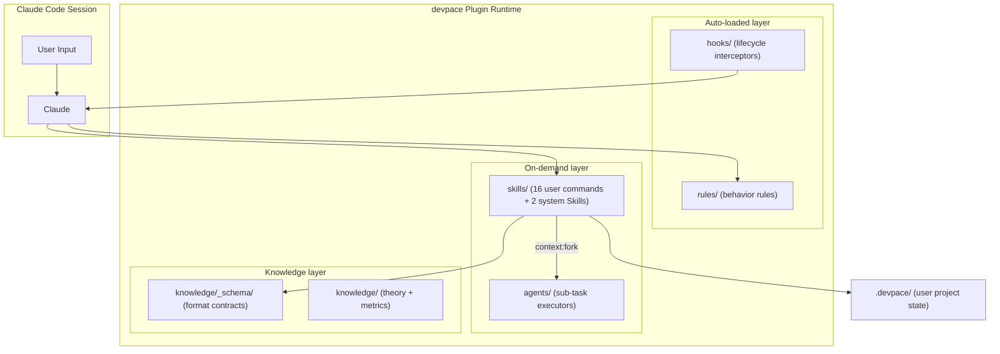

🌐 English | [中文](CONTRIBUTING_zh.md)

# Contributing Guide

Thank you for your interest in contributing to devpace! This guide covers everything you need to get started.

## Prerequisites

- [Claude Code CLI](https://claude.ai/code) installed
- Python 3.9+ (for running tests)
- Node.js (optional, for `markdownlint-cli2` Markdown linting; validation skips this step if not installed)
- Git
- (Recommended) Anthropic official plugin-dev Plugin: `/plugin install plugin-dev@claude-plugins-official`
- (Recommended) Anthropic official skill-creator Skill: `/install skill-creator` or `/install skill-creator@anthropics/skills` — used for behavioral evaluation and description optimization of devpace Skills. See `plugin-spec.md` §skill-creator for integration conventions.

## Getting Started (5-step reading path)

| Step | Goal | Read |
|------|------|------|
| Step 1 | Understand the product (5 min) | `README.md` (focus: 30-second experience + how it works) |
| Step 2 | Understand the architecture (10 min) | "Project Structure" and "Plugin runtime architecture" sections in this file |
| Step 3 | Understand design intent (10 min) | `docs/design/vision.md` + `docs/design/design.md` §0 quick reference |
| Step 4 | Understand dev conventions (5 min) | Three files in `.claude/rules/` (`common.md` / `plugin-spec.md` / `dev-workflow.md`) |
| Step 5 | Hands-on verification (2 min) | `make init && make check && claude --plugin-dir ./` |

### Quick reference for key files

| You want to know... | Look at... |
|---------------------|-----------|
| Why and what to build | `docs/design/vision.md` |
| How to build (design) | `docs/design/design.md` |
| Requirements and acceptance criteria | `docs/planning/requirements.md` |
| Current progress and tasks | `docs/planning/progress.md` |
| Runtime behavior rules | `rules/devpace-rules.md` |
| File format contracts | `knowledge/_schema/*.md` |
| BizDevOps theory reference | `knowledge/theory.md` |

## Development Environment Setup

```bash
# Clone the repository
git clone https://github.com/arch-team/devpace.git
cd devpace

# One-step setup (Python deps + git hooks + tool checks)
make init

# Quick verification
make check

# (Recommended) Install official dev tools
# Run in a Claude Code session:
# /plugin install plugin-dev@claude-plugins-official
```

## Project Structure

devpace has a strict **layered architecture**. You must understand this before making any changes:

| Layer | Directories | Purpose | Distributed? |
|-------|-------------|---------|:------------:|
| **Product layer** | `rules/`, `skills/`, `knowledge/`, `.claude-plugin/`, `hooks/`, `agents/`, `output-styles/`, `settings.json` | Plugin runtime assets delivered to users | Yes |
| **Dev layer** | `.claude/`, `docs/`, `tests/`, `dev-scripts/` | Internal dev conventions and documentation | No |

**Hard constraint**: Product layer files must not reference dev layer files (`docs/` or `.claude/`). Verification:

```bash
grep -r "docs/\|\.claude/" rules/ skills/ knowledge/
# Expected: no output
```

### Layered architecture

```mermaid
graph LR
    subgraph "Product layer (distributed with Plugin)"
        Plugin[".claude-plugin/"] --> RulesP["rules/"]
        Plugin --> SkillsP["skills/"]
        Plugin --> KnowledgeP["knowledge/"]
        Plugin --> HooksP["hooks/"]
        Plugin --> AgentsP["agents/"]
        Plugin --> OutputStylesP["output-styles/"]
        Plugin --> SettingsP["settings.json"]
    end
    subgraph "Dev layer (not distributed)"
        ClaudeDir[".claude/"] --> Docs["docs/"]
        Tests["tests/"] --> Scripts["dev-scripts/"]
    end
    ClaudeDir -.->|"may reference"| RulesP
    RulesP -.-x|"must not reference"| Docs
```



Dev layer → Product layer references are allowed; the reverse is forbidden. `test_layer_separation.py` continuously enforces this constraint.

### Plugin runtime architecture



| Component | Loading | Responsibility |
|-----------|---------|----------------|
| Rules | Auto-injected at session start | Define Claude behavior rules |
| Hooks | Auto-executed on events | Intercept tool calls, session lifecycle management |
| Skills | `/pace-*` or Claude auto-match | Execute specific operations |
| Agents | Delegated by Skills via `context: fork` | Execute sub-tasks with specific roles |
| Schema | Referenced during Skill output | Constrain state file formats |
| Knowledge | Referenced by Agents/Skills on demand | Methodology and metrics definitions |

## Running Tests

```bash
# Full validation suite (recommended before PR)
bash dev-scripts/validate-all.sh

# Markdown linting (product layer)
make lint

# Static tests only (faster)
pytest tests/static/ -v

# Single test module
pytest tests/static/test_frontmatter.py -v

# Plugin loading test (requires Claude CLI)
bash tests/integration/test_plugin_loading.sh
```

> **Shortcut**: All commands above can be run via `make`. Run `make help` to see all available tasks.

### Static test coverage

| Test | What it checks |
|------|----------------|
| `test_layer_separation` | Product layer does not reference dev layer |
| `test_plugin_json_sync` | `plugin.json` matches files on disk |
| `test_frontmatter` | Skill/Agent frontmatter uses only valid fields |
| `test_schema_compliance` | Schema files follow required structure |
| `test_template_placeholders` | Templates use `{{PLACEHOLDER}}` format |
| `test_markdown_structure` | Required §0 quick reference cards exist |
| `test_cross_references` | Internal file references resolve correctly |
| `test_naming_conventions` | Files follow kebab-case naming |
| `test_state_machine` | Task state transitions are consistent across documents |
| Markdown lint (`make lint`) | Product layer Markdown formatting (`rules/`, `skills/`, `knowledge/`) |

## Modification Guide

### Adding a Skill

1. Create `skills/<skill-name>/SKILL.md` with valid frontmatter:

```yaml
---
description: When to trigger this Skill (be specific — Claude uses this to decide auto-invocation)
allowed-tools: Read, Write, Glob, Grep
---
```

2. If the Skill body exceeds ~50 lines of procedural rules, split into:
   - `SKILL.md` — what to do (input/output/high-level steps)
   - `<name>-procedures.md` — how to do it (detailed rules)

3. Update `.claude-plugin/plugin.json` — run `pytest tests/static/test_plugin_json_sync.py -v` to verify sync.

4. Use existing Skills (`pace-dev/`, `pace-change/`) as reference patterns.

### Modifying Schema

Schema files in `knowledge/_schema/` are contracts. Changes affect all Skills that produce content following that Schema. Before modifying:

1. Read the Schema file and understand all consumers
2. Update all affected templates in `skills/pace-init/templates/`
3. Run `pytest tests/static/test_schema_compliance.py -v`

### Modifying Rules

`rules/devpace-rules.md` is the runtime behavior protocol loaded by Claude after plugin activation. Changes here directly affect Claude's behavior in user projects. Test by loading the plugin:

```bash
claude --plugin-dir ./
```

### Modifying Hooks

Hook scripts are located in `hooks/` and come in two types:

**Node.js ESM (`.mjs`)** — primary Hooks (reliable JSON parsing, cross-platform consistency):
- Use `import` syntax and `hooks/lib/utils.mjs` shared utility library
- Read JSON input via `process.stdin`, parse with `JSON.parse`
- Exit codes: `process.exit(0)` = success, `process.exit(2)` = block

**Bash (`.sh`)** — lightweight Hooks (e.g., `session-start.sh`, `session-stop.sh`):
- Must have `#!/bin/bash` shebang and executable permission (`chmod +x`)
- Avoid bash features incompatible with Linux/WSL (test with `bash --posix`)

**General requirements**:
- Use `${CLAUDE_PLUGIN_ROOT}` to reference plugin-relative paths
- Exit codes: `0` = success, `2` = block operation, other = non-blocking error
- Event names are case-sensitive (`PreToolUse`, not `preToolUse`)

## Commit Convention

Format: `<type>(<scope>): <short description>`

**Types**: `feat`, `fix`, `docs`, `refactor`, `test`, `chore`

**Scopes**: `skills`, `rules`, `knowledge`, `hooks`, `scripts`, `agents`, `docs`, `*` (cross-scope)

Examples:
```
feat(skills): add pace-deploy skill
fix(hooks): correct state matching pattern in pre-tool-use
docs(docs): update design.md state machine diagram
test(scripts): add hook cross-platform test
```

## Pull Request Process

1. Create a feature branch from `main`
2. Make changes following the guidelines above
3. Run the full validation suite: `bash dev-scripts/validate-all.sh`
4. Verify plugin loading: `claude --plugin-dir ./`
5. Write a clear PR description explaining what changed and why

### PR Checklist

- [ ] `bash dev-scripts/validate-all.sh` passes
- [ ] Layer separation check passes (no product → dev references)
- [ ] `plugin.json` in sync with actual files
- [ ] New Skills use only valid frontmatter fields
- [ ] Templates use `{{PLACEHOLDER}}` format
- [ ] Hook scripts: `.sh` have executable permission and shebang, `.mjs` use ESM syntax
- [ ] Commit messages follow convention

## Core Design Principles

Keep these principles in mind when contributing:

- **Conceptual model is always complete**: The BR→PF→CR value chain exists from day one. Content can be empty but the structure must be complete.
- **Markdown is the only format**: State files are consumed by LLM + humans, not traditional parsers.
- **Schema is a contract**: Definitions in `knowledge/_schema/` are hard constraints.
- **UX first**: Zero friction, progressive disclosure, side-effects are not prerequisites, interruption tolerance.
- **Theory alignment**: New features should align with `knowledge/theory.md`.

## Questions?

If you have any questions about architecture decisions, contribution scope, or this guide, please open an Issue.
