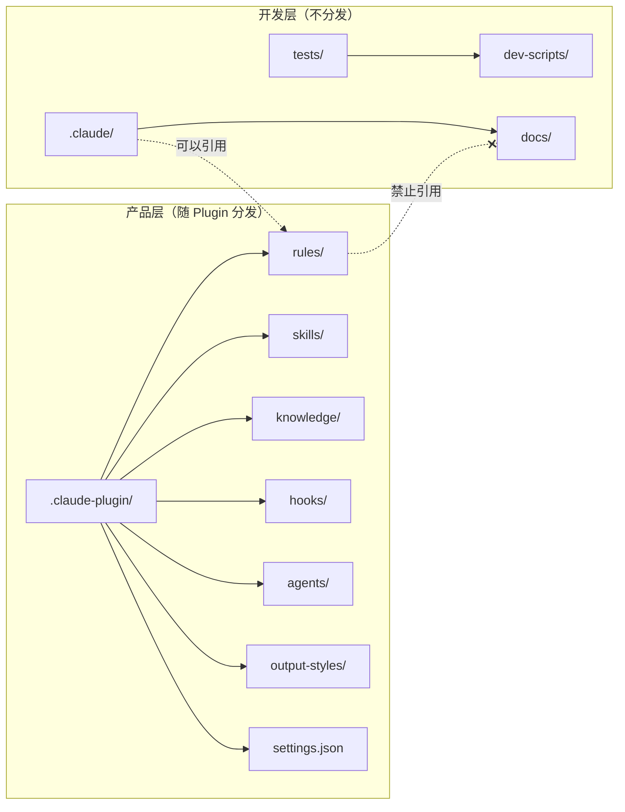
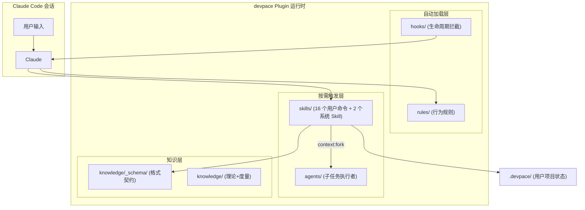

🌐 [English](CONTRIBUTING.md) | 中文

# 贡献指南

感谢你对 devpace 的贡献兴趣！本指南涵盖了开始贡献所需的一切。

## 前置条件

- 已安装 [Claude Code CLI](https://claude.ai/code)
- Python 3.9+（用于运行测试）
- Node.js（可选，用于 `markdownlint-cli2` Markdown 格式检查；未安装时验证会跳过此步骤）
- Git
- （推荐）Anthropic 官方 plugin-dev Plugin：`/plugin install plugin-dev@claude-plugins-official`

## 开发者入门（5 步阅读路径）

| 步骤 | 目标 | 阅读内容 |
|------|------|---------|
| 第 1 步 | 理解产品（5 min） | `README.md`（重点：30 秒体验 + 工作方式） |
| 第 2 步 | 理解架构（10 min） | 本文件的"项目结构"和"插件运行时架构"两节 |
| 第 3 步 | 理解设计意图（10 min） | `docs/design/vision.md` + `docs/design/design.md` §0 速查卡片 |
| 第 4 步 | 理解开发规范（5 min） | `.claude/rules/` 三个文件（`common.md` / `plugin-dev-spec.md` / `dev-workflow.md`） |
| 第 5 步 | 动手验证（2 min） | `make init && make check && claude --plugin-dir ./` |

### 权威文件速查表

| 你想了解... | 去看... |
|------------|---------|
| 为什么做、做什么 | `docs/design/vision.md` |
| 怎么做（设计方案） | `docs/design/design.md` |
| 需求和验收标准 | `docs/planning/requirements.md` |
| 当前进度和任务 | `docs/planning/progress.md` |
| 运行时行为规则 | `rules/devpace-rules.md` |
| 文件格式契约 | `knowledge/_schema/*.md` |
| BizDevOps 理论参考 | `knowledge/theory.md` |

## 开发环境设置

```bash
# 克隆仓库
git clone https://github.com/arch-team/devpace.git
cd devpace

# 一键初始化（Python 依赖 + git hooks + 工具检查）
make init

# 快速验证
make check

# （推荐）安装官方开发工具
# 在 Claude Code 会话中执行：
# /plugin install plugin-dev@claude-plugins-official
```

## 项目结构

devpace 有严格的**分层架构**。在做任何修改前必须理解这一点：

| 层次 | 目录 | 用途 | 是否分发 |
|------|------|------|:--------:|
| **产品层** | `rules/`、`skills/`、`knowledge/`、`.claude-plugin/`、`hooks/`、`agents/`、`output-styles/`、`settings.json` | 交付给用户的插件运行时资产 | 是 |
| **开发层** | `.claude/`、`docs/`、`tests/`、`dev-scripts/` | 内部开发规范和文档 | 否 |

**硬性约束**：产品层文件不得引用开发层文件（`docs/` 或 `.claude/`）。验证方法：

```bash
grep -r "docs/\|\.claude/" rules/ skills/ knowledge/
# 预期：无输出
```

### 分层架构



开发层 → 产品层引用允许，反向禁止。`test_layer_separation.py` 持续验证此约束。

### 插件运行时架构



| 组件 | 加载方式 | 职责 |
|------|---------|------|
| Rules | 会话开始自动注入 | 定义 Claude 行为规则 |
| Hooks | 事件触发自动执行 | 拦截工具调用、会话生命周期管理 |
| Skills | `/pace-*` 或 Claude 自动匹配 | 执行具体操作 |
| Agents | Skill 通过 `context: fork` 委派 | 以特定角色执行子任务 |
| Schema | Skill 输出时引用 | 约束状态文件格式 |
| Knowledge | Agent/Skill 按需参考 | 方法论和度量定义 |

## 运行测试

```bash
# 完整验证套件（PR 前推荐）
bash dev-scripts/validate-all.sh

# Markdown 格式检查（产品层）
make lint

# 仅静态测试（更快）
pytest tests/static/ -v

# 单个测试模块
pytest tests/static/test_frontmatter.py -v

# 插件加载测试（需要 Claude CLI）
bash tests/integration/test_plugin_loading.sh
```

> **快捷方式**：以上命令均可通过 `make` 执行。运行 `make help` 查看所有可用任务。

### 静态测试覆盖范围

| 测试 | 检查内容 |
|------|---------|
| `test_layer_separation` | 产品层不引用开发层 |
| `test_plugin_json_sync` | `plugin.json` 与磁盘文件一致 |
| `test_frontmatter` | Skill/Agent 的 frontmatter 仅使用合法字段 |
| `test_schema_compliance` | Schema 文件遵循规定结构 |
| `test_template_placeholders` | 模板使用 `{{PLACEHOLDER}}` 格式 |
| `test_markdown_structure` | 必要的 §0 速查卡片已存在 |
| `test_cross_references` | 内部文件引用可正确解析 |
| `test_naming_conventions` | 文件遵循 kebab-case 命名 |
| `test_state_machine` | 各文档中的任务状态转换一致 |
| Markdown lint (`make lint`) | 产品层 Markdown 格式规范（`rules/`、`skills/`、`knowledge/`） |

## 修改指南

### 新增 Skill

1. 创建 `skills/<skill-name>/SKILL.md`，使用合法的 frontmatter：

```yaml
---
description: 何时触发此 Skill（要具体——Claude 据此判断是否自动调用）
allowed-tools: Read, Write, Glob, Grep
---
```

2. 如果 Skill 正文超过 ~50 行过程性规则，拆分为：
   - `SKILL.md` — 做什么（输入/输出/高层步骤）
   - `<name>-procedures.md` — 怎么做（详细规则）

3. 更新 `.claude-plugin/plugin.json`——运行 `pytest tests/static/test_plugin_json_sync.py -v` 验证同步。

4. 参考现有 Skill（`pace-dev/`、`pace-change/`）作为模式。

### 修改 Schema

`knowledge/_schema/` 中的 Schema 文件是契约。修改会影响所有按该 Schema 产出内容的 Skill。修改前：

1. 阅读 Schema 文件，理解所有消费方
2. 更新 `skills/pace-init/templates/` 中所有受影响的模板
3. 运行 `pytest tests/static/test_schema_compliance.py -v`

### 修改 Rules

`rules/devpace-rules.md` 是插件激活后 Claude 加载的运行时行为协议。此处的修改直接影响 Claude 在用户项目中的行为。通过加载插件测试：

```bash
claude --plugin-dir ./
```

### 修改 Hook

Hook 脚本位于 `hooks/`，分两类：

**Node.js ESM（`.mjs`）**——主力 Hook（JSON 解析可靠，跨平台一致）：
- 使用 `import` 语法和 `hooks/lib/utils.mjs` 共享工具库
- 通过 `process.stdin` 读取 JSON 输入，`JSON.parse` 解析
- 退出码：`process.exit(0)` = 成功，`process.exit(2)` = 阻断

**Bash（`.sh`）**——轻量 Hook（如 `session-start.sh`、`session-stop.sh`）：
- 必须有 `#!/bin/bash` shebang 和可执行权限（`chmod +x`）
- 避免在 Linux/WSL 上不兼容的 bash 特性（用 `bash --posix` 测试）

**通用要求**：
- 使用 `${CLAUDE_PLUGIN_ROOT}` 引用插件相对路径
- 退出码：`0` = 成功，`2` = 阻断操作，其他 = 非阻断错误
- 事件名称区分大小写（`PreToolUse`，不是 `preToolUse`）

## 提交规范

格式：`<type>(<scope>): <简短描述>`

**类型**：`feat`、`fix`、`docs`、`refactor`、`test`、`chore`

**范围**：`skills`、`rules`、`knowledge`、`hooks`、`scripts`、`agents`、`docs`、`*`（跨范围）

示例：
```
feat(skills): add pace-deploy skill
fix(hooks): correct state matching pattern in pre-tool-use
docs(docs): update design.md state machine diagram
test(scripts): add hook cross-platform test
```

## Pull Request 流程

1. 从 `main` 创建功能分支
2. 按照上述指南进行修改
3. 运行完整验证套件：`bash dev-scripts/validate-all.sh`
4. 验证插件加载：`claude --plugin-dir ./`
5. 编写清晰的 PR 描述，说明改了什么以及为什么

### PR 检查清单

- [ ] `bash dev-scripts/validate-all.sh` 通过
- [ ] 分层检查通过（无产品→开发引用）
- [ ] `plugin.json` 与实际文件同步
- [ ] 新 Skill 仅使用合法的 frontmatter 字段
- [ ] 模板使用 `{{PLACEHOLDER}}` 格式
- [ ] Hook 脚本：`.sh` 有可执行权限和 shebang，`.mjs` 使用 ESM 语法
- [ ] 提交消息遵循规范

## 核心设计原则

贡献时请记住以下原则：

- **概念模型始终完整**：BR→PF→CR 价值链从第一天就存在。内容可以为空但结构必须完整。
- **Markdown 是唯一格式**：状态文件由 LLM + 人类消费，不使用传统解析器。
- **Schema 是契约**：`knowledge/_schema/` 中的定义是硬约束。
- **UX 优先**：零摩擦、渐进暴露、副产物非前置、中断容错。
- **理论对齐**：新功能应与 `knowledge/theory.md` 保持一致。

## 有问题？

如果对架构决策、贡献范围或本指南有任何疑问，请提交 Issue。
