# devpace 设计方案

> **职责**：devpace 的完整设计方案——概念模型、UX 原则、工作流规范、状态机、质量体系和实现细节的统一文件。

**定位**：docs/ 体系的**核心设计文件**——回答"怎么做"。将 vision.md 的目标和 theory.md 的理论转化为可实现的技术方案和可执行的工作流规范。

| 维度 | 说明 |
|------|------|
| 回答的问题 | 概念模型怎么映射？UX 怎么设计？工作流怎么走？状态机怎么流转？质量怎么检查？变更怎么管理？度量怎么算？ |
| 上游输入 | vision.md（愿景约束设计）、theory.md（理论指导模型选择） |
| 下游消费 | requirements.md（从设计拆解出功能需求）、roadmap.md（设计复杂度影响排期）、devpace-rules.md（规则从本文提炼）、各 Skill SKILL.md（Skill 行为与流程对齐） |
| 更新时机 | 概念模型调整、UX 原则变化、流程设计变更、新增子系统时 |
| 类别 | 项目管理 + 产品设计——既指导开发，其概念也编码进 rules/skills/schema |
| 主要读者 | 开发者——需要理解"系统是怎么设计的"再动手实现 |

## §0 速查卡片

```
端到端流程：
Phase 0 ─────→ Phase 1 ─────→ Phase 2A/2B ─────→ Phase 5
/pace-init       会话开始        探索/推进          会话结束
(一次性)         (每次会话)      (工作阶段)         (每次会话)

         ┌──── Phase 3 ────┐  ┌──── Phase 4 ────┐
         │  需求变更         │  │  迭代回顾         │
         │  (随时可能)       │  │  (迭代末尾)       │
         └─────────────────┘  └─────────────────┘

         ┌──── 交付后（可选）──────────────────────────────────┐
         │  /pace-release → Gate 4 → deploy → verify → close  │
         │  changelog + version bump + git tag + GitHub Release│
         │  deployed → rolled_back（回滚路径）                   │
         └────────────────────────────────────────────────────┘

横切：/pace-role（视角切换）· /pace-theory（理论参考）· /pace-status（任意阶段查询）· /pace-trace（决策轨迹）· /pace-guard（风险管理）· /pace-next（全局导航）

价值交付链路：Vision(北极星) → OBJ(北极星贡献, 双维度MoS) → Opportunity → Epic(主/副OBJ, 双维度MoS) → BR(双维度MoS) → PF → CR → merged（→ released，可选）
溯源标记：<!-- source: user --> / <!-- source: claude, [原因] --> — 区分用户输入与 Claude 推断（HTML 注释，日常不可见）
四个闭环：业务闭环(人类主导) → 产品闭环(人机协作) → 技术闭环(Claude 自治) → 运维闭环(人机协作，可选)
状态机：created → developing → verifying → in_review → approved → merged → released（可选）（任意⇄paused）
质量门：Gate 1(developing→verifying) + Gate 2(verifying→in_review) = Claude 自动 | Gate 3(in_review→approved) = 人类审批 | Gate 4(Release create→deploy) = 系统级（可选）
双模式：探索(默认，只读) / 推进(改代码时，绑定 CR，走状态机)
渐进自主性：推进模式内 3 级自主性 — 辅助(询问)/标准(默认，自动)/自主(放宽) — Gate 3 铁律始终不变
```

## §1 设计背景

### 问题

Claude Code 是会话级工具，缺乏跨会话的流程状态感知。要让它融入产品迭代研发流程，需要一套协作机制。

### 设计基础

BizDevOps 方法论。核心启示：**概念模型是一切的基础**——没有统一的概念模型，就无法对齐目标、打通链路、产生可用数据、持续改进。

### 设计约束

- Claude 自治为主（技术闭环自主推进，关键质量检查等待人类审批）
- 度量聚焦质量保障 + 业务价值对齐
- 状态文件使用 Markdown（消费者是 LLM + 人类，不是传统解析器）
- 以 Claude Code Plugin 形态呈现

### 设计优先级（对齐护城河策略）

vision.md 定义了三层护城河，设计优先级据此排列：

1. **入口层（跨会话连续性）**：Phase 1 + Phase 5 + state.md 自动恢复。被原生替代风险高，设计上保持轻量，不过度投入
2. **差异化层（变更管理）**：Phase 3 + paused 状态 + 四种变更场景。核心竞争力，设计上优先打磨
3. **护城河层（完整价值链 + 度量）**：BR→PF→CR 链路 + 度量体系。长期不可替代的价值，随迭代自然加深

**备选入口**：如果跨会话连续性被 Claude Code 原生替代，Phase 3 变更管理可独立作为入口——用户在单会话内首次改变需求时，devpace 自动展示影响分析能力。当前设计已支持此路径（/pace-change 不依赖跨会话状态）。

## §2 UX 设计原则

| # | 原则 | 含义 | 违反示例 |
|---|------|------|---------|
| P1 | **零摩擦接入** | 用户说自然语言就能工作 | 要求先创建 CR yaml 才能编码 |
| P2 | **渐进式暴露** | 日常只看 1 行摘要 | 每次会话输出 50 行状态 |
| P3 | **副产物非前置** | 结构化数据是工作的自动产出 | 要求填写 BR→PF→CR 后才能开始 |
| P4 | **容错恢复** | 任何时刻中断无缝继续 | 中断导致状态不一致 |
| P5 | **自由探索** | 默认自由，正式推进时才走流程 | "CR 被阻塞不能操作" |
| P6 | **分级输出** | 默认简洁，按需展开 | 每次输出质量检查状态和度量 |
| P7 | **Git 为源** | 不重复记录 Git 已有信息 | 在 CR 中维护 commit 列表 |

**P2 延伸——渐进教学**：P2 渐进暴露解决了"信息量"维度的问题（日常 1 行，按需展开）。渐进教学是 P2 在"行为理解"维度的延伸——Claude 的系统行为（创建 CR、质量检查、等待审批等）首次出现时附加 1 句解释，帮助用户理解"为什么"。同一行为终身只教一次，通过 state.md 教学标记去重。规则定义：devpace-rules.md §15。

**P6 延伸——三层渐进透明**（借鉴 Linear AI Triage Intelligence 的三层透明模型）：P6 分级输出解决了"信息量"维度的问题。三层渐进透明是 P6 在"可验证性"维度的延伸——让用户按需验证 AI 的每个判断，从"看到结果"到"理解推理"到"审计轨迹"。

| 层级 | CLI 映射 | 触发方式 | 输出 |
|------|---------|---------|------|
| **表面** | 推理后缀 | 默认 | ≤15 字推理依据，附加在系统行为输出后 |
| **中间** | 追问展开 | 用户说"为什么"/"详细说说" | 结构化推理链（2-5 行）：判断依据 → 对比了什么 → 备选方案 |
| **深入** | /pace-trace | 用户主动查询 | 完整决策轨迹：所有读取的上下文、规则匹配过程、溯源标记 |

设计决策：
- **表面层**（已有）：推理后缀 ≤15 字，不新增输出行——规则定义：devpace-rules.md §5
- **中间层**（新增）：用户追问时展开 2-5 行结构化推理链。触发词："为什么""怎么判断的""详细说说""依据是什么"。不是重复信息，而是展示判断过程
- **深入层**（新增）：/pace-trace 提供完整决策轨迹——读取了哪些文件、匹配了哪些规则、溯源标记（source: user/claude）、confidence 评估。主动查询才触发，对齐 P2 渐进暴露

三层对应 Linear 的设计三元组：表面层 = Native feel（无感嵌入），中间层 = Trust（可验证信任），深入层 = Transparency（完整透明）。

**渐进自主性**（借鉴 Linear AI 三级自主性模型）：推进模式内引入 3 级自主性，映射到 devpace 的 Gate 体系。用户可根据信任程度调整 Claude 在推进模式中的操作边界。

| 自主级别 | Gate 1 行为 | Gate 2 行为 | Gate 3 | 简化审批 | 适用场景 |
|---------|------------|------------|--------|---------|---------|
| **辅助**（assist） | 失败时展示问题并询问修复方向 | 结果展示给用户确认 | 人类阻塞 | 不启用 | 新项目/新用户/不熟悉 devpace |
| **标准**（standard，默认） | 自动执行+自修复 | 自动执行+自修复 | 人类阻塞 | 满足条件时启用 | 已建立信任/标准开发流程 |
| **自主**（autonomous） | 自动执行+自修复 | 自动执行+自修复 | 人类阻塞 | 条件放宽（≤5 文件） | 高信任/批量操作/熟练用户 |

设计决策：
- **默认"标准"**：保持当前行为不变，不增加初始配置成本（对齐 Linear "不强制最高自动化"）
- **Gate 3 铁律不变**：无论自主级别如何，Gate 3 始终是人类阻塞门禁——与 Linear "即使完全自主，人类确认最终结果"完全一致
- **用户主动选择**：每级是用户通过 project.md `自主级别:` 字段主动选择，系统不会自动升级
- **辅助模式差异**：Gate 1 失败不自动修复而是询问；Gate 2 展示结果等确认；复杂度 M 也生成执行计划
- **自主模式差异**：简化审批条件放宽（≤5 文件）；连续 N 个 CR 简化审批通过后主动提示切换
- **配置方式**：project.md 新增 `自主级别:` 字段（辅助/标准/自主），默认"标准"

规则定义：devpace-rules.md §2（按自主级别分化）。格式契约：project-format.md `自主级别` 字段。

### 7 个 UX 问题及解决方案

1. **认知负担**：用户不需要学 BizDevOps 术语，Claude 自动映射自然语言到作业对象
2. **启动延迟**：默认只读 state.md（初始 5-8 行，信息溢出后自动扩展到 project.md），其余按需
3. **ID vs 自然语言**：用户永远不需要知道 CR-001 的存在
4. **中断恢复**：原子写入——每完成一步就 commit + 更新状态，幂等质量检查
5. **自由度**：探索/推进双模式，默认自由探索，修改代码时才进入流程。质量检查仅在 CR 状态流转时触发——探索模式不受约束，推进模式不可跳过
6. **信息过载**：三级输出（1 句话 / 3-5 行 / 完整状态）
7. **Git 重复**：CR 只记分支名，不记 commit hash

## §3 概念模型

### 三类核心概念

| 概念 | BizDevOps 定义 | 在本 Plugin 中的体现 |
|------|----------|-------------------|
| **作业对象** | 价值交付链路上的基本单元 | Opportunity（业务机会）→ Epic（专题）→ BR（业务需求）→ PF（产品功能）→ CR（变更请求） |
| **作业空间** | 角色协作的功能区域 | 当前简化为单项目单开发者，未来扩展多项目时启用 |
| **作业规则** | 流程、规范、约束 | knowledge/_schema/ 中的 workflow.md（状态机）+ checks.md（质量检查），项目可在 .devpace/rules/ 中覆盖 |

### 价值交付链路

devpace 使用五类作业对象构成价值交付链路：

```
Vision (产品愿景)  →分解→  OBJ (业务目标)  →1:N(主)+副→  Epic (专题)  →1:N→  BR (业务需求)  →1:N→  PF (产品功能)  →1:N→  CR (变更请求)
  人类定义                  人类定义                       人机协作         人机协作              人机协作              Claude 创建
  北极星指标                北极星贡献                     双维度MoS        双维度MoS
                           双维度MoS(客户/企业)
                                                             ↑
                                                   Opportunity (业务机会)
                                                        Claude 捕获
```

**双向追溯**：正向确保技术工作锚定业务价值（Vision→OBJ→Epic→BR→PF→CR），反向确保技术工作可追溯到业务目的。**溯源标记**增加第三维度——区分用户输入与 Claude 推断的内容，支持跨会话信任和纠正检测。**Vision→OBJ→Epic 链路实现从代码到战略愿景的完整追溯**，验证每一行代码都有业务来源。**MoS 双维度**（客户价值 + 企业价值）渗透到 OBJ/Epic/BR 三层，确保价值链每一层都关注"对谁有价值"。

| 实体 | 存储位置 | 创建者 | 状态管理 |
|------|---------|--------|---------|
| Vision | vision.md（始终独立） | 人类 | 核心愿景 + 北极星指标 + 战略上下文 |
| OBJ | objectives/OBJ-xxx.md（始终独立） | 人类 | 6 类类型 + 双维度 MoS + 3 态（活跃/已达成/已废弃） |
| Opportunity | opportunities.md | Claude 捕获/人类 | 评估中→已采纳/已搁置/已拒绝 |
| Epic | epics/EPIC-xxx.md（始终独立） | 人机协作 | 规划中→进行中→已完成→已搁置 |
| BR | project.md 树视图（溢出后 requirements/BR-xxx.md） | 人机协作 | 基于 PF 完成度自动计算 |
| PF | project.md 价值功能树（溢出后 features/PF-xxx.md） | 人机协作 | emoji 标记 |
| CR | backlog/CR-xxx.md | Claude 自动 | 7 状态状态机 |

**扩展实体**（可选，渐进启用）：

| 实体 | 存储位置 | 创建者 | 说明 |
|------|---------|--------|------|
| Release | releases/REL-xxx.md | Claude + 人类 | 可选——不使用发布流程时 merged 仍是有效终态 |
| Defect/Hotfix | backlog/CR-xxx.md（type:defect/hotfix） | Claude 自动 | CR 的类型变体，走同一状态机（hotfix 可加速路径） |

设计决策：Release 和 Defect/Hotfix 作为可选扩展纳入——不启用时不影响核心流程，启用后补齐"交付→部署→反馈→修复"闭环。devpace 追踪发布状态、查询 CI 结果、编排发布流程，但不替代 CI/CD 平台的流水线定义和执行（对齐 vision.md "边界与演进"）。

| 实体 | 存储位置 | 创建者 | 说明 |
|------|---------|--------|------|
| Risk（风险） | .devpace/risks/RISK-NNN.md | Claude 自动 / 人类 | 独立于 CR 的轻量风险实体，与 CR 多对多关联 |

**风险实体设计决策**：

- **独立实体**：风险（Risk）不内嵌在 CR 中，而是作为独立实体存储在 `.devpace/risks/`——因为一个风险可关联多个 CR（如"认证模块架构兼容性"可能影响多个 CR），一个 CR 也可关联多个风险
- **自有状态机**：`open → mitigated | accepted | resolved`。与 CR 状态机独立运行——CR 状态推进不强制要求所有关联风险已解决（Low/Medium 可带风险推进），但 High 风险会触发暂停等待人类确认
- **4 种来源**：`pre-flight`（开发前扫描）、`runtime`（开发中发现）、`retrospective`（回顾总结）、`external`（外部报告）——覆盖风险的完整生命周期
- **3 级严重度**：`Low`（可延后）、`Medium`（需计划）、`High`（需立即处理）——驱动分级自主响应
- **格式契约**：`knowledge/_schema/risk-format.md`

### 四个反馈闭环

| 闭环 | 主导方 | 作业对象 | 周期 | 触发入口 | 实现状态 |
|------|--------|---------|------|---------|---------|
| 业务闭环 | 人类 | OBJ + BR + MoS | 专题/季度级 | /pace-retro、人类主动 | ⏳ 被动触发 |
| 产品闭环 | 人机协作 | BR → PF → 迭代 | 迭代级 | /pace-status、/pace-change | ⏳ 被动触发 |
| 技术闭环 | Claude 自治 | CR 状态机 | 单 CR 级 | /pace-dev、自动进入推进模式 | ✅ 自动驱动 |
| 运维闭环 | 人机协作 | Release + Defect CR | 事件驱动 | /pace-release、/pace-feedback | ✅ 已实现（可选） |

设计约束：技术闭环 Claude 自治（自主编码→测试→验证→停在 review），业务/产品闭环人类主导，运维闭环人机协作（部署由人类确认，问题追溯由 Claude 自动化）。

**运维闭环设计原则**：可选启用——不使用 Release 流程时整个运维闭环不生效，核心流程（技术闭环）不受影响。启用后补齐"merged→部署→验证→反馈→修复"完整链路。

### 概念模型始终完整，内容渐进丰富

**核心原则**：BR→PF→CR 三层概念模型从 `/pace-init` 起就完整存在于 Claude 的认知中。区别在于**每个概念的信息丰富度随迭代自然增长**，文件结构按信息量扩展。

| 概念 | 初始形态（轻量） | 丰富后形态 | 存储位置演变 |
|------|-----------------|-----------|------------|
| Vision（产品愿景） | 桩文件（占位文字） | 核心四要素 + 北极星指标 + 战略上下文 | 始终在 vision.md |
| OBJ（业务目标） | 标题 + 类型 + 基本 MoS | 完整双维度 MoS + 北极星贡献 + 关联专题表 | 始终在 objectives/OBJ-xxx.md |
| Opportunity（业务机会） | 一句话描述 + 来源 | 评估结论 + 去向（Epic） + 详细来源 | 始终在 opportunities.md |
| Epic（专题） | 标题 + 主/副 OBJ 关联 + 背景 | 完整双维度 MoS + BR 列表 + 完成度 + 时间框架 | 始终在 epics/EPIC-xxx.md |
| BR（业务需求） | project.md 一行（标题 + 标签） | 带业务上下文、成功标准、PF 列表 | project.md 内联 → **requirements/BR-xxx.md**（溢出） |
| PF（产品功能） | CR 文件的 `功能:` 字段 + state.md 功能概览行 | 功能分组视图 + 用户故事 + 验收标准 + 边界定义、依赖关系、完成进度 | CR + state.md → project.md 功能视图 + 功能规格 → **features/PF-xxx.md**（溢出） |
| CR（变更请求） | backlog/CR-*.md 基础信息 + 意图（用户原话） | 意图完整填充、质量检查记录、review 历史、关联信息 | 始终在 backlog/CR-*.md |

**PF 溢出模式（Overflow Pattern）**：当 PF 信息量增长到一定规模（功能规格 >15 行 | 关联 3+ CR | 经历过 modify），自动溢出为独立文件 `features/PF-xxx.md`。project.md 保留树视图 + `[详情]` 链接。溢出是单向、零摩擦的——对齐 P1 零摩擦、P2 渐进暴露、P3 副产物非前置原则。类比 CR 从第一天就有独立文件（因信息量和生命周期复杂度），PF 在信息丰富后也值得独立存储。格式契约见 `knowledge/_schema/pf-format.md`。

**追溯链从第一天就完整**，只是每层初期较轻量：

```
愿景（vision.md 桩）→ 目标（objectives/ 基本 MoS）→ 功能（CR 的功能:字段）→ CR → 代码（Git 分支）
```

随迭代丰富为：

```
产品愿景 + 北极星（vision.md）→ 业务目标 + 双维度 MoS + 北极星贡献（objectives/）→ 业务机会（opportunities.md）→ 专题 + 双维度 MoS（epics/）→ 功能树（project.md）→ BR 详情 + 双维度 MoS（requirements/ 溢出后）→ PF 详情（features/ 溢出后）→ CR（backlog/）→ 代码（Git）
```

**文件结构：/pace-init 创建完整目录，内容从最小开始**：

```
/pace-init 生成完整目录结构（解决 C1：产出物与渐进丰富的一致性）：
.devpace/
├── state.md          # 含业务目标行 + 功能概览（5-8 行）
├── project.md        # 初始含愿景链接 + OBJ 索引表 + 功能列表
├── vision.md         # 产品愿景（核心四要素 + 北极星 + 战略上下文）
├── objectives/       # OBJ 独立文件（OBJ-xxx.md，6 类类型 + 双维度 MoS）
├── opportunities.md  # 业务机会看板（/pace-biz 时填充，可选）
├── epics/            # Epic 专题文件（/pace-biz 时填充，可选）
├── requirements/     # BR 溢出文件（信息量增长后自动溢出，可选）
├── backlog/          # CR 文件随推进创建
├── iterations/       # 目录预创建，有迭代节奏需求时填充内容
├── rules/            # 目录预创建，项目特有质量规则时填充
├── metrics/          # 目录预创建，需要度量报告时填充
├── releases/         # 目录预创建，启用发布流程时填充（可选）
└── integrations/     # 目录预创建，配置外部工具集成时填充（可选）

内容渐进丰富（结构不变，内容增长）：
vision.md   : 桩 → 核心四要素 → + 北极星指标 → + 战略上下文
objectives/ : 基本 MoS → 完整双维度 MoS + 北极星贡献 + 关联专题
state.md    : 5-8 行 → 超出 ~10 行时精简为摘要，引用 project.md
project.md  : 愿景链接 + OBJ 索引表 + 基础列表 → 完整功能树 + 范围 + 原则 + 功能规格
backlog/    : 基础 CR → 完整意图 + 质量检查记录 + review 历史
iterations/ : 空 → current.md（迭代进度）
rules/      : 空 → checks.md（项目特有质量规则）
metrics/    : 空 → dashboard.md（度量仪表盘）+ insights.md（经验积累）
releases/   : 空 → REL-xxx.md（启用发布流程后填充，可选）
integrations/: 空 → config.md（配置外部工具集成，可选）
```

### MoS 双维度格式

成效指标（MoS）在 OBJ、Epic、BR 三层统一使用双维度格式，区分"对谁有价值"：

```markdown
## 成效指标（MoS）

**客户价值**：
- [ ] [指标]（目标：[值]，当前：[值] → 进度 [N]%）

**企业价值**：
- [ ] [指标]（目标：[值]，当前：[值] → 进度 [N]%）
```

| 维度 | 关注点 | 典型指标 | 主要出现在 |
|------|--------|---------|----------|
| 客户价值 | 对用户/客户有价值的成果 | NPS、完成率、满意度、响应时间 | product/growth 类型 OBJ |
| 企业价值 | 对企业/团队有价值的成果 | 收入、利润率、交付频率、合规率 | business/tech/efficiency 类型 OBJ |

**向后兼容**：无维度标签的简单 checkbox 列表仍合法——Claude 遇到旧格式时按未分类处理，不强制升级。

**度量链**：MoS 沿价值树向上聚合（BR MoS → Epic MoS → OBJ MoS → 北极星指标）。日常操作中度量链隐式存在（通过树结构推断），/pace-retro 时 Claude 自动生成贡献分析。

**质量检查分级**：
- **基础**（始终有）：编译通过 + 测试通过 + 项目 lint 规则
- **完整**（有项目 `rules/` 时）：基础 + 项目特有质量规则
- **需求质量**（始终有）：意图完整度（developing→verifying）+ 意图一致性（verifying→in_review）

### 溯源标记（user vs claude 来源区分）

**设计动机**（借鉴 Linear AI "视觉溯源"）：devpace 中 Claude 静默生成大量结构化内容（CR 自动创建、PF 推断、意图补充、功能树生长）。用户回到项目时需要区分哪些内容是自己说的、哪些是 Claude 推断的。跨会话场景下尤为重要——新会话的 Claude 需要区分"用户明确意图"和"上次推断内容"。

**实现方式**：HTML 注释标记，不影响 Markdown 渲染——`<!-- source: user -->` 和 `<!-- source: claude, [原因] -->`。

**设计决策**：
- **轻量标记**：HTML 注释对 Markdown 渲染完全透明，用户日常使用完全不感知
- **渐进暴露**：标记信息仅在深入层（/pace-trace 或 --detail）展示，日常操作不显示（对齐 P2）
- **跨会话信任**：新会话恢复时，`source: user` 内容优先级高于 `source: claude`——Claude 推断的可重新评估，用户明确说的视为确定
- **纠正检测基础**：溯源标记让"用户修改了 Claude 推断的内容"可检测——为反应式调优（§12 纠正即学习）提供数据基础
- **向后兼容**：无标记的既有内容不影响任何功能

**标记范围**：仅 project.md 和 CR 意图 section——state.md（全部 Claude 生成）和 iterations/current.md（聚合数据）不标记。格式契约见 `project-format.md` 和 `cr-format.md` 溯源标记章节。运行时规则见 `devpace-rules.md` §4、§4.5、§8。

## §4 端到端工作流

### Phase 0：项目初始化

| 维度 | 内容 |
|------|------|
| **触发条件** | 用户运行 /pace-init |
| **执行频率** | 一次性 |
| **对应 Skill** | /pace-init |
| **实现状态** | ✅ 已实现 |

**必须执行的步骤**（详细见 /pace-init SKILL.md）：

1. 检查是否已初始化 → 对话收集项目信息 → 生成 `.devpace/` 目录 → 引导质量检查定义 → 确认功能树

**产出物**：完整的 `.devpace/` 目录结构（内容从最小开始，按 §3 渐进丰富原则增长）。

---

### Phase 1：会话开始

| 维度 | 内容 |
|------|------|
| **触发条件** | 每次会话开始 |
| **执行频率** | 每次会话 |
| **对应规则** | devpace-rules.md §1 |
| **实现状态** | ✅ 已实现 |

**必须执行**：读 state.md → 1 句自然语言报告 → 等待用户指令。不输出 ID、状态机术语（devpace-rules.md §3 自然语言映射）。分级输出（§9）：默认 1 句话。

---

### Phase 2A：探索模式

| 维度 | 内容 |
|------|------|
| **触发条件** | 默认模式，或触发词"看看""分析一下""评估""了解" |
| **执行频率** | 按需 |
| **对应规则** | devpace-rules.md §2 探索模式 |
| **对应 Skill** | /pace-status、/pace-theory |
| **实现状态** | ✅ 已实现 |

**行为规则**：自由读取分析，**不修改**状态文件，不受状态机约束。可随时切换到推进模式。

> 探索/推进双模式的运行时行为规则定义在 devpace-rules.md §2。本节是设计规范，rules 是执行规范。

---

### Phase 2B：推进模式（完整 CR 生命周期）

| 维度 | 内容 |
|------|------|
| **触发条件** | /pace-dev，或"开始做""帮我改""实现""修复"，或 Claude 开始修改项目代码 |
| **执行频率** | 每个 CR |
| **对应规则** | devpace-rules.md §2 推进模式、§4、§4.5、§4.6 |
| **对应 Skill** | /pace-dev、/pace-review |
| **实现状态** | ✅ 已实现 |

**必须执行的步骤**（详细流程见 /pace-dev SKILL.md）：

| Step | 阶段 | 关键行为 | 对应规则 |
|------|------|---------|---------|
| 1 | 定位/创建 CR | 关键词匹配或自动创建，关联 PF | rules §4 |
| 2 | 意图检查点 | 复杂度自适应：简单→原话、标准→范围+验收、复杂→完整意图 | rules §4.5 |
| 3 | developing→verifying | 编码+测试+Gate 1，质量检查失败自修复，每步 checkpoint | rules §2、§6 |
| 4 | verifying→in_review | 集成测试+Gate 2，对比意图一致性 | rules §2 |
| 5 | in_review | 生成摘要（/pace-review），**Claude 停止等待人类** | rules §2 |
| 6 | approved→merged | git merge + merged 连锁更新（见 §5） | rules §8 |

推进过程中，Claude 在 CR 事件表备注列记录重要决策（rules §4.6）：方案选择原因、边界条件、假设。

> 推进模式的运行时行为规则定义在 devpace-rules.md §2。本节是设计规范，rules 是执行规范。

**产出物**：更新后的 CR 文件、state.md、project.md、iterations/current.md。

---

### Phase 3：需求变更

| 维度 | 内容 |
|------|------|
| **触发条件** | 触发词"不做了""加一个""先做 Y""改一改"，或 /pace-change |
| **执行频率** | 随时可能发生 |
| **对应规则** | devpace-rules.md §9 |
| **对应 Skill** | /pace-change |
| **实现状态** | ✅ 规则已实现，Skill 已定义 |

变更管理的设计原理、四种场景和三步操作流程见 §7。

**产出物**：影响分析报告 + 全部关联文件更新。

---

### Phase 4A：迭代规划

| 维度 | 内容 |
|------|------|
| **触发条件** | /pace-plan，或迭代边界 |
| **执行频率** | 每个迭代开始/结束 |
| **对应 Skill** | /pace-plan |
| **实现状态** | ✅ 已定义 |

**流程**（详细见 /pace-plan SKILL.md）：

1. **评估当前迭代**：读取 iterations/current.md + project.md，汇总 PF 完成率
2. **关闭当前迭代**：填写偏差快照，归档为 iter-N.md
3. **规划新迭代**：展示待选 PF，引导用户选择纳入范围和目标
4. **生成迭代文件**：创建/更新 iterations/current.md + state.md

**产出物**：新迭代的 iterations/current.md + 更新后的 state.md。

---

### Phase 4B：迭代回顾

| 维度 | 内容 |
|------|------|
| **触发条件** | /pace-retro，或迭代末尾 |
| **执行频率** | 每个迭代 |
| **对应规则** | devpace-rules.md §8（dashboard 更新时机） |
| **对应 Skill** | /pace-retro |
| **实现状态** | ✅ 完整实现（7 子命令 + 两层输出 + 趋势分析 + 经验沉淀 + 迭代传递） |

**六步流程**（详细见 /pace-retro SKILL.md）：

1. **采集数据 + 基准线检测**：CR 状态分布、质量检查首次通过率、人类驳回次数、CR 周期（来自 backlog/）；MoS 达成（来自 project.md）；计划 vs 实际 PF 数（来自 iterations/）；DORA 代理指标（来自 releases/）
2. **更新 dashboard.md**（含历史快照追加）
3. **生成回顾报告**（两层：行动摘要 ~10 行 + 维度详情）：交付 + 质量 + 缺陷 + 价值 + 周期时间 + DORA 代理指标 + 变更偏差 → 做得好的 / 需改进的 / 下个迭代建议
4. **经验沉淀 + 本次学习透明段**：回顾提炼的 pattern 交给 pace-learn 统一写入管道，报告中显示本次提交的经验条目
5. **迭代传递清单**：为 /pace-plan next 生成结构化输入（待继续 PF、建议优先级、风险提示、流程改进建议）
6. **报告质量自评**：数据充分性、趋势置信度、建议质量的自我评估

**产出物**：回顾报告（含行动摘要 + 维度详情 + 迭代传递清单 + 质量自评）+ 更新后的 dashboard.md + 经验沉淀。

### 经验积累闭环（反应式调优）

经验积累有两个输入通道，形成完整闭环：

| 通道 | 触发方式 | 写入内容 | 实现 |
|------|---------|---------|------|
| **主动提取** | CR merged / Gate 修复 / 人类打回 | 模式/防御/改进 pattern | pace-learn（§11） |
| **纠正即学习** | 用户纠正 Claude 判断 + 用户确认 | 偏好 pattern（优先级更高） | §12.5 |

设计动机（借鉴 Linear AI Natural Language Guidance 最佳实践）：Linear 的 guidance 是**反应式**使用——AI 先工作→行为不对时用户纠正→AI 后续自动参考纠正。devpace 的"纠正即学习"实现相同理念：当用户否决简化审批、修改 PF 分解、调整影响评估等行为构成纠正时，Claude 提议记录为偏好。偏好条目在后续 §12 引用时优先级高于统计规律。

设计决策：
- **必须用户确认**：纠正不是自动写入——Claude 提议，用户确认后才记录
- **偏好优先级**：偏好 > 模式/防御/改进——用户的明确纠正 > 统计规律
- **溯源标记辅助**：利用 §3 溯源标记检测"用户修改了 Claude 推断的内容"，提升纠正检测准确性
- **格式契约**：`knowledge/_schema/insights-format.md`（含偏好条目结构）

---

### Phase 5：会话结束

| 维度 | 内容 |
|------|------|
| **触发条件** | 会话即将结束时 |
| **执行频率** | 每次会话 |
| **对应规则** | devpace-rules.md §0（速查）、§6（中断恢复与会话结束） |
| **实现状态** | ✅ 已实现——§6 包含触发条件、3 步执行清单、checkpoint 与会话结束的区分 |

**必须执行的步骤**：

1. 更新 state.md：当前工作 + 下一步建议
2. 更新 CR 文件：最新状态、质量检查进度、事件记录
3. 输出 3-5 行会话总结：
   - 做了什么
   - 质量检查状态
   - 下一步建议

**产出物**：更新后的 state.md + CR 文件 + 会话总结。

> **已解决**：rules §6 已扩展为"中断恢复与会话结束"，包含触发条件和强制执行步骤。见附录 A.1。

## §5 CR 状态机

```
           ┌──────────┐
           │ created  │  /pace-dev 或自动创建
           └────┬─────┘
                │
                ▼
           ┌──────────┐     质量检查失败
           │developing│ ◀──── 自修复 ────┐
           └────┬─────┘ ────────────────┘
                │  代码提交 + Gate 1 通过
                ▼
           ┌──────────┐     质量检查失败
           │verifying │ ◀──── 自修复 ────┐
           └────┬─────┘ ────────────────┘
                │  集成测试 + Gate 2 通过
                ▼
           ┌──────────┐
人类驳回 ──▶│in_review │  Claude 停止，等待人类
(→developing)└────┬─────┘
                │  人类批准 (Gate 3)
                ▼
           ┌──────────┐
           │ approved │
           └────┬─────┘
                │  git merge + 连锁更新
                ▼
           ┌──────────┐
           │  merged  │  ← 默认终态
           └────┬─────┘
                │  Release 关闭（可选）
                ▼
           ┌──────────┐
           │ released │  ← 可选终态（启用发布流程时）
           └──────────┘

任意状态 ⇄ paused（需求变更触发，保留全部工作成果）
```

`released` 设计决策：
- **可选终态**：不使用 Release 流程时 `merged` 仍是有效终态（向后兼容）
- 不可手动设置——仅通过 Release 关闭流程（/pace-release close）自动标记
- CR 纳入 Release 并完成部署验证后，由 Release 关闭连锁更新批量触发

### 设计约束（决策原因）

- **意图检查点**（created→developing）：复杂度自适应——简单 CR 用原话，复杂 CR 需完整意图描述。同时执行复杂度量化评估（S/M/L/XL），L/XL 自动触发拆分建议。L/XL 强制生成执行计划（步骤级精度+可验证预期）+ 方案确认门禁（用户确认后才进入 developing）
- **自动门禁**（Gate 1/2）：Claude 自执行 + 失败自修复，不中断用户
- **人类审批门**（Gate 3）：in_review→approved 是唯一阻塞门禁，Claude 必须停下等待
- **暂停转换**（任意⇄paused）：保留全部工作成果，变更管理的核心机制

### 转换门禁

字段定义见 `_schema/cr-format.md`。核心约束：

| 转换 | 门禁 | 执行角色 | 说明 |
|------|------|---------|------|
| created→developing | 意图检查点（§4.5） | Claude | 复杂度自适应的意图明确 |
| developing→verifying | Gate 1 质量检查 | Claude | 代码质量自动检查，失败自修复 |
| verifying→in_review | Gate 2 集成验证 | Claude | 需求质量+意图一致性，失败自修复 |
| in_review→approved | Gate 3 人类审批 | **人类** | **唯一阻塞门禁**，Claude 必须停下等待 |
| approved→merged | git merge + 连锁更新 | Claude | 人类批准后自动执行 |
| merged→released | Release 关闭流程 | 系统 | 可选，Release 关闭时自动标记 |
| 任意→paused | 需求变更 | 人类/Claude | 变更管理触发，保留全部工作成果 |
| paused→原状态 | 恢复 | 人类/Claude | 回到暂停前状态，条件重验 |

**角色约束原则**：
- **Claude 自治区**（Gate 1/2）：代码质量和需求质量检查，Claude 全权处理，不打断用户
- **人类决策区**（Gate 3、paused）：涉及业务判断的环节，必须由人类确认
- **系统自动区**（released）：流程自动触发，无需人工干预

### 状态转换 Checkpoint

每次门禁通过时，在 CR 事件表备注列写入 `[checkpoint: <名称>]` 标记，作为命名快照锚点。

**用途**：
- **精确恢复**：CR 从 paused 恢复时，对比 paused checkpoint 与当前代码库状态，判断质量检查是否需要重验
- **审计追溯**：门禁通过历史可审计，支持 /pace-retro 的通过率分析
- **变更影响定位**：变更管理（§7）中恢复已暂停 CR 时，根据 checkpoint 判断恢复点而非粗粒度的"暂停前状态"

**命名规则**：`gate1-passed`、`gate2-passed`、`gate3-approved`。字段定义见 `_schema/cr-format.md`。

### merged 后的连锁更新（必须执行清单）

1. 更新 PF 状态：如果该 PF 的所有 CR 均 merged → PF 标记 ✅
2. 更新 project.md 价值功能树中的 CR emoji
3. 更新 state.md：进行中/下一步
4. 更新 iterations/current.md：进度

> **已解决**：devpace-rules.md §2 已包含 merged 后 4 步连锁更新清单。见附录 A.2。

## §6 质量检查体系

完整定义见项目 `.devpace/rules/checks.md`。

| 门禁 | 位置 | 执行者 | 共同属性 |
|------|------|--------|---------|
| Gate 1 | developing → verifying | 🤖 Claude | 自动执行、失败自修复、幂等 |
| Gate 2 | verifying → in_review | 🤖 Claude | 同上 |
| Gate 3 | in_review → approved | 👤 **人类** | 阻塞门禁 |

**两个维度**：代码质量（lint/test/typecheck，Gate 1-2）+ 需求质量（意图完整度+一致性，状态转换时）。

**属性**：项目级可配置（checks.md）、以 checkbox 写入 CR、通过率流入 dashboard.md（仅 /pace-retro 更新）。

**Gate 2 结构化验收比对**：Gate 2（verifying→in_review）执行时，Claude 按 CR 验收条件的格式逐一比对实际变更：
- 编号清单格式 → 逐条标注"满足/不满足"
- Given/When/Then 格式 → 逐场景验证
- 自由文本格式 → 整体判定

同时检查 CR 意图 section 中是否存在未解决的 `[待确认]` 歧义标记——存在则 Gate 2 失败，要求先解决歧义再推进。

### 自然语言质量门禁

checks.md 支持两种检查类型：**命令检查**（bash 执行）和**意图检查**（Claude 自然语言判定）。

意图检查允许用户用自然语言描述质量期望——"所有公共 API 必须有文档"、"单个函数不超过 50 行"——Claude 在 Gate 执行时阅读变更代码并对照规则判定。

**与 CodeRabbit 的差异**：
- CodeRabbit 在 PR 级别评估（一次性），devpace 在 CR 状态流转时评估（Gate 1/2 分别触发）
- CodeRabbit 需要用户在 Web UI 配置规则，devpace 在 Markdown 文件中定义（LLM+人类双消费者）
- devpace 的意图检查失败后 Claude 自修复，CodeRabbit 需要开发者手动修复

**设计约束**：
- 意图检查必须"可判定"——Claude 阅读代码后能明确通过/失败
- 意图检查失败输出附加 1 句原因（推理透明度，§5 推理后缀原则）
- 格式定义见 `knowledge/_schema/checks-format.md`

### 对抗审查（Adversarial Review）

借鉴 BMAD-METHOD 的 Adversarial Review 机制，Gate 2 通过后追加对抗审查——对抗 Claude 的确认偏差。

**核心设计**：不是"检查是否有问题"，而是"假设存在问题，找出来"。零发现不可接受。

| 维度 | 意图检查 | 对抗审查 |
|------|---------|---------|
| 心态 | 确认式 | 质疑式 |
| 零发现 | 正常（通过） | 异常（需重新分析） |
| 失败处理 | Claude 自修复 | 记入 Review 摘要，人类过滤假阳性 |
| Gate 影响 | 失败→Gate 失败 | 不影响 Gate 通过/失败 |

**与 BMAD 的差异**：BMAD 在全新上下文中审查（Agent 间无共享状态），devpace 在同一 Claude 会话中执行——因此更依赖"强制切换心态"而非"信息不对称"。

**适用范围**：M/L/XL CR。S 复杂度跳过（变更范围小，确认式检查已足够）。

### 复杂度自适应路径

借鉴 BMAD-METHOD 的 Quick Flow + 升级守卫，为不同复杂度的 CR 提供差异化工作流路径：

| 复杂度 | 路径 | 省略步骤 |
|--------|------|---------|
| S（单文件） | 快速模式 | 详细意图 section、执行计划、计划反思 |
| S（多文件）/ M | 标准模式 | 无（M 可选执行计划） |
| L / XL | 完整模式 | 无（意图+计划+反思+确认全部必须） |

**升级守卫**（运行时）：
- 意图检查点发现复杂度信号超标 → 建议升级（不阻断）
- 开发过程中文件/目录数超过初始评估阈值 → 复杂度漂移提醒（不阻断）
- 已有工作不丢失——升级后作为更完整计划的输入保留

**关键约束**：CR 状态机始终完整执行，快速模式是"省略可选步骤"而非"绕过状态机"。

### 步骤隔离（Micro-File 受启发）

借鉴 BMAD-METHOD 的 Micro-File 工作流引擎，为 L/XL CR 增加步骤隔离规则：

**核心铁律**："处理当前状态转换时，不预读后续状态的处理逻辑"。

设计动机：BMAD 通过物理文件分离（每个步骤一个文件）实现隔离。devpace 在 Claude Code Plugin 架构中无法做到文件级隔离（Skill 整体加载），因此通过**行为规则**实现等效效果——在 devpace-rules.md 中增加铁律，在 dev-procedures-*.md（按 CR 状态路由加载）中定义各阶段的聚焦范围和不可预读范围。

**与 BMAD 的差异**：BMAD 是物理隔离（文件级），devpace 是逻辑隔离（规则级）。devpace 的 `context: fork` 机制在 Skill→Agent 路由场景下可提供接近物理隔离的效果。

### 技术约定文件（context.md）

借鉴 BMAD-METHOD 的 project-context.md，为 devpace 增加"技术约定"维度的项目上下文。

| 文件 | 职责 | 消费者 |
|------|------|--------|
| project.md | 业务全景（OBJ→Epic→BR→PF→CR 价值树） | /pace-plan, /pace-change, /pace-status |
| state.md | 恢复锚点（当前状态 + 下一步） | 会话开始, §6 中断恢复 |
| context.md | 技术约定（编码规范、项目约定、架构约束） | 推进模式, /pace-dev |

**精简原则**：只记录 Claude 不会自动推断的非显而易见规则。判定标准："如果删除这条约定，Claude 有 >50% 概率猜错。"

**创建方式**：/pace-init 自动扫描项目代码库检测（可选），或用户讨论技术约定时 Claude 追加。检测到的约定 < 3 条时跳过创建。

## §7 变更管理（核心差异化能力）

### 设计原则

BizDevOps 方法论："专题更强调拥抱不确定性...在过程中持续迭代、反馈和调整。"

**变更不是异常，是常态。** devpace 把变更当作一等公民——这是与纯任务管理工具的核心差异。

### 五种变更场景

变更管理的精细度随信息丰富度自然增加：

| 场景 | 用户意图 | 初始（信息轻量） | 丰富后（多功能 + 业务目标） |
|------|---------|----------------|--------------------------|
| 插入新需求 | "还要加一个 X" | 创建 CR，标注所属功能 | 创建 CR + 功能影响分析 + MoS 评估 |
| 暂停/砍掉 | "X 先不做了" | CR→paused，通知关联功能 | 功能级联暂停 + 功能树更新 + MoS 重评估 |
| 恢复已暂停 | "把 X 恢复" | CR 从 paused 恢复到暂停前状态 | 恢复 + 迭代容量评估 + 质量检查有效性验证 |
| 优先级调整 | "X 优先做" | 重排 CR，更新 state.md | 基于业务优先级重排功能和 CR |
| 修改已有需求 | "X 还要支持 Y" | 更新 CR 描述，重置质量检查 | 评估功能级返工 + 追溯业务目标影响 |

关键：即使只有 1 个 CR，Claude 也知道它属于哪个功能，变更管理始终有功能意识。

### 双入口设计

变更管理有两个入口，共享同一套三步流程：

| 入口 | 触发方式 | 适用场景 |
|------|---------|---------|
| **devpace-rules.md §9** | Claude 自动检测变更意图触发词 | 自然对话中临时变更，无需用户学习命令 |
| **/pace-change** | 用户显式调用 Skill | 计划性变更，需要参数化输入和完整交互流程 |

设计决策：§9 让 Claude 在任何对话中都能响应变更意图（对齐 P1 零摩擦），/pace-change 提供结构化的操作流程（对齐 P2 渐进暴露）。

### 操作流程（四步）

详细规则见 devpace-rules.md §9（行为规则）和 `skills/pace-change/` 目录下各 procedures 文件（详细步骤，按子命令路由加载）：

1. **Triage 分流**（快速筛选）：对变更请求做 Accept/Decline/Snooze 快速判断。低价值变更可 Decline 或 Snooze，避免全部走完整影响分析流程。Hotfix/Critical 跳过 Triage 直接进入影响分析
2. **影响分析**（Accept 后执行）：读取功能树 → 识别受影响 PF/CR → 评估 MoS 影响 → 用自然语言汇报（不使用 ID 和技术术语，对齐 §3 自然语言映射）
3. **调整方案**（必须等确认）：根据场景类型提出具体方案。**Claude 不自作主张执行变更**——变更影响业务决策，必须由人类确认
4. **执行并记录**：确认后更新全部关联文件（CR + project.md + iterations/current.md + state.md）+ git commit

设计决策：
- **"确认门禁"的必要性**：与推进模式中 Claude 自治推进不同，变更管理涉及业务优先级和范围决策，属于产品闭环（人机协作），Claude 不应单方面调整计划
- **Triage 分流的价值**：不是所有变更都值得完整分析。Triage 降低认知负担，让用户可快速 Decline 低价值变更或 Snooze 非紧急变更

### 渐进降级

变更管理在项目任何阶段均可工作，功能随信息丰富度自然扩展：

| 项目阶段 | 可用文件 | 变更管理能力 |
|---------|---------|-------------|
| 未初始化（无 .devpace/） | 无 | 最小：识别变更意图，基于对话上下文和代码库分析输出即时影响评估。不创建 .devpace/ 文件，不更新状态。仅提供单次变更分析价值 |
| 初始（刚 /pace-init） | state.md | 基础：识别变更意图，分析单层影响，更新 state.md |
| 有 CR 后 | state.md + backlog/ | 标准：CR 级影响分析，暂停/恢复，质量检查重置 |
| 有迭代计划后 | + iterations/ | 完整：迭代容量评估，变更记录表，偏差快照 |
| 功能树丰富后 | + project.md | 完整+：功能级联分析，功能树标记更新，MoS 评估 |

设计决策：不因文件缺失阻断流程——无 project.md 时读 state.md 功能概览，无迭代文件时跳过容量评估，无 .devpace/ 时仅提供即时分析。对齐 §3"渐进丰富"原则。

**未初始化降级的战略意义**：vision.md 识别了"跨会话连续性可能被原生替代"的风险，备选入口是"变更管理即时价值"。未初始化降级模式正是这个备选入口的技术实现——用户在单会话内首次改变需求时，/pace-change 立即展示影响分析能力（无需前置 /pace-init），让用户感受到差异化价值后自然转向完整初始化。降级输出末尾应自然引导："完整初始化后可获得持久化追溯、质量门禁和度量能力"。

### paused 状态

paused 的状态值和字段定义见 `_schema/cr-format.md`，运行时操作规则见 `skills/pace-init/templates/workflow.md`。

设计决策：
- **暂停前状态字段**：CR 进入 paused 时记录当前状态值，恢复时据此回到正确阶段（而非统一回到 created 或 developing）
- **双向更新**：进入/恢复 paused 时同步更新功能树标记和 state.md，保证所有状态文件一致
- **质量检查条件重验**：恢复时如果代码库在暂停期间有变化，质量检查需重新验证（已通过的检查可能失效）
- **Checkpoint 精确恢复**：恢复时读取 CR 事件表中最近的 `[checkpoint: ...]` 标记，对比暂停时间点与 checkpoint 时间点之间的代码变更（`git log --since`），精确判断哪些门禁结果仍然有效，避免不必要的全量重验

### 功能树变更标记

功能树存在于 project.md 中（信息溢出后自动创建）。在 project.md 创建前，功能状态通过 state.md 的功能概览行和 CR 文件的状态字段体现。

```
⏸️ — 暂停           🔄 — 进行中       ✅ — 完成
⏳ — 待开始         🆕 MM-DD — 变更新增   ⏫ — 优先级提升
```

### 变更记录存储

| 存储位置 | 记录内容 | 时机 |
|---------|---------|------|
| iterations/current.md 变更记录表 | 迭代级变更事件（类型/描述/影响） | /pace-change 执行后，有迭代文件时 |
| CR 文件事件表 | CR 级变更事件（暂停/恢复/范围修改） | 始终记录，作为无迭代文件时的降级存储 |

设计决策：变更记录双写——迭代文件提供宏观视图（/pace-retro 消费），CR 事件表提供微观视图（单 CR 追溯）。无迭代文件时 CR 事件表是唯一存储，保证变更可追溯。

### 度量扩展

迭代回顾中增加"变更偏差分析"（数据来源：iterations/current.md 偏差快照）：
- 迭代内发生了几次变更
- 变更导致多少 PF 延后/取消
- 计划 vs 实际的偏差率

## §8 度量体系

基于 BizDevOps 白皮书的 DIKW 模型（理论框架见 [theory.md §8](../../knowledge/theory.md#8-度量体系metrics)）。

指标定义见 [knowledge/metrics.md](../../knowledge/metrics.md)（单一来源）。本节记录 devpace 的设计决策：什么时候度量可用、什么场景输出度量。

### 度量可用条件

度量随信息丰富度自然可用：

| 可用条件 | 度量指标 |
|---------|---------|
| 始终可用 | 质量检查一次通过率 |
| 有 in_review 数据时 | 人类打回率、缺陷逃逸率 |
| 有功能分组时 | 需求交付周期 |
| 有 BR + MoS 时 | 成效指标达成率、价值链完整率、变更偏差分析 |

### 度量基准线与趋势对比

度量体系的价值不仅在于"当前数据"，还在于"与基准的对比"。

| 基准类型 | 数据来源 | 用途 |
|---------|---------|------|
| 项目内基准 | 首次 /pace-retro 输出的度量快照 | 后续迭代与自身首次数据对比，展示改进趋势 |
| 跨方案基准 | T13 对比验证数据（手动方案纠正次数等） | 展示 devpace 相对于手动方案的结构性优势 |

设计决策：首次 /pace-retro 执行时自动建立项目内基准线（snapshot），后续回顾报告中展示与基准的趋势对比。跨方案基准由验证阶段一次性收集，作为 README 和 Marketplace 描述的量化证据。

### DORA 代理指标（对应 OBJ-15）

devpace 作为单开发者 + Claude 的研发管理工具，无法直接采集生产级 DORA 指标。采用代理值方案：

| DORA 指标 | 代理计算方式 | 数据源 | 局限性 |
|-----------|-------------|--------|--------|
| 部署频率 | Release 关闭次数 / 时间段 | releases/REL-*.md 关闭日期 | 依赖启用 Release 流程，未启用时不可用 |
| 变更前置时间 | CR created→merged 平均周期 | backlog/CR-*.md 事件表时间戳 | 不含 CI/CD 执行时间，仅覆盖开发阶段 |
| 变更失败率 | defect/hotfix CR 数 / 总 CR 数 | backlog/CR-*.md type 字段 | 依赖 /pace-feedback 创建 defect CR，未使用时低估 |
| MTTR | defect CR created→merged 平均周期 | backlog/CR-*.md（type:defect）事件表 | 仅覆盖代码修复时间，不含检测和部署时间 |

**设计决策**：
- **代理值声明**：/pace-retro 输出 DORA 时明确标注"代理值"，避免与生产级 DORA 混淆
- **基准分级**：参考 DORA State of DevOps 报告的 Elite/High/Medium/Low 四级分类，按代理值映射等级（映射规则见 metrics.md）
- **趋势优先**：绝对值受代理偏差影响，趋势变化更有意义——/pace-retro 重点展示"比上次好/差"
- **CI 感知增强（OBJ-17）**：Gate 4 支持查询 CI 状态（`gh run list`），未来可将 CI 执行时间纳入变更前置时间计算

### 度量应用时机

- 每次会话：不输出度量
- 用户问"质量怎样"：当前可用的质量指标
- `/pace-retro`：所有可用度量 + 与基准线的趋势对比 + 回顾报告 + DORA 代理指标（含基准分级）
- 功能完成时：MoS 评估（需有 BR + MoS 数据）

## §9 信息分层

| 层级 | 文件 | 加载时机 |
|------|------|---------|
| L1 摘要 | state.md（≤15行） | 每次会话开始（强制） |
| L2 详情 | iterations/current.md、backlog/CR-*.md | 推进模式、/pace-status detail |
| L3 全景 | project.md、rules/*、metrics/dashboard.md | 影响分析、追溯树、/pace-retro |

**原则**：默认 L1，推进模式展开到 L2，全景需求时加载 L3。

## §10 格式决策：Markdown

在 Claude Code 场景中，状态文件的消费者是 LLM + 人类。

| 维度 | Markdown | YAML |
|------|----------|------|
| LLM 解析 | ✅ 同等准确 | ✅ 同等准确 |
| 人类可读性 | ✅ 直接阅读 | ⚠️ 需理解缩进语义 |
| 表达状态 | ✅ checkbox `[x]/[ ]` | ⚠️ `pass/null/fail` |
| Git diff | ✅ 行级差异清晰 | ⚠️ 上下文依赖缩进 |

结论：协作状态、作业规则、度量数据全部使用 Markdown。

## §11 Plugin 结构

```
devpace/                           # Plugin 本体（可分发）
├── .claude-plugin/plugin.json     # 入口声明
├── rules/devpace-rules.md         # 自动注入的行为协议（§1-§16）
├── agents/                        # 3 个 Agent（角色分离）
│   ├── pace-pm.md                 #   产品经理视角
│   ├── pace-engineer.md           #   工程师视角
│   └── pace-analyst.md            #   分析师视角
├── skills/pace-*/SKILL.md         # 15 个 Skills（13 用户 + 2 内部）
│   └── pace-init/templates/       #   初始化模板（含 context.md）
├── hooks/                         # Hook 脚本（PostToolUse, UserPromptSubmit）
└── knowledge/
    └── _schema/                   #   格式契约（7 个 schema）
```

### 项目状态目录（按信息量渐进扩展）

`/pace-init` 生成完整目录结构，内容从最小开始，后续在信息量增长时由 Claude 自动丰富（见 §3 渐进丰富）：

```
target-project/.devpace/
├── state.md                   #   /pace-init 生成（始终存在）
├── project.md                 #   /pace-init 生成（初始基础，渐进丰富）
├── vision.md                  #   /pace-init 生成桩（始终独立文件）
├── objectives/OBJ-*.md        #   /pace-init 推断或 /pace-biz 创建
├── opportunities.md           #   业务机会看板（/pace-biz 时填充）
├── epics/EPIC-*.md            #   /pace-biz epic 创建（始终独立文件）
├── backlog/CR-*.md            #   推进模式中创建（type: feature/defect/hotfix）
├── requirements/BR-*.md       #   BR 溢出后自动创建
├── features/PF-*.md           #   PF 溢出后自动创建
├── iterations/current.md      #   有迭代节奏需求时填充
├── rules/                     #   需要项目特有质量规则时填充
├── metrics/                   #   需要度量报告时填充
│   ├── dashboard.md           #     度量仪表盘（/pace-retro 更新）
│   └── insights.md            #     经验积累（pace-learn 自动追加）
├── risks/                     #   /pace-guard 风险管理时填充（可选）
├── releases/REL-*.md          #   启用发布流程后填充（可选）
└── integrations/config.md     #   配置外部工具集成（可选）
```

## §12 Skills 到流程的映射

| Skill | 对应 Phase/规则 | 功能 | 用户可调 | 实现状态 |
|-------|----------------|------|:--------:|---------|
| /pace-init | Phase 0 | 项目初始化（一次性） | ✅ | ✅ 已实现 |
| /pace-status | Phase 2A | 状态查询（只读） | ✅ | ✅ 已实现 |
| /pace-dev | Phase 2B | 推进模式核心入口 | ✅ | ✅ 已实现 |
| /pace-review | Phase 2B | 审阅摘要 + 等待决策 | ✅ | ✅ 已实现 |
| /pace-plan | Phase 4A | 迭代规划 | ✅ | ✅ 已实现 |
| /pace-retro | Phase 4B | 迭代回顾 + 度量 | ✅ | ✅ 已实现 |
| /pace-change | Phase 3 | 需求变更管理 | ✅ | ✅ 已实现 |
| /pace-theory | 任意时刻 | 理论参考（只读） | ✅ | ✅ 已实现 |
| /pace-feedback | Post-merge + 事件驱动，§15 | 反馈收集与事件处理（可选） | ✅ | ✅ 已实现 |
| /pace-role | 任意时刻，§13 | 角色视角切换 | ✅ | ✅ 已实现 |
| /pace-release | Post-merge，§14 | 发布编排：changelog/version/tag/rollback/full/notes/branch（可选） | ✅ | ✅ 已实现 |
| /pace-trace | 任意时刻，§5 深入层 | 决策轨迹查询（只读） | ✅ | ✅ 已实现 |
| pace-pulse | 推进模式中，§10 | 节奏心跳检查（Claude 自动） | ❌ | ✅ 已实现 |
| /pace-guard | Phase 0-4 跨阶段，§18 | 风险管理：scan/monitor/trends/report/resolve | ✅ | ✅ 已实现 |
| /pace-next | 任意时刻，§19 | 全局导航：跨域信号推荐下一步 | ✅ | ✅ 已实现 |
| /pace-test | Phase 2B，§20 | 测试策略：验收/回归/影响分析 | ✅ | ✅ 已实现 |
| /pace-sync | 任意时刻，§21 | 外部工具同步（GitHub/Linear/Jira） | ✅ | ✅ 已实现 |
| /pace-biz | Phase 0+，§22 | 业务规划：discover/import/infer/epic/decompose/align/view | ✅ | ✅ 已实现 |
| pace-learn | merged 后，§11 | 即时知识积累（Claude 自动） | ❌ | ✅ 已实现 |

**Agents**（角色分离）：

| Agent | 路由 Skill | 视角 | 工具权限 |
|-------|-----------|------|---------|
| pace-pm | /pace-plan, /pace-change, /pace-biz | 产品经理 | Read, Glob, Grep, AskUserQuestion |
| pace-engineer | /pace-dev, /pace-test | 工程师 | Read, Write, Edit, Bash, Glob, Grep |
| pace-analyst | /pace-retro | 分析师 | Read, Glob, Grep, Bash |

**说明**：
- 18 个用户可调 Skill（含 3 个仅手动触发）+ 1 个内部 Skill（pace-pulse）+ 3 个 Agent = 完整角色分离体系
- Skill→Agent 路由通过 `context: fork` + `agent` 字段实现
- Phase 1（会话开始）和 Phase 5（会话结束）不对应 Skill，由 rules 自动驱动
- §10-§12 实现 Claude 主动管理行为，§13-§16 实现角色意识与生命周期扩展
- /pace-release 和 /pace-feedback 为可选功能——未启用发布流程时相关行为静默跳过

## §13 模型关系索引

精简版：仅列出有实际运行时依赖的关键关系。

| 关系 | 说明 | 实现载体 |
|------|------|---------|
| 交付链 → 追溯树 | OBJ→Epic→BR→PF→CR 分解关系的可视化 | project.md 价值功能树 |
| 状态机 → 质量检查 | 状态转换由质量检查把关 | Gate 1/2/3 |
| 状态机 → 变更管理 | paused 状态是变更管理的核心机制 | CR 的 paused 状态 |
| 状态机 → Release | merged→released 由 Release 关闭触发 | §14 + /pace-release |
| 双模式 → 状态机 | 推进模式绑定 CR，遵循状态机 | devpace-rules.md §2 |
| 质量检查 → 度量 | 通过率等数据成为度量数据源 | dashboard.md |
| 变更管理 → 追溯树 | 变更后同步更新功能树 | project.md 更新 |
| 信息分层 → 交付链 | 分层决定何时加载哪个层级的信息 | Level 1/2/3 策略 |
| 闭环 → 状态机 | 技术闭环 = CR 状态机驱动 | devpace-rules.md §2 推进模式 |
| 闭环 → 度量 | 度量结果反馈驱动闭环改进 | /pace-retro |
| 运维闭环 → 追溯树 | 生产问题追溯到引入 CR/PF | /pace-feedback + Release 关联 |
| 运维闭环 → 状态机 | defect/hotfix CR 走状态机 | CR type 字段 + 加速路径 |
| 角色意识 → 信息分层 | 不同角色视角决定输出内容 | §13 + /pace-role |
| 风险管理 → 状态机 | Pre-flight scan 是意图检查点子步骤 | §18 + /pace-guard |
| 风险管理 → 度量 | 风险趋势数据流入回顾报告 | /pace-guard trends → /pace-retro |
| 风险管理 → 自主性 | 分级自主响应联动项目自主级别 | §18 + project.md 自主级别 |

## §14 发布管理（可选扩展）

Release 是可选功能——未配置发布流程时所有 Release 相关行为不生效，merged 仍是有效终态。

### 设计决策

- **可选性优先**：`releases/` 目录不存在或无 Release 文件时，所有 Release 行为静默跳过。核心流程（CR 状态机、质量门、变更管理）完全不受影响
- **主动编排，不替代 CI/CD**：devpace 可在用户授权下执行发布动作（生成 changelog、bump 版本、创建 tag），但不替代 GitHub Actions/Jenkins 等 CI/CD 工具——对齐 vision.md "边界与演进：查询状态、消费结果、编排发布流程"。无配置时优雅降级到手动模式
- **人类确认门禁**：deployed 和 verified 状态转换需人类确认，Claude 仅执行关闭连锁更新
- **CR 数据驱动**：changelog、version、release notes 全部从 CR 元数据生成，不依赖 commit 消息格式——devpace 拥有比 commit 消息更丰富的结构化数据（类型、PF 关联、BR 关联）

### 两层渐进暴露（子命令 UX）

/pace-release 有 12 个子命令，是 devpace 所有 Skill 中最复杂的参数集。为对齐 P2 渐进暴露原则，将子命令分为两层：

**用户层**（argument-hint 可见，6 个）：
- `create` / `deploy` / `verify` / `close` / `full` / `status` + 空参数引导向导
- 覆盖 Release 完整生命周期，用户无需知道工具操作子命令

**专家层**（功能保留，不在 hint 中展示，6 个）：
- `changelog` / `version` / `tag` — close/full 的内部步骤，自动执行
- `notes` / `branch` — 独立功能
- `rollback` — 异常处理，status 的"建议下一步"会在需要时推荐

**设计依据**：
- 12 个子命令混合了生命周期阶段（create/deploy/verify/close）、工具操作（changelog/version/tag）、分支操作（branch）、异常处理（rollback）和只读查询（status）——用户无法一眼判断使用场景
- close 自动包含 changelog → version → tag 工具操作，用户不再需要手动调用这些步骤
- 空参数引导向导让用户无需知道任何子命令名称，始终做正确的下一步
- full 作为 close 的推荐别名保留（语义更明确），功能完全相同

### Release 生命周期

```
/pace-release create → Gate 4 → staging → deploy确认 → deployed → verify → verified → close → closed
                                              │           │
                                              │           └→ 发现问题 → /pace-feedback → defect CR
                                              └→ rolled_back（严重问题需回滚）
```

### Gate 4：系统级发布门禁

Gate 1/2/3 是 per-CR 的代码级检查，Gate 4 是 Release 级的系统级检查（create 后、deploy 前）：

- **构建验证**：运行 integrations/config.md 配置的构建/测试命令
- **CI 状态检查**：检查 CI pipeline 是否绿色（如 `gh run list`）
- **候选完整性**：所有纳入 CR 的 Gate 1/2/3 均已通过
- **可选性**：无 integrations/config.md 时 Gate 4 静默跳过

### 关闭时自动化动作

Release close 时 Claude 按顺序执行：

1. **Changelog 生成**：从 Release CR 元数据按类型分组（Features/Bug Fixes/Hotfixes），写入 Release 文件和用户产品的 CHANGELOG.md
2. **版本号 Bump**：根据 CR 类型推断 semver（feature→minor, defect/hotfix→patch），更新 integrations/config.md 配置的版本文件
3. **Git Tag 创建**：`git tag v{version}` + 可选 `gh release create`（附 changelog 内容）
4. **CR 状态更新**：关联 CR 批量 merged → released
5. **project.md 更新**：功能树中 released CR 标记 🚀
6. **iterations/current.md 更新**：产品功能表 Release 列
7. **state.md 更新**：移除已关闭 Release 的发布状态段
8. **dashboard.md 更新**：部署频率、变更前置时间、变更失败率

步骤 1-3 需要用户确认后执行，任一步可跳过（优雅降级）。无 integrations/config.md 配置时步骤 2 跳过。

### 回滚路径

Release 状态机增加 `rolled_back` 状态：

- **触发**：deployed 状态下发现严重问题需要回滚
- **流程**：`/pace-release rollback` → 记录回滚原因 → deployed → rolled_back → 自动引导创建 defect/hotfix CR
- **不可逆**：rolled_back 是终态，修复后需创建新 Release

### 与 CR 状态机的关系

- **候选收集**：仅 merged 且未关联 Release 的 CR 可纳入新 Release
- **关闭连锁**：Release closed 时，关联 CR 批量 merged → released + 功能树 🚀 + changelog + tag
- **格式契约**：`knowledge/_schema/release-format.md`、`knowledge/_schema/integrations-format.md`

### Release Notes（用户级变更说明）

与 Changelog（按 CR 类型分组，面向开发者）不同，Release Notes 按 BR→PF 组织，面向产品最终用户：

- **数据来源**：devpace 的 BR→PF→CR 追溯链天然支持从 CR 向上聚合到 PF/BR 级别
- **生成方式**：`/pace-release notes` 或 close 时自动提示
- **输出格式**：用产品语言描述（去除 CR/PF 编号），按业务需求分组
- **独特优势**：devpace 是 Claude Code 生态中唯一能从 CR 元数据自动生成 BR 级 Release Notes 的工具

### 发布分支管理

可选功能——不使用时所有发布操作在 main 分支完成。

- **直接发布模式（默认）**：main 分支直接 tag + release，适合小型项目和持续部署
- **Release 分支模式**：main → `release/v{version}` → 最终验证修复 → merge 回 main
- **Release PR 模式**（借鉴 Release Please）：create 时生成包含 changelog + version bump 的 PR，用户 merge PR = 确认发布
- **配置**：通过 `integrations/config.md` 的"发布分支"段声明模式
- **可选性**：无配置时所有发布操作在 main 分支完成，不影响核心流程

### 环境晋升（渐进部署）

支持多环境渐进部署（如 staging → canary → production），不改变 Release 状态机：

- **晋升顺序**：由 integrations/config.md 环境表的行序定义（首行=首环境，末行=最终环境）
- **逐环境 deploy+verify**：每个环境独立部署和验证，当前环境验证通过后才能晋升到下一环境
- **状态机不变**：staging（准备中）→ deployed（最终环境已部署）→ verified（最终环境验证通过）
- **部署记录追踪**：每次 deploy 在部署记录表追加一行（含环境名），Release 的"当前环境"字段实时更新
- **单环境降级**：仅 1 个环境或无环境配置时，行为与 v1.1.0 完全一致

### 对应 Skill

- `/pace-release`：用户显式管理 Release 生命周期。用户层：create/deploy/verify/close/full/status + 空参引导。专家层：changelog/version/tag/notes/branch/rollback
- 运行时规则：devpace-rules.md §14

## §15 运维反馈（可选扩展）

运维反馈补齐"部署→反馈→修复"闭环，是运维闭环的核心机制。

### 设计决策

- **CR 类型扩展**：在 feature 基础上增加 `defect`（缺陷修复）和 `hotfix`（紧急修复），走同一状态机
- **加速路径**：hotfix + critical 可跳过 in_review（created → developing → verifying → merged），但仍需事后审批记录
- **追溯能力**：生产问题自动追溯到引入变更的 CR 和 PF，与价值链反向关联
- **可选性**：不使用 Release 流程时，/pace-feedback 仍可用于创建 defect CR（降级为普通 CR 流程）

### 触发与流程

```
生产问题报告 → /pace-feedback report → 影响追溯（Release + PF）→ 严重度评估 → 创建 defect/hotfix CR → 走状态机
```

### 格式契约

- CR type/severity 字段：`knowledge/_schema/cr-format.md`
- 集成配置：`knowledge/_schema/integrations-format.md`（可选，提供告警映射自动化）

### 对应 Skill

- `/pace-feedback report`：用户报告生产问题
- 运行时规则：devpace-rules.md §15

## §16 角色意识

Claude 自动推断用户当前角色，调整输出视角和关注点。仍是 1 人 + Claude 协作，但显式建模 5 个角色（Biz Owner / PM / Dev / Tester / Ops），同一人在不同阶段切换"角色帽子"。

### 设计决策

- **自动推断优先**：根据用户话语中的关键词自动推断角色，无需显式声明
- **显式切换兜底**：`/pace-role` 提供显式切换能力，覆盖自动推断
- **输出适配**：不同角色下同一 Skill（如 /pace-status）输出不同维度的信息
- **默认 Dev**：未能明确推断时默认 Dev 角色

### 角色与视角映射

| 角色 | 关注点 | 常用 Skill |
|------|--------|-----------|
| Biz Owner | 业务价值、ROI、MoS 达成 | /pace-status（MoS 视角）、/pace-retro |
| PM | 交付节奏、优先级、影响评估 | /pace-plan、/pace-change |
| Dev | 代码质量、Gate 通过、技术方案 | /pace-dev、/pace-review |
| Tester | 测试覆盖、缺陷发现、验证充分性 | /pace-status（质量视角） |
| Ops | 部署稳定性、MTTR、生产健康度 | /pace-release、/pace-feedback |

### 对应 Skill

- `/pace-role`：用户显式切换角色视角
- 运行时规则：devpace-rules.md §13

## §17 集成管理（可选扩展）

外部工具集成通过 `.devpace/integrations/config.md` 配置，完全可选。

### 设计决策

- **手动摄入始终可用**：即使无集成配置，所有功能通过手动输入可用
- **集成是增强不是前置**：集成配置提供自动化便利，但不是必需
- **格式契约**：`knowledge/_schema/integrations-format.md`
- **降级行为**：无集成配置时，/pace-release 手动输入部署信息、/pace-feedback 手动输入严重度

## §18 风险管理（Risk Fabric）

风险管理贯穿 CR 全生命周期——从编码前的 Pre-flight 预判、到开发中的实时监控、再到迭代回顾的趋势分析——让风险可见、可追踪、可解决。

### 设计原则

| 原则 | 含义 | 对齐 |
|------|------|------|
| **零摩擦嵌入** | 风险扫描作为意图检查点的子步骤自然触发，不新增用户操作 | P1 零摩擦接入 |
| **渐进暴露** | Low 风险静默记录，Medium 提醒方案，High 暂停等人——日常无感，关键时刻拦截 | P2 渐进式暴露 |
| **分级自主** | 风险响应级别与项目自主级别（辅助/标准/自主）联动——信任越高 Claude 处理越多，High 风险始终需人类确认 | 渐进自主性 |
| **独立追踪** | 风险作为独立实体存储，与 CR 多对多关联——一个风险可跨多个 CR，不随单个 CR 关闭而消失 | 数据完整性 |

### 风险模型

**4 种来源**：

| 来源 | 定义 | 典型触发 |
|------|------|---------|
| pre-flight | 开发前扫描发现 | /pace-guard scan 在意图检查点 |
| runtime | 开发过程中发现 | pace-pulse 心跳检测、开发中主动识别 |
| retrospective | 回顾总结中识别 | /pace-retro 分析历史模式 |
| external | 外部报告或人工录入 | 安全审计、依赖漏洞通报 |

**3 级严重度**：

| 严重度 | 定义 | 响应行为 |
|--------|------|---------|
| Low | 影响有限，可延后处理 | 静默记录，不阻塞推进 |
| Medium | 有实质影响，需计划处理 | 记录 + 提醒 + 推荐缓解方案 |
| High | 影响严重，需立即处理 | **暂停推进 + 等待人类确认**（铁律，与 Gate 3 同级） |

**风险状态机**：

```
open ──→ mitigated ──→ resolved
  │                       ↑
  ├──→ accepted ──────────┘
  │
  └──→ resolved
```

- `accepted` 必须由人类决策，Claude 不可自主标记
- `resolved` 是终态，不可回退
- 每次状态变更必须在风险文件"处理记录"表追加一行

### 三阶段风险闭环

| 阶段 | 时机 | 机制 | Skill 映射 |
|------|------|------|-----------|
| **Pre-flight** | CR 进入 developing 前（意图检查点） | 5 维扫描：历史教训 / 依赖影响 / 架构兼容性 / 范围复杂度 / 安全敏感度 | /pace-guard scan |
| **Runtime** | 推进模式开发过程中 | pace-pulse 第 8 信号检测运行时风险信号 | /pace-guard monitor |
| **Retrospective** | 迭代回顾时 | 跨 CR 风险趋势分析、重复 Pattern 识别 | /pace-guard trends |

**Pre-flight 5 维扫描详细**：

| 维度 | 检查内容 | 数据源 |
|------|---------|--------|
| 历史教训 | 相似 CR 的失败/打回 pattern | insights.md defense 条目 |
| 依赖影响 | 改动文件的反向依赖链 | 代码 import/require 分析 |
| 架构兼容性 | 变更是否违反项目技术约定 | context.md（如存在） |
| 范围复杂度 | 实际工作量 vs 预期 | CR 描述 + 项目文件树 |
| 安全敏感度 | 涉及认证/授权/数据/加密 | 文件路径关键词匹配 |

**复杂度自适应触发**：

| CR 复杂度 | 扫描行为 |
|-----------|---------|
| S（单文件） | 不触发 |
| S（多文件）/ M | 仅在 insights.md 有匹配 defense pattern 时触发历史教训维度 |
| L / XL | 必须执行完整 5 维扫描 |

### 分级自主响应矩阵

读取 project.md `自主级别:` 字段（默认"标准"），联动项目渐进自主性（§2）。

| 项目自主级别 | Low 风险 | Medium 风险 | High 风险 |
|------------|---------|------------|----------|
| 辅助 | 记录 + 简要提醒 | 记录 + 详细提醒 + 方案 | 暂停 + 等用户确认 |
| 标准（默认） | 静默记录 | 记录 + 提醒 + 方案 | 暂停 + 等用户确认 |
| 自主 | 静默记录 | 记录 + 自动缓解 + 报告 | 提醒 + 方案 + 等用户确认 |

**High 风险不可绕过人类确认**——铁律，与 Gate 3 审批不可绕过同级别。

### 与现有机制的整合

| 整合点 | 关系 | 说明 |
|--------|------|------|
| 意图检查点（§5） | Pre-flight scan 是意图检查点的子步骤 | L/XL CR 进入 developing 时自动执行 5 维扫描，扫描结果写入 CR 风险预评估 section，影响执行计划 |
| pace-pulse（§10） | 第 8 信号：运行时风险监控 | 推进模式中 pace-pulse 自动检测风险信号变化，触发 /pace-guard monitor |
| /pace-retro（§8） | 趋势数据输入回顾报告 | /pace-guard trends 数据作为迭代回顾的风险维度输入 |
| Gate 2 通过后 | 自动提议 resolve 关联风险 | CR 通过 Gate 2 时提议更新关联 open 风险状态 |
| 变更管理（§7） | 变更影响包含风险维度 | /pace-change 影响分析中引用已有风险数据 |
| 渐进降级 | 无 .devpace/ 时降级 | 仅 scan/monitor 可用（即时评估，不写文件），trends/report/resolve 不可用 |

### 存储与格式

- **风险文件**：`.devpace/risks/RISK-NNN.md`（NNN 三位补零，按最大编号 +1）
- **格式契约**：`knowledge/_schema/risk-format.md`
- **CR 写入**：扫描结果同时写入 CR 文件"风险预评估"section
- **目录自动创建**：`.devpace/risks/` 首次扫描时自动创建

### 对应 Skill

- `/pace-guard`：用户显式调用或意图检查点自动触发。5 个子命令：scan / monitor / trends / report / resolve

---

## §19 外部工具同步（可选扩展）

### 设计目标

让 devpace 与外部项目管理工具（GitHub/Linear/Jira/GitLab）形成语义级双向桥接，使 BizDevOps 价值链跨工具完整。

### 核心创新：语义桥接 vs 字段映射

传统集成做"字段 A → 字段 B"的机械映射。devpace 利用 Claude 理解能力做**语义桥接**：
- CR `developing` 不是简单映射为 GitHub `in progress` 标签，而是 Claude 理解"这个变更请求正在被实现"并生成对应操作
- 外部 PR merged 不只触发状态变化，而是 Claude 理解"代码已合入，需要推进质量门检查"
- 冲突不是"谁赢"的规则，而是 Claude 分析两侧上下文后给出智能建议

### 分层架构

```
┌──────────────────────────────────┐
│        pace-sync Skill 层        │
│  setup/link/push/pull/sync/      │
│  resolve/status                  │
├──────────────────────────────────┤
│  操作编排（sync-procedures-*.md）│
│  按子命令按需加载的步骤序列      │
├──────────────────────────────────┤
│   平台适配器（sync-adapter-*.md）│
│  操作表 + 状态策略 + 限流规则    │
├──────────────────────────────────┤
│    现有 MCP/CLI（不自建）        │
│  gh CLI / Linear MCP / Jira MCP  │
├──────────────────────────────────┤
│          配置层                  │
│  sync-mapping.md + config.md     │
└──────────────────────────────────┘
```

**关键决策**：
- 不自建 MCP Server——GitHub/Linear/Jira/GitLab 都有成熟的现有工具，devpace 只聚焦语义编排层
- 适配器按平台拆分为独立文件（sync-adapter-github.md 等），sync-procedures-*.md 使用操作语义引用适配器，新增平台零修改 procedures（OCP）

### 适配器路由

| 平台 | 适配器文件 | 工具 | 状态 |
|------|-----------|------|------|
| GitHub | sync-adapter-github.md | gh CLI | 可用 |
| Linear | sync-adapter-linear.md | MCP | Phase 19 |
| Jira | sync-adapter-jira.md | MCP/CLI | Phase 19+ |

MVP 默认 GitHub（通过 gh CLI，零依赖）。子命令使用操作语义（如"验证连接"、"更新状态标记"），Claude 按 sync-mapping.md 平台字段加载对应适配器文件执行。

### 事件模型

**出站（devpace → 外部）**：

| 触发 | 操作 | Phase |
|------|------|:-----:|
| CR created + 有配置 | 建议创建 Issue（或自动创建） | 18/19 |
| CR 状态变更 | 更新标签 + 语义 Comment | 18 |
| Gate 结果 | 推送 Comment + 结果标签 | 19 |
| CR merged | 关闭 Issue + done 标签 + 完成摘要 | 18 |
| Release 发布 | Release Draft / Tag | 19 |

**入站（外部 → devpace，Phase 20）**：

| 触发 | 操作 | 实现方式 |
|------|------|---------|
| Issue 创建/更新 | 建议创建/更新 CR | 轮询 |
| PR merged | 触发 Gate 1 | 轮询 |
| CI 通过/失败 | 更新 Gate 1 | 轮询 |

### 入站架构约束

**CLI Plugin 无 webhook 能力**——Claude Code Plugin 运行在用户本地 CLI 环境中，没有持续运行的 HTTP 服务器，无法接收 webhook 回调。

**轮询架构设计**（Phase 20）：
- **触发时机**：会话开始时（§1 扩展）+ 用户显式 `/pace-sync pull`
- **轮询范围**：仅查询已关联的外部实体（sync-mapping.md 关联记录表），不做全量扫描
- **变更检测**：比较外部实体的 `updated_at` 与 sync-mapping.md 的"最后同步"时间戳
- **冲突处理**：两侧同时变更 → 按 sync-mapping.md "冲突策略"决定（ask-user 为默认）

**设计原则**：入站能力（pull）与出站能力（push）完全解耦——即使 pull 未实现，push 独立完整可用。

### 与治理基础设施协调

pace-sync 是 orchestrator 不是 executor，尊重项目已有的 Issue 模板、PR 模板、CODEOWNERS、Release 工作流。

### 渐进实施

Phase 18（语义 MVP + merged 闭环）→ Phase 19（智能推送 + Issue 生命周期）→ Phase 20（轮询入站 + 冲突解决）

---

## 附录 A：对 rules 的补强建议

在设计方案重写过程中识别的 rules 空白，记录为后续任务：

### A.1 会话结束协议 ✅

**已解决**：devpace-rules.md §6 已扩展为"中断恢复与会话结束"，包含触发条件、3 步必须执行清单、checkpoint 与会话结束的区分。

### A.2 merged 后连锁更新清单 ✅

**已解决**：devpace-rules.md §2 推进模式中增加"merged 后连锁更新"4 步必须执行清单。

### A.3 闭环节奏提醒 ✅

**已解决**：devpace-rules.md §10 主动节奏管理 + §11 迭代自动节奏。6 种信号检测 + merged 后自动管道 + 迭代节奏信号。pace-pulse Skill 实现心跳检查，pace-learn 实现即时知识积累。

## 附录 B：组件依赖图

devpace 完整架构的组件依赖关系。图中展示 18 个 Skill、3 个 Agent、5 个 Hook 脚本、13 个 Schema、5 个 Knowledge 文件及其相互依赖。

```mermaid
graph TB
    %% ============ 样式定义 ============
    classDef rules fill:#ff6b6b,color:#fff,stroke:#c0392b
    classDef userSkill fill:#4dabf7,color:#fff,stroke:#1971c2
    classDef sysSkill fill:#51cf66,color:#fff,stroke:#2f9e44
    classDef agent fill:#a5d8ff,color:#1864ab,stroke:#1971c2
    classDef hook fill:#ffe066,color:#664d00,stroke:#f59f00
    classDef schema fill:#d0bfff,color:#5f3dc4,stroke:#7950f2
    classDef knowledge fill:#e8d5ff,color:#5f3dc4,stroke:#7950f2

    %% ============ Rules 中心枢纽 ============
    RULES["devpace-rules.md<br/>§0-§15 核心规则"]:::rules

    %% ============ 用户触发 Skill（蓝底）============
    subgraph UserSkills["用户触发 Skill（16）"]
        direction TB
        INIT["/pace-init"]:::userSkill
        DEV["/pace-dev"]:::userSkill
        STATUS["/pace-status"]:::userSkill
        REVIEW["/pace-review"]:::userSkill
        NEXT["/pace-next"]:::userSkill
        CHANGE["/pace-change"]:::userSkill
        PLAN["/pace-plan"]:::userSkill
        RETRO["/pace-retro"]:::userSkill
        RELEASE["/pace-release"]:::userSkill
        TEST["/pace-test"]:::userSkill
        GUARD["/pace-guard"]:::userSkill
        FEEDBACK["/pace-feedback"]:::userSkill
        ROLE["/pace-role"]:::userSkill
        THEORY["/pace-theory"]:::userSkill
        TRACE["/pace-trace"]:::userSkill
        SYNC["/pace-sync"]:::userSkill
    end

    %% ============ 系统自动 Skill（绿底）============
    subgraph SysSkills["系统 Skill（2）"]
        LEARN["pace-learn"]:::sysSkill
        PULSE["pace-pulse"]:::sysSkill
    end

    %% ============ Agents（浅蓝底）============
    subgraph Agents["Agent（3）"]
        ENGINEER["pace-engineer"]:::agent
        PM["pace-pm"]:::agent
        ANALYST["pace-analyst"]:::agent
    end

    %% ============ Hooks（黄底）============
    subgraph Hooks["Hook 脚本（5+1）"]
        H_SESSION_START["session-start.sh"]:::hook
        H_SESSION_STOP["session-stop.sh"]:::hook
        H_PRETOOL["pre-tool-use.mjs"]:::hook
        H_INTENT["intent-detect.mjs"]:::hook
        H_POSTCR["post-cr-update.mjs"]:::hook
    end

    %% ============ Schema（紫底）============
    subgraph Schemas["Schema（13）"]
        direction TB
        S_STATE["state-format"]:::schema
        S_CR["cr-format"]:::schema
        S_PROJECT["project-format"]:::schema
        S_ITERATION["iteration-format"]:::schema
        S_CHECKS["checks-format"]:::schema
        S_RELEASE["release-format"]:::schema
        S_CONTEXT["context-format"]:::schema
        S_INSIGHTS["insights-format"]:::schema
        S_INTEGRATIONS["integrations-format"]:::schema
        S_TESTSTRATEGY["test-strategy-format"]:::schema
        S_TESTBASELINE["test-baseline-format"]:::schema
        S_RISK["risk-format"]:::schema
        S_SYNCMAP["sync-mapping-format"]:::schema
    end

    %% ============ Knowledge（紫底浅色）============
    subgraph Knowledge["Knowledge（5）"]
        K_THEORY["theory.md"]:::knowledge
        K_METRICS["metrics.md"]:::knowledge
        K_OUTPUT["output-guide.md"]:::knowledge
        K_EXPERIENCE["experience-reference.md"]:::knowledge
        K_CHECKS_GUIDE["checks-guide.md"]:::knowledge
    end

    %% ============ Rules → Skill 触发链 ============
    RULES -->|"§2 推进模式"| DEV
    RULES -->|"§9 变更检测"| CHANGE
    RULES -->|"§10 脉搏触发"| PULSE
    RULES -->|"§11 merged 管道"| LEARN
    RULES -->|"§12 经验引用"| K_EXPERIENCE
    RULES -->|"§15 渐进教学"| S_STATE

    %% ============ Skill → Agent fork 路由 ============
    DEV ==>|"fork"| ENGINEER
    CHANGE ==>|"fork"| PM
    PLAN ==>|"fork"| PM
    RETRO ==>|"fork"| ANALYST

    %% ============ Hook → Rules 触发链 ============
    H_SESSION_START -->|"SessionStart"| RULES
    H_SESSION_STOP -->|"SessionEnd"| RULES
    H_PRETOOL -->|"PreToolUse"| RULES
    H_INTENT -->|"UserPromptSubmit"| RULES
    H_POSTCR -->|"PostToolUse"| RULES

    %% ============ Skill → Schema 读取（虚线）============
    INIT -.->|"写入"| S_STATE
    INIT -.->|"写入"| S_PROJECT
    INIT -.->|"写入"| S_CONTEXT
    DEV -.->|"读写"| S_CR
    DEV -.->|"读写"| S_STATE
    DEV -.->|"读取"| S_CHECKS
    REVIEW -.->|"读取"| S_CR
    REVIEW -.->|"读取"| S_CHECKS
    STATUS -.->|"读取"| S_STATE
    STATUS -.->|"读取"| S_CR
    NEXT -.->|"读取"| S_STATE
    NEXT -.->|"读取"| S_CR
    CHANGE -.->|"读取"| S_CR
    CHANGE -.->|"读取"| S_PROJECT
    PLAN -.->|"读写"| S_ITERATION
    PLAN -.->|"读取"| S_PROJECT
    RETRO -.->|"写入"| S_INSIGHTS
    RETRO -.->|"读取"| S_ITERATION
    RELEASE -.->|"读写"| S_RELEASE
    RELEASE -.->|"读取"| S_INTEGRATIONS
    FEEDBACK -.->|"读取"| S_RELEASE
    LEARN -.->|"写入"| S_INSIGHTS
    ROLE -.->|"读取"| S_STATE
    TRACE -.->|"读取"| S_CR

    %% ============ pace-guard 依赖网络 ============
    GUARD -.->|"读取"| S_CR
    GUARD -.->|"读取"| S_STATE
    GUARD -.->|"读取"| S_PROJECT
    GUARD -.->|"读取"| S_CONTEXT
    GUARD -.->|"读取"| S_INSIGHTS
    GUARD -->|"写入风险"| S_RISK
    GUARD -->|"写入预评估"| S_CR
    GUARD -->|"趋势数据→回顾"| RETRO
    PULSE -->|"第 8 信号→monitor"| GUARD
    PULSE -.->|"信号 #8 读取风险文件"| S_RISK

    %% ============ pace-sync 依赖网络 ============
    SYNC -.->|"读写"| S_SYNCMAP
    SYNC -.->|"读取"| S_CR
    SYNC -.->|"读取"| S_INTEGRATIONS
    RULES -->|"§16 同步管理"| SYNC
    RULES -->|"§11 第 7 步"| SYNC

    %% ============ pace-test 依赖网络（重点新增）============
    TEST -.->|"读取"| S_CR
    TEST -.->|"读取"| S_CHECKS
    TEST -.->|"读取"| S_STATE
    TEST -.->|"读取"| S_PROJECT
    TEST -->|"写入策略"| S_TESTSTRATEGY
    TEST -->|"写入基准"| S_TESTBASELINE
    TEST -->|"写入验证证据"| S_CR
    TEST -->|"写入 flaky pattern"| S_INSIGHTS

    %% ============ Schema → Knowledge 参考链 ============
    S_CHECKS -.->|"编写指南"| K_CHECKS_GUIDE

    %% ============ pace-test 产出消费链 ============
    TEST -->|"accept→Gate 2 证据"| REVIEW
    TEST -->|"impact→风险量化"| CHANGE
    TEST -->|"report→测试报告"| RELEASE
    RETRO -.->|"趋势数据"| S_TESTBASELINE
    K_METRICS -.->|"测试效能指标"| TEST

    %% ============ Knowledge 引用 ============
    THEORY -.->|"方法论参考"| INIT
    K_OUTPUT -.->|"输出格式"| RULES
    K_EXPERIENCE -.->|"经验引用"| DEV
    K_EXPERIENCE -.->|"经验引用"| CHANGE
    K_EXPERIENCE -.->|"经验引用"| PLAN
```



### 图例

| 颜色 | 含义 | 数量 |
|------|------|:----:|
| 🔴 红底 | Rules 中心枢纽 | 1 |
| 🔵 蓝底 | 用户触发 Skill | 16 |
| 🟢 绿底 | 系统自动 Skill | 2 |
| 🩵 浅蓝底 | Agent（fork 路由目标） | 3 |
| 🟡 黄底 | Hook 脚本 | 5 |
| 🟣 紫底 | Schema / Knowledge | 13 + 5 |

### 箭头说明

| 线型 | 含义 |
|------|------|
| 实线箭头（`-->`） | 触发/路由/写入产出 |
| 粗实线箭头（`==>`） | Agent fork 路由 |
| 虚线箭头（`-.->`） | 按需读取/数据引用 |

### pace-test 依赖摘要

- **上游读取（4）**：cr-format、checks-format、state-format、project-format
- **下游写入（4）**：test-strategy-format、test-baseline-format、cr-format（验证证据）、insights-format（flaky pattern）
- **产出消费（4）**：pace-review（accept→Gate 2 证据）、pace-change（impact→风险量化）、pace-release（report→测试报告）、pace-retro（趋势数据←test-baseline）
- **数据源**：metrics.md 定义的 4 个测试效能指标（覆盖率趋势、flaky 率、验证周期、断言实质性）
