# devpace 业务需求阶段——架构 5 视图

> 分析日期：2026-03-30
> 方法论：Kruchten 4+1 视图模型
> 范围：Vision / OBJ / Opportunity / Epic / BR / PF 六实体全生命周期

## 导航指南

| 你是谁 | 先看哪里 | 关注什么 |
|--------|---------|---------|
| **产品经理** | 视图 1 场景 + 视图 2 逻辑 | 用户旅程、实体关系、MoS 双维度、就绪度 |
| **开发者** | 视图 4 开发 + 视图 5 物理 | 文件依赖、procedures 规范、.devpace/ 布局 |
| **架构师** | 视图 3 过程 + 附录一致性矩阵 | 事件驱动、Hook 守护、跨会话、数据流 |

## Fig-0 五视图关系总览

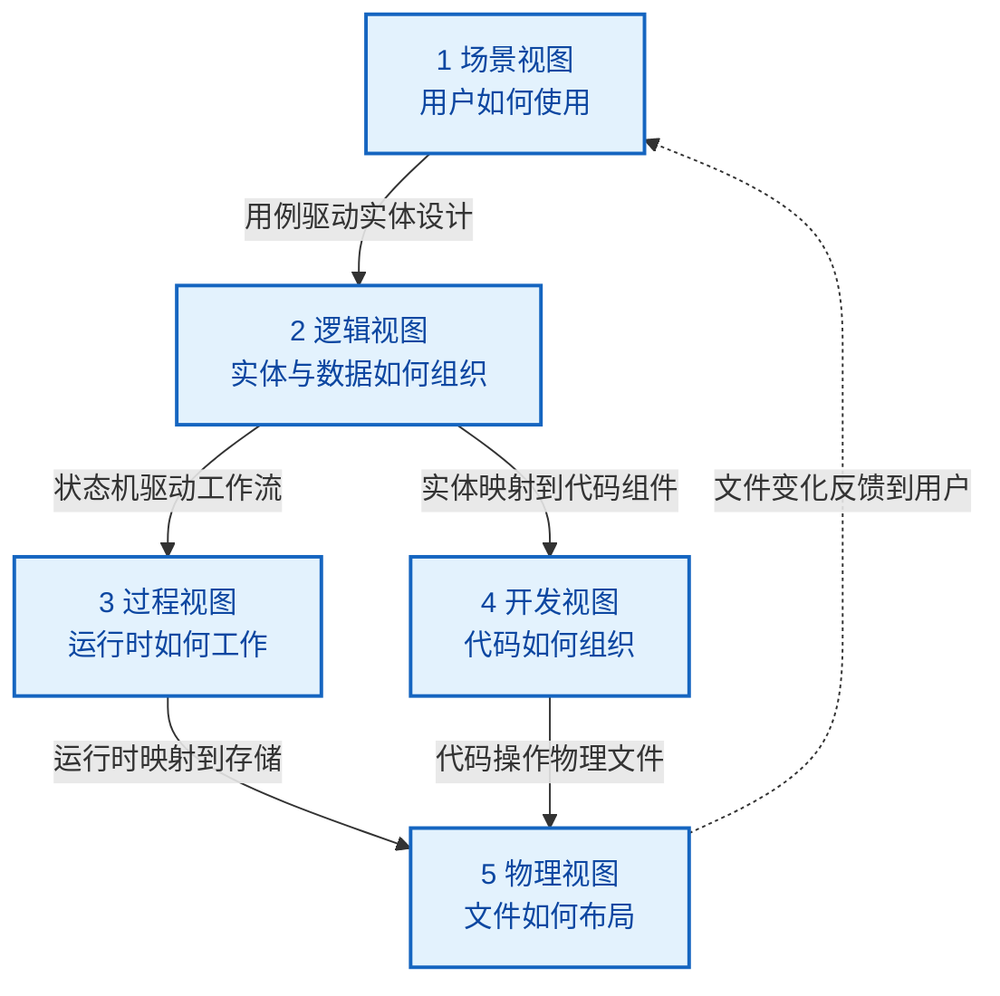

---

## 视图 1：场景视图 (Scenario View)

> 回答：**用户如何使用业务需求阶段的各种能力？**

### 1.1 角色与用例矩阵

devpace 通过 `project.md` 的 `preferred-role` 字段识别角色（缺省 Dev），角色仅影响**追问方向、展示维度、措辞风格**，不改变核心流程。

| 角色 | 典型用例 | 追问侧重 | 展示侧重 |
|------|---------|---------|---------|
| **Biz Owner** | 定义 OBJ、评估 OPP、检查 MoS 达成 | 商业价值、ROI | MoS 进度、营收指标 |
| **PM** | 分解 Epic/BR、精炼需求、规划迭代 | 用户场景、优先级、竞品 | PF 完成度、依赖 |
| **Dev** | 推断代码功能、快速创建 CR | （默认，零改变） | CR 状态、技术复杂度 |
| **Tester** | 补充验收标准、边界条件 | 可测试性、边界 | 验收标准数、Gate 2 |
| **Ops** | 评估运维影响、部署需求 | 运维影响、基础设施 | Release 状态 |

**权威源**：`knowledge/role-adaptations.md`

### 1.2 核心用户旅程

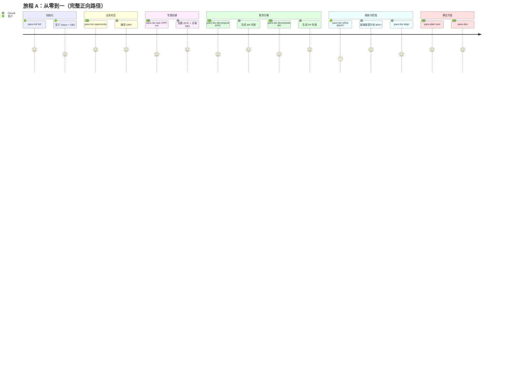

**五条用户旅程速查**：

| 旅程 | 路径 | 适用场景 |
|------|------|---------|
| **A 从零到一** | `init full -> opportunity -> epic -> decompose -> refine -> align -> /pace-plan` | 全新项目，从战略到执行 |
| **B 探索发现** | `discover（多轮对话）-> decompose -> /pace-plan` | 模糊想法，需要头脑风暴 |
| **C 文档导入** | `import <文档> -> align -> /pace-plan` | 已有 PRD/会议纪要 |
| **D 代码反推** | `infer -> align -> /pace-dev` | 已有代码库，补充追踪 |
| **E 快速注入** | `/pace-change add`（跳过 OPP/Epic） | 日常零散需求 |

### 1.3 空参数智能引导

当用户无参数调用 `/pace-biz` 时，系统基于项目状态自动推荐（阶段名不输出给用户）：

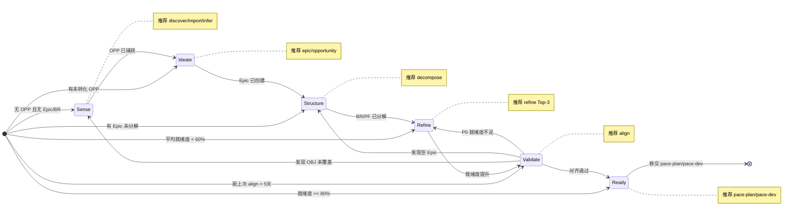

**信号驱动**：S16（Epic 需分解）、S17（未评估 OPP）、S18（功能树稀疏）、S19（范围未定义）——定义在 `knowledge/_signals/signal-priority.md`。

### 1.4 关键设计决策

| 决策 | 选择 | WHY |
|------|------|-----|
| 10 子命令统一入口 | 单 Skill 多子命令 | 降低认知负担（一个命令），利用空参数引导自动推荐 |
| 空参数不报错 | 生命周期感知推荐 | P1 零摩擦——用户不需要知道"应该做什么" |
| 5 角色正交适配 | 角色仅影响输出层 | 单一代码路径 + 输出层适配，避免 5 倍维护成本 |

---

## 视图 2：逻辑视图 (Logical View)

> 回答：**实体、关系、状态机、数据流如何组织？**

### 2.1 实体关系模型

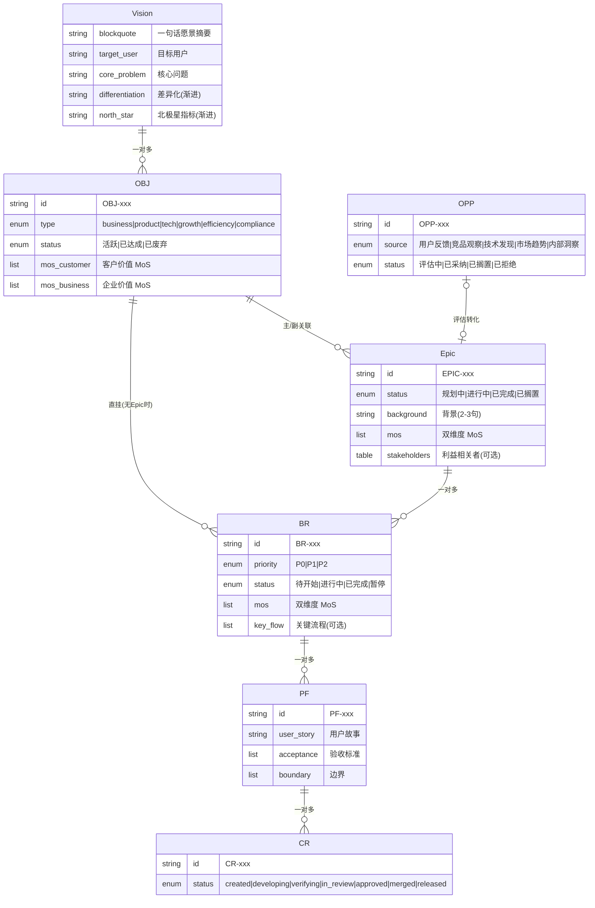

### 2.2 三种文件存在模式

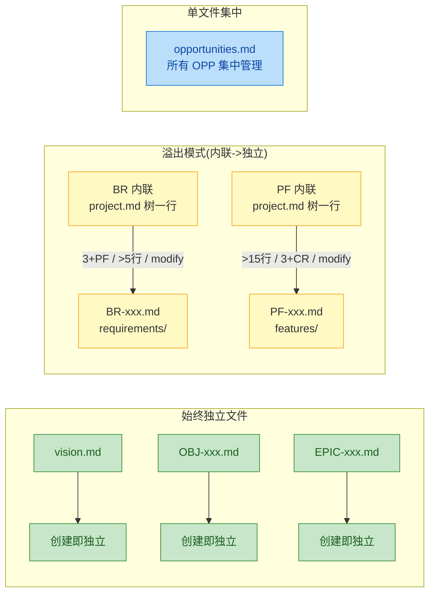

**溢出是单向不可逆的**——一旦溢出不回退。`project.md` 价值功能树始终是统一入口。

### 2.3 状态机集合

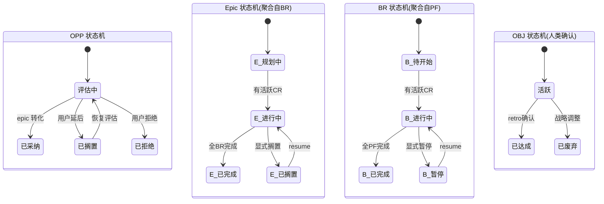

**自底向上聚合链**：

```
CR 状态 (Gate/手动)
  |  全merged→完成; 有developing→进行中; 全paused→暂停
  v
PF 状态 = f(关联 CR)
  |  同规则
  v
BR 状态 = f(关联 PF)
  |  同规则
  v
Epic 状态 = f(关联 BR)
  |  人类确认
  v
OBJ 状态 (/pace-retro 建议 + 人类确认)
```

### 2.4 渐进丰富模型

```mermaid
flowchart TD
    classDef trigger fill:#E8F5E9,stroke:#4CAF50,color:#1B5E20
    classDef entity fill:#FFF9C4,stroke:#F9A825,color:#333

    INIT["pace-init\n创建桩"] --> PM["project.md\n(桩状态)"]
    INIT --> VM["vision.md\n(桩状态)"]

    FULL["pace-init full\n阶段2"] --> VM2["vision.md\n核心四要素"]
    FULL --> OBJ["OBJ-xxx.md\n类型+MoS"]
    FULL --> OPP_E["opportunities.md\n空文件"]

    BIZ_OPP["pace-biz\nopportunity"] --> OPP_F["opportunities.md\n+OPP条目"]
    BIZ_EPIC["pace-biz\nepic"] --> EPIC_F["EPIC-xxx.md\n背景+MoS"]
    BIZ_EPIC --> PM2["project.md\n+Epic链接"]

    DEC_E["pace-biz\ndecompose EPIC"] --> PM3["project.md\n+BR行"]
    DEC_B["pace-biz\ndecompose BR"] --> PM4["project.md\n+PF行"]

    REF["pace-biz\nrefine"] --> PM5["project.md/BR/PF\n验收标准+边界+故事"]

    RETRO["pace-retro"] --> VM3["vision.md\n北极星当前值"]
    RETRO --> OBJ2["OBJ-xxx.md\nMoS进度"]

    class INIT,FULL,BIZ_OPP,BIZ_EPIC,DEC_E,DEC_B,REF,RETRO trigger
    class PM,VM,VM2,OBJ,OPP_E,OPP_F,EPIC_F,PM2,PM3,PM4,PM5,VM3,OBJ2 entity
```

**MoS 双维度贯穿三层**：

| 层级 | MoS 粒度 | 示例 | 评估时机 |
|------|---------|------|---------|
| OBJ | 战略级 | 月活 MAU、订阅收入 | /pace-retro |
| Epic | 专题级 | 注册转化率、支持成本 | /pace-retro |
| BR | 业务结果 | 登录成功率 > 95% | /pace-retro |
| PF | **非 MoS**，是验收标准 | 邮箱+密码，>=8位 | Gate 2 |

### 2.5 就绪度评分模型

6 维度加权评分（权威源：`knowledge/_schema/auxiliary/readiness-score.md`）：

| 维度 | BR 权重 | PF 权重 | 达标条件 |
|------|:-------:|:-------:|---------|
| 用户故事/描述 | 20% | 25% | 非空且 >10 字 |
| 验收标准 | 25% | 30% | >= 2 条 |
| 优先级 | 15% | 15% | 已评估（非"--"） |
| 上游关联 | 15% | 10% | 有 Epic/OBJ 关联 |
| 异常/边界 | 15% | 10% | 有异常或边界描述 |
| NFR 考量 | 10% | 10% | 有非功能需求 |

**四档成熟度标签**：骨架级(0-20%) / 基本级(21-59%) / 详细级(60-79%) / 就绪级(>=80%)

### 2.6 关键设计决策

| 决策 | 选择 | WHY |
|------|------|-----|
| 溢出模式 | BR/PF 内联→阈值触发→独立文件 | 小项目避免过度文件化，大项目自然成长 |
| 状态自底向上聚合 | 上层状态由下层推算 | 消除状态不一致，减轻人工维护 |
| OBJ 仅 3 态 | 活跃/已达成/已废弃 | 战略级无"暂停"——等价于优先级调整 |
| MoS 双维度贯穿三层 | 客户价值+企业价值 | 从战略到执行保持价值视角一致 |
| OPP 段落式非表格 | 二级标题+列表字段 | 来源详情变长，表格无法承载 |

---

## 视图 3：过程视图 (Process View)

> 回答：**运行时工作流、事件驱动、跨会话恢复如何工作？**

### 3.1 子命令执行流水线

以 `decompose EPIC` 为例展示完整时序（其他子命令结构类似）：

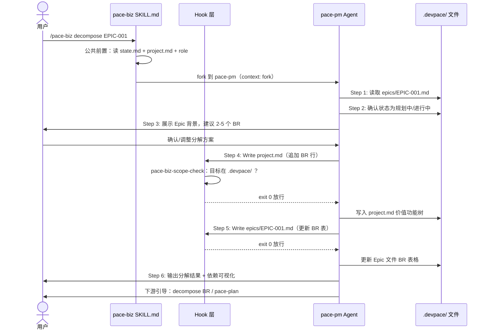

**子命令读写矩阵**（摘要）：

| 子命令 | 读取 | 写入 |
|--------|------|------|
| opportunity | project.md, opportunities.md | opportunities.md |
| epic | opportunities.md, project.md | epics/, project.md, opportunities.md |
| decompose EPIC | epics/, project.md | project.md, epics/ |
| decompose BR | requirements/, project.md | project.md, requirements/ |
| refine | project.md, requirements/ | project.md, requirements/ |
| discover | state.md, project.md, opportunities.md | 全链路 + scope-discovery.md |
| import | project.md, insights.md | project.md, epics/, requirements/ |
| infer | project.md, src/ | project.md |
| align | project.md, epics/, requirements/, opportunities.md | metrics/insights.md |
| view | project.md, epics/, requirements/, opportunities.md | **无（只读）** |

### 3.2 事件驱动守护机制

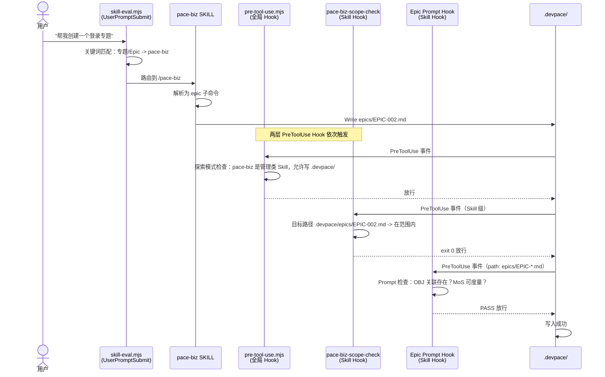

**四层 Hook 守护总览**：

| 层级 | Hook | 触发事件 | 守护内容 |
|------|------|---------|---------|
| 全局路由 | skill-eval.mjs | UserPromptSubmit | 关键词 -> Skill 映射 |
| 全局守护 | pre-tool-use.mjs | PreToolUse | 探索模式 IR-1 保护 |
| Skill 范围 | pace-biz-scope-check.mjs | PreToolUse(Write/Edit) | 仅允许写 .devpace/ |
| Skill 质量 | Epic Prompt Hook | PreToolUse(Write EPIC-*.md) | OBJ 关联 + MoS 可度量 |

### 3.3 跨会话恢复机制

discover 子命令是唯一有跨会话中间态的子命令：

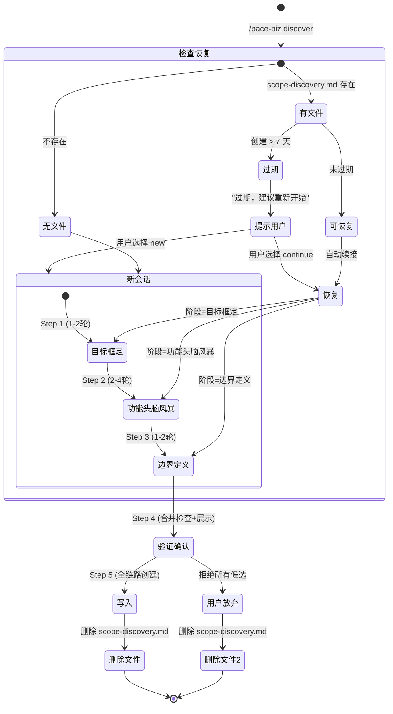

**恢复机制**：`scope-discovery.md` 的 `## 阶段：xxx` 标记是唯一恢复标识。格式定义见 `knowledge/_schema/process/scope-discovery-format.md`。

### 3.4 子命令间协作模式

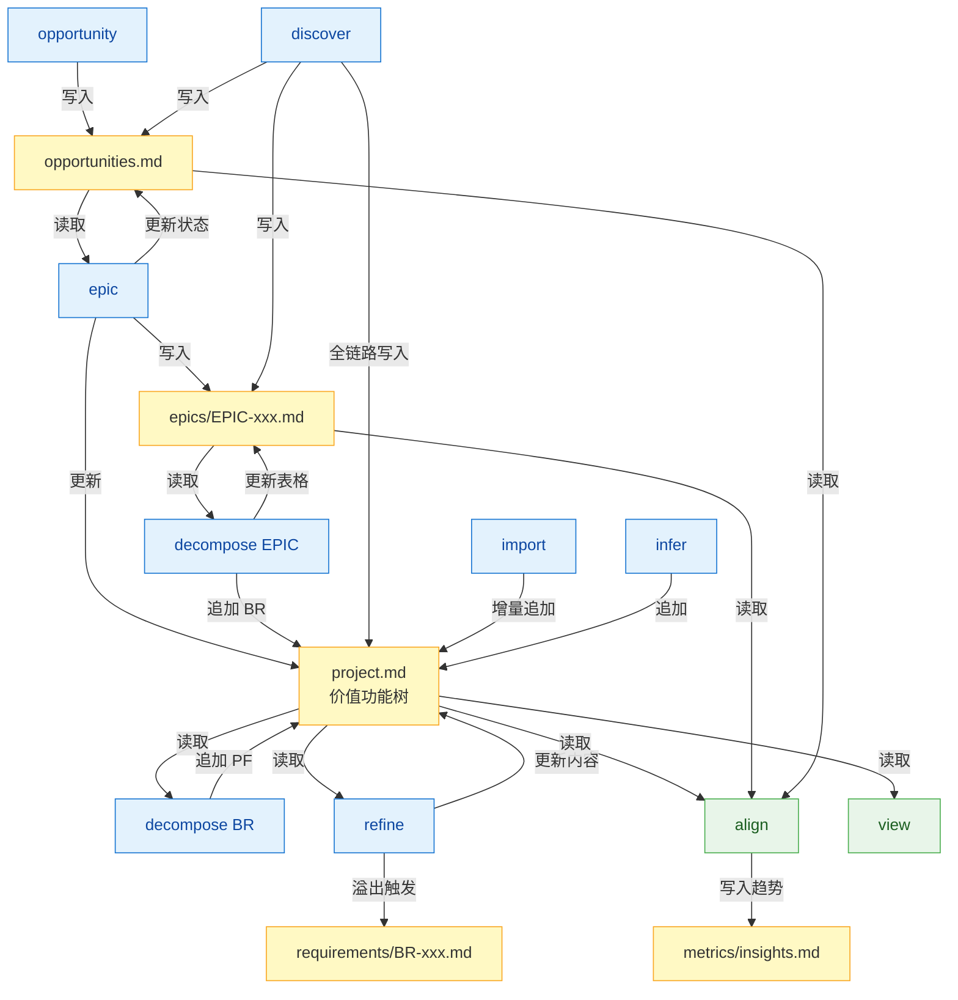

**核心协作原则**：子命令间**不直接调用**对方 procedures——通过 Schema 约束的 `.devpace/` 文件间接协作（IA-10 契约隔离）。

### 3.5 fork Agent 执行模型

pace-biz 通过 `context: fork` + `agent: pace-pm` 路由到产品经理 Agent：

| 属性 | 值 |
|------|-----|
| Agent | pace-pm |
| Model | sonnet（Agent 定义）/ opus（SKILL.md 覆盖） |
| 工具 | Read, Write, Edit, Glob, Grep, Bash, AskUserQuestion |
| 记忆 | project 级跨会话记忆 |
| 决策模式 | 分析+建议+确认后执行（不自主决策） |
| 沟通风格 | 业务语言，"建议 [行动] 因为 [原因]" 收尾 |
| 降级 | fork 不可用时 inline 静默回退（rules 13.5） |

### 3.6 关键设计决策

| 决策 | 选择 | WHY |
|------|------|-----|
| Skill 专属 Hook | scope-check 仅 pace-biz 上下文触发 | pace-biz 不应改源码，pace-dev 需要。Skill 级避免误拦截 |
| discover 中间态文件 | scope-discovery.md 持久化 | 多轮对话跨会话恢复；7 天过期防僵尸 |
| Epic Prompt Hook | 让 Claude 自行检查修复 | Command Hook 只能阻断；Prompt Hook 可给修复建议 |
| 子命令不直接调用 | Schema 中介 + 信号推荐 | IA-10 契约隔离——独立演进 |

---

## 视图 4：开发视图 (Development View)

> 回答：**代码如何组织？模块间依赖关系？**

### 4.1 组件分层图

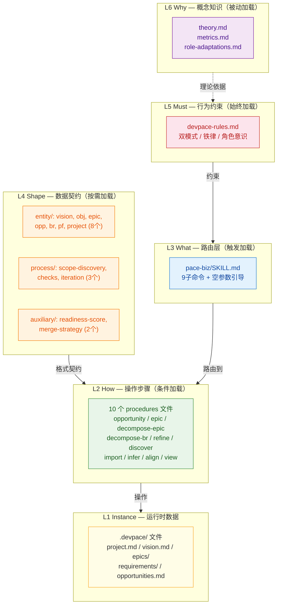

**依赖方向严格从下层指向上层**：L2 引用 L4 合法；L4 引用 L2 禁止。

### 4.2 文件依赖矩阵

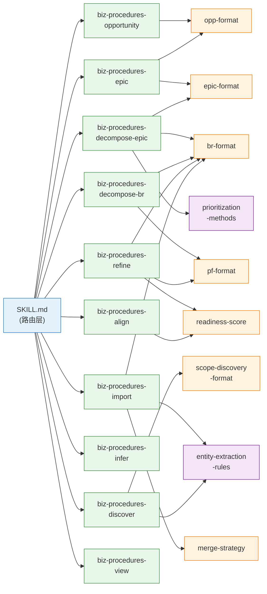

**禁止依赖方向**：
- Schema 不引用 Skill/Rules（`grep -r "skills/\|rules/" knowledge/_schema/` 应为空）
- 跨 Skill procedures 不互相引用（`grep -rn "skills/pace-" skills/ --include="*-procedures*.md"` 应为空）

### 4.3 procedures 结构规范

标准章节顺序（源：`plugin-spec.md` 分拆模式）：

| 序号 | 章节 | 必须 | 说明 |
|------|------|:----:|------|
| 1 | 职责 | 是 | 一句话 blockquote |
| 2 | 触发 | 是 | 命令格式+自然语言触发条件 |
| 3 | 与其他子命令的区别 | 否 | 仅易混淆的子命令需要 |
| 4 | 步骤（Step 0-N） | 是 | Step 0=前置检查，最后=下游引导 |
| 5 | 降级模式 | 否 | .devpace/不存在等场景 |
| 6 | 容错 | 是 | 异常-处理 表格 |

**步骤编写规范**（HE-3 Agent Legibility）：
- 每步可直接执行（"读取 epics/EPIC-xxx.md" 而非"检查 Epic 状态"）
- 条件分支完整（"若 status=developing → A；若 paused → B；其他 → 报错"）
- 引用 Schema 不内联（"格式遵循 `br-format.md` §内联格式"）

### 4.4 Hook 工程结构

| 注册位置 | 生效范围 | pace-biz 相关 Hook |
|---------|---------|-------------------|
| `hooks/hooks.json` | 全局所有 Skill | pre-tool-use.mjs（探索模式保护）、skill-eval.mjs（关键词路由） |
| `SKILL.md` frontmatter `hooks:` | 仅 pace-biz 激活时 | pace-biz-scope-check.mjs（写入范围）、Epic Prompt Hook（质量检查） |

**Hook 输出格式标准**（HE-4）：`devpace:<标签> <状态>。ACTION: <步骤1>；<步骤2>。`

### 4.5 辅助知识层

| 子目录 | 文件 | pace-biz 消费方 |
|--------|------|----------------|
| `_extraction/` | entity-extraction-rules.md | import Step 2、discover Step 2 |
| `_extraction/` | prioritization-methods.md | decompose-epic Step 3 |
| `_signals/` | signal-priority.md (S16-S19) | 空参数引导、pace-next |
| root | role-adaptations.md | 所有子命令公共前置 |
| `_schema/auxiliary/` | readiness-score.md | refine Step 1、align Step 2.8 |
| `_schema/auxiliary/` | merge-strategy.md | import Step 3 |

### 4.6 关键设计决策

| 决策 | 选择 | WHY |
|------|------|-----|
| 10 文件分拆 | SKILL.md 路由 + procedures 执行 | IA-2 路由与步骤分离；SKILL.md <200 行保持可扫描 |
| project-format 549 行 | 价值功能树+溢出+渐进丰富 | 高 fan-in 枢纽（10 Skill 引用），承载统一入口契约 |
| 优先级方法论独立 | `_extraction/prioritization-methods.md` | decompose Epic 和 BR 共用；IA-6 单一权威 |
| 提取规则独立 | `_extraction/entity-extraction-rules.md` | init --from 和 import 共用；避免双源头 |

---

## 视图 5：物理视图 (Physical View)

> 回答：**.devpace/ 文件如何布局？加载策略？存储格式？**

### 5.1 .devpace/ 文件系统布局

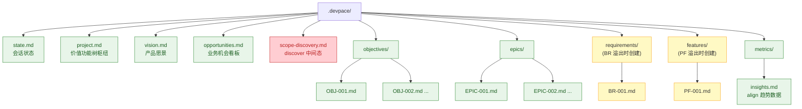

**图例**：绿色=持久文件 | 红色=临时文件（完成后删除） | 黄色=按需创建（溢出触发）

### 5.2 文件加载策略

| 策略 | 文件 | 加载时机 |
|------|------|---------|
| **始终加载** | state.md | 每次会话开始 |
| **公共前置** | state.md + project.md | 所有子命令 Step 0 |
| **按子命令** | 见 3.1 读写矩阵 | 路由后按需读取 |
| **按引用** | Schema 文件 | procedures 引用时读取 |
| **延迟** | epics/*、requirements/* | 仅操作特定实体时 |

**上下文预算**：description < 300 字符，SKILL.md < 500 行，单次执行加载 < 800 行

### 5.3 文件写入权限矩阵

| 文件 | 主写入者 | 辅助写入者 | 只读消费者 |
|------|---------|-----------|-----------|
| opportunities.md | opportunity | discover, epic(状态更新) | view, align |
| epics/EPIC-xxx.md | epic | decompose-epic, discover | view, align |
| project.md 树 | decompose, import, infer | epic, discover | view, align, refine |
| requirements/BR-xxx.md | refine(溢出) | import | align |
| features/PF-xxx.md | — (pace-dev 溢出) | — | view |
| scope-discovery.md | **discover(唯一)** | — | — |
| metrics/insights.md | **align(唯一)** | — | pace-retro |

**Single Writer 原则**：scope-discovery.md 和 insights.md align 趋势段各有唯一写入者，防止并发冲突。

### 5.4 数据格式与向后兼容

**格式约束**：Markdown 是唯一格式。消费者是 LLM + 人类，不使用 YAML/JSON。

**溯源标记**：`<!-- source: claude, [operation-name] -->` / `<!-- source: user -->`。日常不可见，/pace-trace 时展示。

**向后兼容矩阵**：

| 场景 | 行为 |
|------|------|
| 无 objectives/ | project.md 保持原有内联 `### OBJ-N` 格式 |
| 无 epics/ | BR 直挂 OBJ |
| MoS 无维度标签 | 简单 checkbox 列表仍合法 |
| 旧格式"成功标准"章节名 | 仍可识别（br-format） |

**容错统一模式**：文件丢失→重建 | 目录不存在→自动创建 | 不一致→以独立文件为准 | 字段缺失→渐进填充

### 5.5 关键设计决策

| 决策 | 选择 | WHY |
|------|------|-----|
| Markdown 唯一 | 不用 YAML/JSON | LLM + 人类双可读；渲染即文档 |
| project.md 枢纽 | 价值功能树集中 | 一文件纵览全局，避免 20+ 文件散落 |
| HTML 注释溯源 | `<!-- source: ... -->` | P2 渐进暴露——日常不可见，深查时才展示 |
| scope-discovery 完成即删 | 不归档中间态 | 最终产出已写入正式文件；保留只增噪声 |

---

## 附录 A：跨视图一致性追踪矩阵

| 场景视图(用户旅程) | 逻辑视图(实体变化) | 过程视图(触发步骤) | 开发视图(代码文件) | 物理视图(存储文件) |
|-------------------|-------------------|-------------------|-------------------|-------------------|
| 旅程A: opportunity | OPP 创建(评估中) | opportunity Step 3 | biz-procedures-opportunity.md | opportunities.md |
| 旅程A: epic | Epic 创建(规划中), OPP→已采纳 | epic Step 5-7 | biz-procedures-epic.md | epics/EPIC-xxx.md, project.md |
| 旅程A: decompose EPIC | BR 创建(待开始) | decompose-epic Step 4-5 | biz-procedures-decompose-epic.md | project.md 树, epics/ |
| 旅程A: decompose BR | PF 创建(待开始) | decompose-br Step 4 | biz-procedures-decompose-br.md | project.md 树 |
| 旅程A: refine | BR/PF 就绪度提升 | refine Step 2-3 | biz-procedures-refine.md | project.md, requirements/ |
| 旅程A: align | 无实体变化(分析) | align Step 2(9维度) | biz-procedures-align.md | metrics/insights.md |
| 旅程B: discover | OPP+Epic+BR+PF 批量创建 | discover Step 1-5 | biz-procedures-discover.md | 全链路 + scope-discovery.md(临时) |
| 旅程C: import | BR+PF 增量追加 | import Step 2-5 | biz-procedures-import.md | project.md, epics/, requirements/ |
| 旅程D: infer | PF+技术债务追加 | infer Step 1-5 | biz-procedures-infer.md | project.md |

## 附录 B：与现有分析报告的关系

| 报告 | 定位 | 本文档增量价值 |
|------|------|---------------|
| `biz-schema-analysis-2026-03-28.md` | Schema 层设计模式分析 | 本文档将 Schema 放入逻辑视图和物理视图的更大架构上下文中 |
| `biz-stage-full-analysis-2026-03-28.md` | 执行流程线性描述 | 本文档增加事件驱动、跨会话恢复、Hook 守护、分层架构等维度 |
| **本文档** | 架构设计文档（5视图） | 提供多角色可导航的结构化视角；14 张 Mermaid 图飞书可渲染 |
