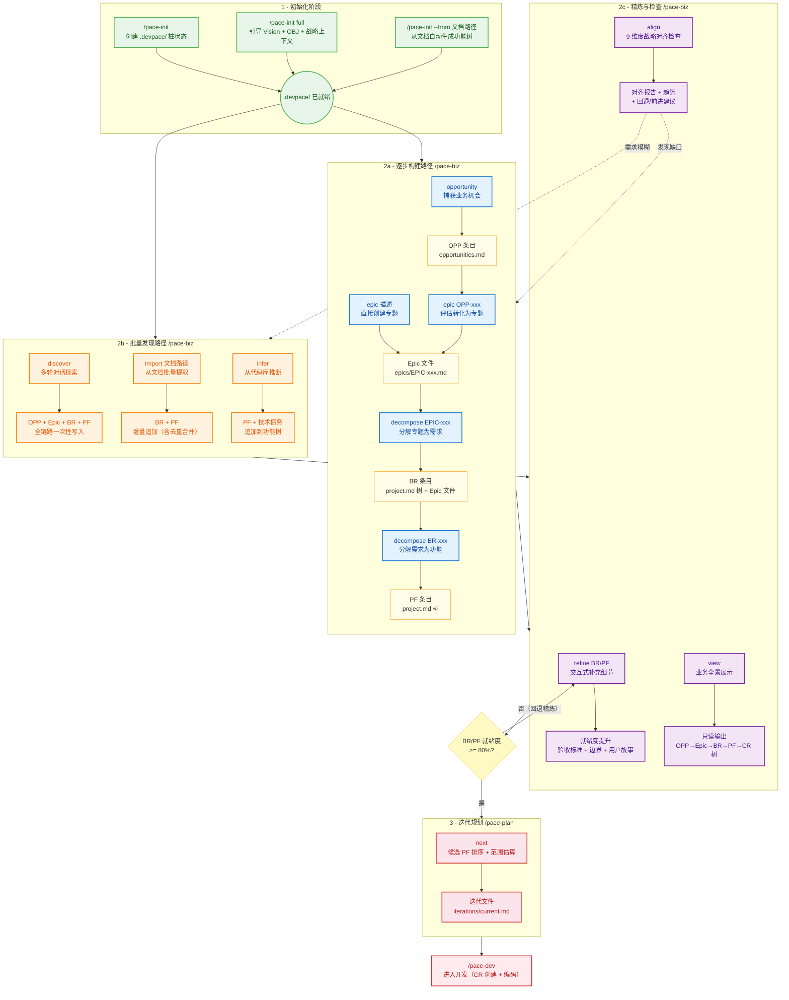

# devpace 产品层——业务需求阶段完整执行流程分析

> 分析日期：2026-03-28
> 范围：Schema（entity/ 8 个 + process/auxiliary 辅助）、Skill（pace-biz 10 个子命令 + pace-init full + pace-plan）、Procedures、Hooks、Knowledge 辅助层

---

## 一、业务需求阶段全景架构

### 1.1 价值链与 Skill 映射

#### 价值链实体关系

devpace 的业务需求阶段围绕 6 个核心实体展开，形成自上而下的价值交付链：

```
Vision                  产品愿景（目标用户 + 核心问题 + 差异化 + 成功图景）
  │
  ├── OBJ-001           业务目标（类型 + 双维度 MoS + 状态）
  │     │
  │     ├── EPIC-001    专题（背景 + MoS + 利益相关者）
  │     │     │
  │     │     ├── BR-001   业务需求（优先级 + 验收标准 + 业务上下文）
  │     │     │     ├── PF-001  产品功能（用户故事 + 验收标准 + 边界）
  │     │     │     └── PF-002  产品功能
  │     │     │
  │     │     └── BR-002   业务需求
  │     │           └── PF-003  产品功能
  │     │
  │     └── EPIC-002    专题
  │           └── ...
  │
  └── OBJ-002           业务目标
        └── ...

  OPP-001 ──(评估)──► EPIC-001     业务机会（独立看板，转化后关联 Epic）
  OPP-002 ──(搁置)                  业务机会
```

**层级关系说明**：
- **Vision → OBJ**：一对多。一个愿景下可有多个业务目标
- **OBJ → Epic**：一对多，支持主/副关联。Epic 也可跳过直接创建
- **Epic → BR**：一对多。BR 也可直接挂在 OBJ 下（无 Epic 时向后兼容）
- **BR → PF**：一对多。PF 是最终进入开发的最小可交付单元
- **OPP → Epic**：可选路径。Opportunity 评估通过后转化为 Epic

#### 实体创建的 Skill 映射

每个实体由特定的 Skill/子命令创建，下表展示"谁创建谁"：

| 实体 | 主要创建者 | 创建方式 | 备选创建路径 |
|------|-----------|---------|-------------|
| **Vision** | `/pace-init full` 阶段 2a | 引导填充核心四要素 | `/pace-biz` 讨论时触发迁移 |
| **OBJ** | `/pace-init full` 阶段 2c | 从项目描述推断 | `/pace-biz discover` Step 5 |
| **OPP** | `/pace-biz opportunity` | 从用户输入捕获 | `/pace-biz discover` Step 5 |
| **Epic** | `/pace-biz epic` | 从 OPP 转化或直接创建 | `/pace-biz discover` Step 5 |
| **BR** | `/pace-biz decompose EPIC` | 分解 Epic 为 2-5 个 BR | `/pace-biz discover/import/infer` |
| **PF** | `/pace-biz decompose BR` | 分解 BR 为 1-3 个 PF | `/pace-biz discover/import/infer` |

#### 业务阶段完整 Skill 流转图

> **飞书使用方法**：在飞书文档中插入「代码块」，语言选择 `mermaid`，粘贴以下代码即可渲染为交互式流程图。



**流程图阅读指南**：

| 颜色 | 阶段 | 说明 |
|------|------|------|
| 绿色 | 初始化 | /pace-init 三种模式，产出 .devpace/ 目录 |
| 蓝色 | 逐步构建 | opportunity → epic → decompose，正向价值链构建 |
| 橙色 | 批量发现 | discover/import/infer，三种批量需求注入路径 |
| 紫色 | 精炼检查 | refine 提升就绪度，align 检查对齐，view 只读查看 |
| 粉色 | 迭代规划 | /pace-plan next，将就绪 PF 纳入迭代 |
| 红色 | 开发 | /pace-dev，进入 CR 创建和编码 |
| 黄色 | 实体/判断 | 产出的实体文件和就绪度判断节点 |

**关键回路**：
- **精炼回路**：就绪度不足 → refine → 重新检查就绪度
- **缺口回退**：align 发现 OBJ 未覆盖/空 Epic → 回退到逐步构建路径补充
- **模糊回退**：align 发现需求模糊/功能树稀疏 → 回退到批量发现路径探索

#### 推荐使用路径速查

| 场景 | 推荐路径 | 说明 |
|------|---------|------|
| 从零开始 | `opportunity → epic → decompose → /pace-dev` | 完整正向业务路径 |
| 模糊想法探索 | `discover → decompose → /pace-plan next` | 交互式全链路发现 |
| 已有文档 | `import <文档> → align → /pace-plan next` | 从 PRD/会议纪要导入 |
| 已有代码 | `infer → align → /pace-dev` | 反向推断未追踪功能 |
| 快速注入需求 | `/pace-change add`（跳过 OPP/Epic） | 日常零散需求快速路径 |
| 直接创建专题 | `epic <描述>`（跳过 OPP） | 不需要机会评估时 |
| 战略检查 | `align` | 只读分析，定期执行 |
| 了解全貌 | `view` | 只读展示 OPP→Epic→BR→PF→CR |

### 1.2 子命令分类

| 类别 | 子命令 | 产出 | 写入文件 |
|------|--------|------|---------|
| **创建型** | opportunity | OPP 条目 | opportunities.md |
| **创建型** | epic | EPIC 独立文件 | epics/EPIC-xxx.md, project.md, opportunities.md |
| **创建型** | decompose EPIC | BR 条目 | project.md 树, epics/EPIC-xxx.md |
| **创建型** | decompose BR | PF 条目 | project.md 树, requirements/BR-xxx.md |
| **精炼型** | refine | BR/PF 内容深化 | project.md, requirements/BR-xxx.md |
| **发现型** | discover | OPP+Epic+BR+PF 候选树 | 全链路写入 |
| **发现型** | import | 从文档提取实体 | project.md, epics/, requirements/ |
| **发现型** | infer | 从代码推断功能 | project.md |
| **分析型** | align | 对齐报告+趋势 | metrics/insights.md（唯一写入） |
| **分析型** | view | 全景展示 | 无（只读） |

### 1.3 公共前置流程

所有子命令执行前的统一步骤：

```
1. 读取 state.md + project.md 确认项目上下文
2. 确认 .devpace/ 已初始化（否→引导 /pace-init）
3. 读取 project.md 配置的 preferred-role（缺省=Dev）
4. 按子命令路由到对应 procedures 文件
```

---

## 二、Schema 层详解

### 2.1 实体 Schema 总览

| Schema | 文件模式 | 状态机 | 创建者 | 主要消费者 |
|--------|---------|--------|--------|-----------|
| vision-format | 单文件 vision.md | 无（质量维度） | pace-init, pace-biz | pace-biz, pace-retro |
| obj-format | 独立文件 OBJ-xxx.md | 3态：活跃/已达成/已废弃 | pace-init, pace-biz | pace-biz, pace-init |
| epic-format | 独立文件 EPIC-xxx.md | 4态：规划中/进行中/已完成/已搁置 | pace-biz epic | pace-biz |
| opportunity-format | 单文件 opportunities.md | 4态：评估中/已采纳/已搁置/已拒绝 | pace-biz opportunity | pace-biz |
| br-format | 溢出模式（内联→独立） | 4态：待开始/进行中/已完成/暂停 | pace-biz decompose | pace-dev, pace-biz |
| pf-format | 溢出模式（内联→独立） | 5态：待开始/进行中/全部完成/已发布/暂停 | pace-biz decompose | pace-dev, pace-biz |

### 2.2 辅助 Schema

| Schema | 目录 | 用途 | 消费者 |
|--------|------|------|--------|
| scope-discovery-format | process/ | discover 跨会话中间状态 | pace-biz discover |
| readiness-score | auxiliary/ | BR/PF 就绪度评分（6维度） | pace-biz refine, align |
| merge-strategy | auxiliary/ | import 合并相似度阈值 | pace-biz import |

### 2.3 状态自底向上聚合链

```
CR 状态（手动/Gate触发）
  ↑ 聚合规则：全 merged→完成; 有 developing→进行中; 全 paused→暂停
PF 状态 = f(关联 CR)
  ↑ 聚合规则：全 PF 完成→已完成; 有活跃→进行中; 全待开始→规划中; 全暂停→已搁置
BR 状态 = f(关联 PF)
  ↑ 聚合规则同上
Epic 状态 = f(关联 BR)
  ↑ 人类确认
OBJ 状态（/pace-retro 建议，人类确认）
```

### 2.4 溢出机制

BR 和 PF 采用溢出模式——初始在 project.md 内联，达到阈值后溢出为独立文件：

| 实体 | 溢出条件（任一满足） | 溢出后 project.md 行为 |
|------|-------------------|----------------------|
| BR | 关联 3+ PF / 业务上下文 >5 行 / 经历 /pace-change modify | 树视图行改为链接 `[BR-xxx](requirements/BR-xxx.md)` |
| PF | 功能规格 >15 行 / 关联 3+ CR / 经历 /pace-change modify | 树视图行追加 `→ [详情](features/PF-xxx.md)` |

溢出是**单向不可逆**的。project.md 树视图始终是入口。

---

## 三、十个子命令详细执行流程

### 3.1 opportunity — 捕获业务机会

```
Step 1: 解析来源类型（关键词→5种来源类型映射）
Step 2: 生成 OPP 编号（扫描 opportunities.md 最大编号+1）
Step 3: 预览确认 → 写入 opportunities.md 末尾
Step 4: 输出确认 + 引导 → /pace-biz epic OPP-xxx
```

**Schema 依赖**：opportunity-format（段落式，非表格）
**写入文件**：opportunities.md（单文件集中）
**创建初始值**：状态=评估中，日期=当天

### 3.2 epic — 创建专题

```
Step 1: 确定来源（有 OPP-xxx→转化模式; 无→直接创建）
Step 2: 确定 OBJ 关联（1个→自动; 多个→询问; 无→引导 /pace-init full）
Step 3: 引导定义内容（名称 + 背景 + MoS 双维度可选）
Step 4: 生成 EPIC 编号（扫描 epics/ 最大编号+1）
Step 5: 预览确认 → 创建 epics/EPIC-xxx.md
Step 6: 更新 project.md 价值功能树（OBJ 下追加 Epic 链接行）
Step 7: 更新 opportunities.md（OPP 状态→已采纳 → EPIC-xxx）
Step 8: 输出确认 + 引导 → /pace-biz decompose EPIC-xxx
```

**Schema 依赖**：epic-format, opportunity-format, obj-format
**Hook 守护**：prompt Hook 检查 Epic 文件——OBJ 关联是否存在 + MoS 是否可度量
**创建初始值**：状态=规划中, 来源=OPP-xxx(如有), 时间框架=空, MoS=占位或用户提供, 利益相关者=空表头, BR 表=空表

### 3.3 decompose EPIC → BR

```
Step 1: 确认参数为 EPIC-xxx（无参→列出可分解 Epic）
Step 2: 读取 Epic 信息（确认状态为规划中/进行中）
Step 3: 引导需求分解:
        3a. Claude 建议 2-5 个 BR（名称+描述+初始验收标准 2-3 条）
        3b. 优先级评估（默认 Value×Effort，可 --moscow/--kano）
        3c. 依赖关系识别（BR 间依赖，记入 Epic 文件）
        3d. 利益相关者关联（可选，Epic 有利益相关者段时触发）
        3e. 角色追加考量（Biz→商业价值; Dev→NFR; Tester→验收标准）
        3f. 用户确认/调整
Step 4: 创建 BR 条目（project.md 树 + 编号自增）
Step 5: 更新 Epic 文件 BR 表格 + 初始验收标准段
Step 6: 输出分解结果（含依赖可视化 + 建议实施顺序）
```

**Schema 依赖**：epic-format, br-format
**Knowledge 依赖**：prioritization-methods.md（3种优先级方法）, role-adaptations.md
**特殊逻辑**：依赖关系拓扑排序输出建议实施顺序；Epic 状态不因分解而变化

### 3.4 decompose BR → PF

```
Step 1: 确认参数为 BR-xxx（无参→列出可分解 BR）
Step 2: 读取 BR 信息 + 关联 Epic/OBJ 上下文
Step 3: 引导功能分解:
        3a. Claude 建议 1-3 个 PF（名称+用户故事）
        3b. 优先级继承与微调（核心路径可提升，锦上添花可降级）
        3c. 角色适配（Dev→复杂度; Tester→边界条件）
        3d. PF 级不建模依赖（CR 层管理）
        3e. 用户确认/调整
Step 4: 创建 PF 条目（project.md 树 + 编号自增）
Step 5: 更新 BR 溢出文件 PF 列表（如有）
Step 6: 输出分解结果（含价值链追溯）
```

**Schema 依赖**：br-format, pf-format
**设计决策**：PF 级不建模依赖——执行顺序由 CR 层 /pace-dev 管理

### 3.5 refine — 精炼已有 BR/PF

```
Step 1: 定位实体 + 展示就绪度评分（6维度雷达）
        显示格式: [就绪度 N%·成熟度标签] + 各维度 ✓/✗
Step 2: 精炼引导（仅提问缺失维度，每轮 2-3 问）:
        BR: 验收标准/业务规则/异常场景/用户故事/NFR/关键流程
        PF: 边界条件/输入输出/错误处理/安全约束/可测试性
Step 3: 预览确认 → 写入更新（含溢出触发检查）
Step 4: 输出就绪度变化 + 动态推荐（含反馈循环检测）
```

**Schema 依赖**：br-format, pf-format, readiness-score
**反馈循环检测**：
- "太大了/应该拆分" → 回退建议 decompose
- "方向不对" → 回退建议 discover/align
- 多维度"不确定" → 建议 view 了解全景或稍后再来

### 3.6 discover — 交互式需求发现

```
Step 0: 上下文加载 + 智能路由:
        - 检测文件路径 → 建议 import
        - 检测代码关键词 → 建议 infer
        - 空项目 → 引导 /pace-init full
        - 检查 scope-discovery.md → 恢复/新建会话
Step 1: 目标框定（1-2轮）:
        - 核心意图提取
        - 需求信号分层（L1基础→L2理解→L3行动）
        - 产出: OBJ 候选 + 用户画像 + 利益相关者候选
        → 持久化到 scope-discovery.md（阶段：目标框定）
Step 2: 功能头脑风暴（2-4轮）:
        - 必做: 核心能力 + 场景延伸
        - 按需: 边界探索 + 差异化
        - 实时整理为 BR→PF 候选分组
        - 模式识别辅助（entity-extraction-rules.md）
        → 持久化到 scope-discovery.md（阶段：功能头脑风暴）
Step 3: 边界定义（1-2轮）:
        - "不做什么？" + "技术/时间约束？"
        → 持久化到 scope-discovery.md（阶段：边界定义）
Step 4: 验证与确认:
        4a. 轻量合并检查（与已有实体去重，重叠>70%标注）
        4b. 展示结构化候选价值链树
        → 用户调整/确认
Step 5: 写入 .devpace/:
        OBJ→OPP→Epic→BR→PF 全链路创建 + 范围写入
        → 删除 scope-discovery.md
        → git commit
Step 6: 下游引导（基于成熟度分布动态推荐）
```

**Schema 依赖**：scope-discovery-format（过程态）, obj-format, opportunity-format, epic-format, br-format, pf-format
**Knowledge 依赖**：entity-extraction-rules.md, role-adaptations.md
**跨会话恢复**：scope-discovery.md 阶段标记（7天过期）
**降级模式**：.devpace/ 不存在时输出到控制台不写文件

### 3.7 import — 从文档批量导入

```
Step 0: 前置检查 + 加载 insights.md 导入经验
Step 1: 源文件摄入（单文件/目录/多文件）+ 源类型自动检测:
        会议纪要→Action Items | 用户反馈→痛点/请求 | 竞品分析→差距功能
        技术债务→TODO/FIXME | Issue 导出→CSV/JSON | PRD→用户故事/功能列表
Step 2: 实体提取（通用规则 + import 扩展规则）
        参考 entity-extraction-rules.md 映射表
Step 3: 合并分析（两阶段快筛）:
        快筛（关键词重叠率）: <20%→NEW | >80%→DUPLICATE候选
        精判（语义分析）: 20-80%区间
        分类: NEW / DUPLICATE / ENRICHMENT / CONFLICT
Step 4: 用户确认（diff 格式，含来源交叉引用 + 相似度百分比）
Step 5: 执行写入（NEW→追加 | ENRICHMENT→更新 | 触发溢出检查）
Step 6: 下游引导（基于导入结果动态推荐）
```

**Schema 依赖**：br-format, pf-format, merge-strategy
**Knowledge 依赖**：entity-extraction-rules.md（映射表 + PF 粒度判断）, role-adaptations.md
**与 init --from 区别**：import 有合并分析（去重/冲突检测），init --from 从零创建

### 3.8 infer — 从代码库推断

```
Step 0: 前置检查 + git 可用性检测
Step 1: 代码结构分析:
        源码根检测（src/ > app/ > lib/ > 根）
        扫描: 目录结构→模块 | 路由→API PF | 数据模型→BR | UI→PF | CLI→PF
Step 2: 信号挖掘:
        注释信号: TODO/FIXME→技术债务 | HACK/XXX→高优技术债务
        配置信号: package.json scripts / Makefile / README 功能声明
        Git 增强: 热点文件(30天变更频率) / 共变文件(耦合) / 贡献者分布(知识集中度)
Step 3: 差距分析:
        未追踪（代码有，树无）| 未实现（树有，代码无）| 技术债务 | 文档漂移
Step 4: 三段式报告 + 用户逐项选择
Step 5: 写入 .devpace/（未追踪→追加PF; 技术债务→"技术债务"BR 分组; 已放弃→标记状态）
Step 6: 下游引导
```

**Schema 依赖**：pf-format, br-format
**降级模式**：无 Git→跳过热点/共变/贡献者分析；无源码目录→提示指定

### 3.9 align — 战略对齐检查

```
Step 1: 采集数据（project.md + epics/ + requirements/ + opportunities.md）
Step 2: 分析对齐度（9个检查维度）:
        2.1 OBJ 覆盖率（每个 OBJ 是否有 Epic/BR）
        2.2 孤立实体检测（孤立 BR/PF、空 Epic、未处理 OPP）
        2.3 MoS 完整性（OBJ/Epic 级 MoS 定义率）
        2.4 价值链完整性（OBJ→CR 链路连续性）
        2.5 优先级分布健康度（P0:P1:P2 比例，通胀检测）
        2.6 依赖健康度（循环依赖、关键路径、就绪度风险）
        2.7 MoS 达成度（BR 全完成但 MoS 未勾选→异常检测）
        2.8 需求就绪度分布（readiness-score 6 维度 + P0 就绪度）
        2.9 利益相关者覆盖度（可选，有数据时展示）
Step 3: 生成对齐报告（含回退路由决策 + 前进推荐）
Step 4: 历史趋势记录（写入 insights.md）+ 趋势对比
```

**Schema 依赖**：readiness-score, insights-format
**特殊行为**：唯一写入 insights.md 趋势数据的子命令（Single Writer 原则）
**回退路由**：根据问题类型推荐回退到不同阶段（Sense/Structure/Refine/Validate）

### 3.10 view — 业务全景展示

```
Step 1: 采集数据（opportunities.md + epics/ + project.md + state.md）
Step 2: 构建全景视图:
        - 默认模式: OBJ→Epic→BR→PF 层级树
        - 问题优先模式（3+问题实体时自动切换）: 需关注项前置 + 正常折叠
        - 角色适配展示维度
Step 3: 适配项目规模（无Epic→简化; 4+Epic→折叠已完成）
Step 4: 输出（只读，不写入任何文件）
```

**角色适配展示**：
| 角色 | 追加展示 |
|------|---------|
| Biz Owner | Epic MoS 达成进度 |
| PM | BR PF 完成度 + 依赖 |
| Dev | PF CR 状态 + 技术复杂度 |
| Tester | 验收标准数量 + Gate 2 状态 |
| Ops | Release 关联状态 |

---

## 四、Hook 守护层

### 4.1 pace-biz 专属 Hooks

| Hook | 类型 | 触发时机 | 行为 |
|------|------|---------|------|
| pace-biz-scope-check.mjs | command | Write/Edit 操作前 | 检查写入目标是否在 .devpace/ 内，否则 exit 2 阻断 |
| Epic 质量 Prompt Hook | prompt | Write 到 epics/EPIC-*.md 前 | 检查 OBJ 关联存在性 + MoS 可度量性，不合格阻断 |

### 4.2 Hook 输出格式（HE-4 规范）

```
devpace:blocked /pace-biz 写入范围守卫：目标文件 [path] 不在允许范围内。
ACTION: 将写入目标调整到 .devpace/ 目录下；若确需修改非 .devpace/ 文件则退出 /pace-biz 使用 /pace-dev。
```

---

## 五、Knowledge 辅助层

### 5.1 提取规则（_extraction/）

**entity-extraction-rules.md**：
- 文档元素→实体映射表（用户故事→BR, 功能列表→PF 树, API→PF 等）
- PF 粒度判断规则（独立交付→拆分; 同一操作步骤→合并; 默认保守合并）
- API 规格特殊处理（OpenAPI paths→按资源分组为 PF）
- 消费方：pace-init --from, pace-biz import

**prioritization-methods.md**：
- 方法 A（默认）：Value × Effort 矩阵 → P0/P1/P2
- 方法 B：MoSCoW（Must→P0, Should→P1, Could→P2, Won't→不做）
- 方法 C：Kano 模型（基本型→P0, 期望型→P1, 兴奋型→P2）
- 选择条件：BR 候选 >8 个→建议 MoSCoW; Epic 含"用户体验"→建议 Kano

### 5.2 信号路由（_signals/）

signal-priority.md 中与业务阶段相关的信号：

| 信号 | 条件 | 推荐 |
|------|------|------|
| S16 Epic 需分解 | epics/ 有规划中 Epic 且 BR 列表为空 | → /pace-biz decompose |
| S17 未评估机会 | opportunities.md 有评估中 OPP | → /pace-biz epic |
| S18 功能树稀疏 | PF <3 且项目 >7 天 | → /pace-biz discover/import |
| S19 范围未定义 | project.md 范围 section 为桩 | → /pace-biz discover |

### 5.3 角色适配（role-adaptations.md）

5 种角色（Biz Owner / PM / Dev / Tester / Ops），调整维度：
- **追问方向**：Biz→商业价值, Tester→可测试性
- **展示维度**：PM→完成度+依赖, Ops→Release+运维
- **措辞风格**：业务/产品/技术/质量/运维导向
- **Dev 为默认**（零改变），避免最常见角色的额外负担
- 角色不影响写入格式和数据结构，只影响交互体验

### 5.4 就绪度评分（readiness-score）

6 维度加权评分：

| 维度 | BR 权重 | PF 权重 |
|------|:-------:|:-------:|
| 用户故事/描述 | 20% | 25% |
| 验收标准 | 25% | 30% |
| 优先级 | 15% | 15% |
| 上游关联 | 15% | 10% |
| 异常/边界 | 15% | 10% |
| NFR 考量 | 10% | 10% |

4 档成熟度标签：骨架级(0-20%) → 基本级(21-59%) → 详细级(60-79%) → 就绪级(>=80%)

---

## 六、初始化阶段与业务层的衔接

### 6.1 pace-init full 阶段 2（业务引导）

pace-init full 的阶段 2 是业务层的起点：

```
阶段 2a: 愿景引导 → vision.md（目标用户+核心问题+差异化+成功图景）
阶段 2b: 战略上下文 → project.md（核心假设+外部约束）
阶段 2c: OBJ 引导 → objectives/OBJ-xxx.md（描述+类型+MoS）
阶段 2d: 自动创建 opportunities.md 空文件
```

**提前退出**：用户任何阶段说"够了"→ 跳过剩余，已收集信息完成初始化

### 6.2 从初始化到业务规划的衔接路径

| 初始化方式 | 衔接建议 |
|-----------|---------|
| pace-init（最小） | "说'我想做...'开始头脑风暴" 或 /pace-biz discover |
| pace-init full | 已有 OBJ → /pace-biz epic 创建专题 或 /pace-biz decompose |
| pace-init --from | 已有功能树 → /pace-plan next 或 /pace-dev |
| 有源代码项目 | → /pace-biz infer 推断已有功能 |

---

## 七、空参数智能引导（生命周期感知）

当用户无参数调用 `/pace-biz` 时，系统基于项目状态自动推荐：

```
阶段判断（内部逻辑，不输出给用户）：
├── Sense    — 无 OPP 且无 Epic/BR → 侧重发现型推荐
├── Ideate   — 有未转化 OPP / 活跃 discover → 侧重转化和探索
├── Structure — 有 Epic 未分解 / BR 未分解出 PF → 侧重 decompose
├── Refine   — BR/PF 平均就绪度 <60% → 侧重 refine
├── Validate — 距上次 align >5天 或从未执行 → 侧重 align
└── Ready    — 大部分就绪度 >=80% → 推荐移交 /pace-dev
```

多阶段同时满足时，按上述顺序取最早未完成的阶段。

---

## 八、跨子命令协作模式

### 8.1 Schema 中介模式

子命令间不直接调用对方 procedures，而是通过 Schema + .devpace/ 状态文件间接协作：

```
opportunity 写 opportunities.md ──(schema)──→ epic 读 opportunities.md
epic 写 epics/EPIC-xxx.md ──(schema)──→ decompose 读 epics/EPIC-xxx.md
decompose 写 project.md 树 ──(schema)──→ refine 读 project.md 树
align 写 insights.md 趋势 ──(schema)──→ align 下次读取趋势对比
```

### 8.2 典型端到端路径

**完整业务路径**：
```
/pace-biz opportunity "用户反馈登录太慢"
  → OPP-001 (评估中)
/pace-biz epic OPP-001 "登录体验优化"
  → EPIC-001 (规划中), OPP-001 (已采纳→EPIC-001)
/pace-biz decompose EPIC-001
  → BR-001 (P0), BR-002 (P1), BR-003 (P2)
/pace-biz decompose BR-001
  → PF-001, PF-002
/pace-biz refine BR-001
  → 就绪度 45%→82%
/pace-biz align
  → 对齐报告 + 趋势记录
/pace-plan next
  → 迭代规划
/pace-dev
  → 开始开发
```

**探索式路径**：
```
/pace-biz discover "我想做一个任务管理工具"
  → 多轮对话 → OPP+Epic+BR+PF 候选树
  → 一次性全链路写入
/pace-biz refine [最低就绪度实体]
  → 逐个精炼到就绪级
```

**代码库推断路径**：
```
/pace-biz infer
  → 未追踪功能 + 技术债务盘点
/pace-biz align
  → 检查新增实体与 OBJ 对齐度
```

---

## 九、设计原则总结

### 9.1 渐进暴露（Progressive Disclosure）

- 空参数→智能引导，不暴露所有子命令
- 默认简洁摘要，`--detail` 展示完整
- 桩状态合法且不阻塞功能，渐进填充

### 9.2 零摩擦（Zero Friction）

- 来源类型自动推断（不强制用户分类）
- 优先级继承（PF 默认继承 BR 优先级）
- 利益相关者关联可选（用户跳过→不记录）
- 提前退出（"够了"→跳过剩余轮次）

### 9.3 容错恢复

统一模式：文件丢失→重建; 目录不存在→自动创建; 文件不一致→以详细文件为准; 字段缺失→渐进填充

### 9.4 溯源标记

所有 Claude 生成内容标记来源注释：`<!-- source: claude, [operation-name] -->`

### 9.5 降级模式

每个发现型子命令都有降级路径：.devpace/ 不存在→输出到控制台不写文件; project.md 是桩→跳过合并分析

### 9.6 反馈循环

refine 和 align 都内置了**回退路由**——当发现问题时，不只是输出报告，而是推荐回退到更早阶段的具体命令
