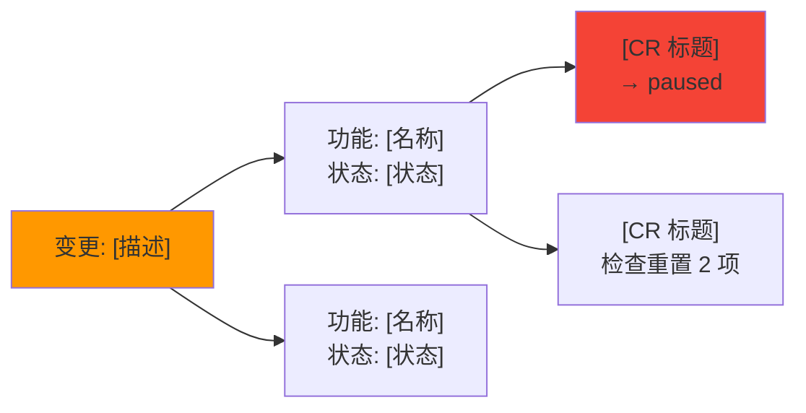

# 需求变更通用规程

> **职责**：核心 5 子命令（add/pause/resume/reprioritize/modify）共享的框架逻辑。按 SKILL.md 路由表按需加载。

## §0 速查卡片

- **经验预加载**：Step 0 读取 insights.md 匹配同类 pattern，有匹配引用历史、有回滚 pattern 提升风险
- **上下文感知引导**：空参数时扫描 paused CR、Snooze 条件、迭代容量，给出推荐
- **Step 0.5 Triage 分流**：变更分类（需求新增/修改/删除/优先级调整）→路由到对应流程
- **Step 1 影响分析**：BR 级→PF 级→CR 级→代码级四层影响追踪，三层分级输出（表面→中间→深入）
- **传递性依赖**：最多 3 层传递追踪（CR-A→CR-B→CR-C），分层展示直接/间接/深度影响
- **Step 1.5 风险量化**：3 维风险评分 → L/M/H 等级 + 变更成本估算
- **Step 2-3 调整方案与执行**：提出方案→用户确认→执行变更→记录到变更日志
- **类型细节**：各类型的分析逻辑和执行细节见 `change-procedures-types.md`
- **降级场景**：无 .devpace/ 时见 `change-procedures-degraded.md`

## Step 0：经验预加载

> OPT-14：将 experience-reference.md 时机 3 的规则落地到执行流程。

读取 `.devpace/metrics/insights.md`（不存在则静默跳过）：

1. 匹配当前变更类型（add/pause/resume/reprioritize/modify）与已有 pattern 的标签
2. **有同类变更 pattern** → 在 Step 1 影响分析报告中引用："历史上类似范围的变更平均影响 N 个模块"
3. **有变更回滚 pattern** → Step 1.5 风险量化中提升风险等级并引用原因
4. **有成功 pattern** → 在 Step 2 调整方案中采用推荐策略
5. 无匹配 → 静默跳过，不影响后续流程

## 上下文感知引导

> OPT-03：空参数时基于项目上下文智能推荐，替代静态选项列表。

当 $ARGUMENTS 为空时执行：

### 正常模式（.devpace/ 存在）

1. **扫描 paused CR**：遍历 `.devpace/backlog/` 中 paused 状态 CR → 有则推荐："恢复「[功能名]」？（已暂停 [N] 天）"
2. **扫描 Snooze 条目**：检查 CR 事件表和迭代变更记录中 Snooze 条目的触发条件 → 已满足则推荐："之前延后的「[描述]」条件已满足，现在评估？"
3. **评估迭代容量**：读取 iterations/current.md → 有余量则推荐 "插入新需求？（当前容量还有空间）"；已满则提示 "迭代容量已满，新增需求需要延后或调整现有优先级"
4. **检查频繁变更 PF**：统计 iterations/current.md 变更记录表中同一 PF 出现次数 → >2 次则提醒 "功能「[名称]」已变更 [N] 次，是否再次调整？"
5. **标准选项兜底**：上述推荐后附标准列表——"或选择：插入 / 暂停 / 恢复 / 调优先级 / 修改范围 / 批量变更"

### 降级模式（无 .devpace/）

无上下文数据，直接展示标准选项列表："你想做什么变更？（插入新需求 / 暂停某功能 / 恢复 / 调整优先级 / 修改范围）"

---

## Step 0.5：Triage 分流

在进入完整影响分析前，先对变更请求做快速分流判断，避免所有变更都走完整流程。

### 分流选项

| 决策 | 含义 | 后续 |
|------|------|------|
| **Accept** | 接受，进入完整影响分析 | → Step 1 影响分析 |
| **Decline** | 拒绝，记录原因并归档 | → 记录到迭代变更记录（如存在）或 CR 事件表，结束 |
| **Snooze** | 延后，标记提醒条件 | → 持久化记录，结束 |

### 判断依据

Claude 根据以下信号自动建议分流决策（用户可覆盖）：

| 信号 | 建议 |
|------|------|
| 变更与当前迭代目标高度相关 | Accept |
| 变更明确是低优先级且无紧迫性 | Snooze |
| 变更与项目方向冲突或已被否决 | Decline |
| 变更为 hotfix/critical 级别 | Accept（跳过 Triage，直接进入影响分析） |
| 无法判断 | 询问用户："接受并分析影响、延后处理、还是不做？" |

### Decline 记录格式

```
**变更请求**：[描述]
**决策**：Decline
**原因**：[拒绝原因]
**日期**：[日期]
```

### Snooze 记录与持久化

> OPT-06：Snooze 记录持久化，确保触发条件满足时可被唤醒。

**记录格式**：

```
**变更请求**：[描述]
**决策**：Snooze
**原因**：[延后原因]
**触发条件**：[满足什么条件时重新评估，如"下一迭代开始时"或"X 功能完成后"]
**日期**：[日期]
```

**持久化位置**（按优先级）：

1. 迭代变更记录表存在 → 追加到 `iterations/current.md` 变更记录，类型列标注 "snooze"
2. 无迭代文件但有相关 CR → 追加到 CR 事件表，备注列写入触发条件
3. 都不存在 → 追加到 `state.md` 末尾 `<!-- snooze: [描述] | 条件: [条件] | 日期: [日期] -->`

**唤醒机制**：由 `pulse-procedures.md` Snooze 唤醒检测负责——在会话开始、新迭代创建、CR merged 时自动检测触发条件。每条 Snooze 仅唤醒提醒 1 次。

---

## Step 1：影响分析（正常模式）

### 加载上下文

1. 读取 `.devpace/project.md` 价值功能树
   - 无 project.md → 读取 `.devpace/state.md` 功能概览行（早期项目仅有 state.md）
   - 有 `features/` 目录 → 同时读取已溢出 PF 的独立文件（获取完整验收标准和关联 CR）
2. 读取 `.devpace/iterations/current.md` 当前迭代
   - 无迭代文件 → 跳过迭代容量评估，仅分析功能影响
3. 读取相关 `.devpace/backlog/` CR 文件
   - 无 CR 文件 → 记录"当前无进行中的变更请求"
4. 评估对成效指标（MoS）的影响（有 MoS 数据时）
5. **经验数据加载**（Step 0 预加载结果）：有同类变更 pattern 时引用历史影响数据

### Release 影响评估

如果 `.devpace/releases/` 中存在活跃 Release（staging/deployed），额外评估：

1. 变更是否涉及已纳入 Release 的 CR？
2. 涉及 → 评估对 Release 稳定性的影响：
   - **staging 中的 CR**：可修改或移出，影响范围可控
   - **deployed 中的 CR**：不可修改，需创建新 defect/hotfix CR
3. 在影响报告中附加 Release 影响段

### 按变更类型分析

各类型的详细分析逻辑见 `change-procedures-types.md`。

### 传递性依赖链分析

> OPT-17：追踪最多 3 层传递性依赖，分层展示影响。

影响分析中检测到依赖关系时，继续追踪间接依赖：

1. **直接影响**（第 1 层）：变更直接涉及的 CR 和 PF
2. **间接影响**（第 2 层）：依赖第 1 层 CR 的其他 CR（通过 CR 关联关系字段追踪）
3. **深度影响**（第 3 层）：依赖第 2 层 CR 的 CR（最多追踪到此层）

**展示规则**：
- 低风险变更：仅展示第 1 层
- 中风险变更：展示第 1-2 层
- 高风险变更：展示全部 3 层
- 每层用缩进区分：`→ 直接影响 → → 间接影响 → → → 深度影响`

### 报告格式——三层分级输出

> OPT-02：对齐 design.md §2 三层渐进透明，日常变更阅读量从 15-20 行降至 3-5 行。

用自然语言向用户报告影响范围，遵循 §3 自然语言映射规则。

**表面层**（默认输出，所有变更）：
```
这个变更影响 [N] 个功能，综合风险 [低/中/高]。[1 句话结论]
```

**中间层**（用户追问"具体呢""影响哪些"，或中风险时自动展开）：
```
影响范围：
- [功能名 1]：[状态描述]，[N] 个任务受影响
- [功能名 2]：[状态描述]，[影响说明]
风险概要：波及 [N] 模块，[M] 个任务需调整
[经验引用（如有）]
```

**深入层**（用户追问"详细分析""为什么"，或高风险时自动展开）：
- 完整四层追踪（BR→PF→CR→代码）
- 风险三维表
- BR 级影响视角（触发条件满足时）
- 传递性依赖链（中/高风险时展示）
- 变更影响 Mermaid 图（OPT-21，中/高风险或用户请求时）
- 报告末尾附加追溯说明："（影响分析覆盖了从业务目标到代码的完整链路。）"

**教学行去重**：影响报告末尾教学句利用 `taught: change` 标记——首次触发才附教学，后续静默。

### 变更影响可视化

> OPT-21：中/高风险或用户请求时生成 Mermaid 影响链路图。

**触发条件**：综合风险为中/高，或用户明确要求"画个图""可视化"。低风险不生成。

**格式**：



### BR 级影响视角

当变更影响整个 BR（如"不做用户认证了"），向上报告 BR 级影响：

```
影响分析:
- 业务层：需求"[BR 名称]"下 N 个功能全部受影响
- MoS 影响："[相关指标]"将无法达成
- 功能层：[PF-001](暂停)、[PF-002](暂停)、[PF-003](暂停)
- 任务层：[CR-001](developing→paused)、[CR-002](created→paused)
```

**触发条件**：变更涉及 BR 下 ≥50% 的 PF，或用户明确表达 BR 级变更意图（如"不做 XX 了"）。

## Step 1.5：风险量化

影响分析完成后，输出半定量风险概要。如果 CR 文件已有"影响分析"section（由 `/pace-test impact` 写入），直接引用其风险等级和受影响 PF 数据，仅补充未覆盖的评估维度。

### 评估维度

| 维度 | 低 | 中 | 高 |
|------|:--:|:--:|:--:|
| 波及模块数 | ≤2 | 3-5 | >5 |
| 进行中 CR 受影响数 | 0 | 1-2 | ≥3 |
| 质量检查需重置数 | 0 | 1-3 | >3 |

### 风险等级计算

- **低**：三个维度均为"低" → 可直接执行
- **中**：任一维度为"中"且无"高" → 建议分步执行
- **高**：任一维度为"高" → 建议分步执行 + 重点测试

### 变更成本估算

> OPT-22：风险量化后追加成本维度。

在风险概要后追加成本估算：

1. **有 insights.md 历史数据**：基于同类变更的历史 checkpoint 数估算额外工作量
   - 格式："预计额外工作量：约 [N] 个工作步骤（基于 [M] 次同类变更的历史数据）"
2. **无历史数据**：基于启发式规则估算
   - add：按 CR 数 × 平均 checkpoint 数（S:3/M:5/L:8）
   - modify：按需重置检查项数 × 2
   - pause/resume：固定 1-2 步
   - 标注："估算基于经验启发，实际可能有偏差"

### 输出格式

**低风险**（简洁输出，不展示维度明细）：
```
**风险：低** — 可直接执行。
```

**中/高风险**（展示维度明细）：
```
**风险概要**：
- 波及模块：N 个（低/中/高）
- 受影响 CR：N 个（低/中/高）
- 检查重置：N 项（低/中/高）
- **综合风险：中/高**
- 预计额外工作量：[估算]
```

高风险变更额外输出：
- 建议测试重点区域（列出受波及的核心模块）
- 建议分步执行策略（将大变更拆为 2-3 个可独立验证的小步骤）

## Step 2：提出调整方案

根据变更类型，提出具体方案（类型细节见 `change-procedures-types.md`）：

| 变更类型 | 调整动作 |
|---------|---------|
| 插入新需求 | 创建 PF + CR，评估迭代容量，建议排期或延后其他项 |
| 暂停/砍掉 | CR 标记 paused + 记录暂停前状态，解除依赖阻塞，功能树标 ⏸️ |
| 恢复 | CR 从 paused 恢复到暂停前状态，评估质量检查有效性，功能树恢复原标记 |
| 优先级调整 | 更新 state.md 下一步，重排迭代计划 |
| 修改已有需求 | 评估返工范围，精确重置受影响的质量检查 checkbox（基于敏感范围），更新 CR 意图 section（范围/验收条件） |
| 批量变更 | 合并所有变更的调整方案为一个清单，标注交叉影响 |

**变更影响预览**（OPT-08）：

Step 2 追加"预览变更清单"——列出将修改的文件和关键变更内容：
- **默认折叠**：低风险时只展示文件清单（如"将修改 3 个文件：project.md, CR-005.md, current.md"）
- **追问或高风险时展开**：展示每个文件的具体变更内容
- `--dry-run` 标志：只输出预览清单，不继续执行

**必须等待用户确认**后再执行。不自作主张调整计划。

## Step 3：执行并记录

确认后执行（各类型的 CR 更新细节见 `change-procedures-types.md`）：

1. 更新相关 CR 文件（状态、意图、质量检查、事件表）
2. 更新 `project.md` 功能树（新增/暂停/恢复/状态变更）
   - 无 project.md → 更新 state.md 功能概览行
3. 更新 PF 文件（modify 且 PF 已溢出时，细节见 types）
4. 更新 `iterations/current.md` 计划和变更记录表（格式参考 Plugin `knowledge/_schema/iteration-format.md`）
   - 无迭代文件 → 跳过此步
5. 更新 `state.md` 快照（当前工作 + 下一步）
6. **变更管理指标更新**（OPT-15）：dashboard.md 存在时增量更新变更管理 section

变更事件记录到迭代文件的"变更记录"表：

```markdown
## 变更记录

| 日期 | 类型 | 描述 | 影响 |
|------|------|------|------|
```

无迭代文件时，变更事件记录到 CR 文件的事件表。

### Step 4：外部同步检查

> OPT-20：执行后自动生成同步摘要（不只是提醒）。

变更操作（pause/resume/priority change 等）执行完成后：

1. 检查受影响 CR 是否有外部关联（读取 CR 文件的"外部关联"字段）
2. 有关联 → 生成同步摘要 + 提醒：
   - 格式："[CR 标题] 状态变更为 [新状态]。建议运行 `/pace-sync push CR-{id}` 同步。"
   - 批量变更时合并："N 个已关联 CR 的状态已变更，建议运行 `/pace-sync push` 同步。"
3. 无关联 → 静默跳过

**规则**：
- 仅提醒，不自动执行 push（Phase 18 MVP 行为）
- sync-mapping.md 不存在时跳过整个步骤

## paused 状态规则

paused 状态的完整定义见 `knowledge/_schema/cr-format.md`。操作要点：

- 进入 paused：记录 `暂停前状态` 字段，保留分支、代码、质量检查进度、事件记录
- 功能树中用 ⏸️ 标记暂停项
- 解除依赖此 CR 的其他 CR 的阻塞关系
- 恢复时回到暂停前状态；代码库在暂停期间有变化时重新验证质量检查

## 变更后的功能树标记

```
⏸️ — 暂停       🔄 — 进行中     ✅ — 完成
⏳ — 待开始     🆕 MM-DD — 变更新增    ⏫ — 优先级提升
```
