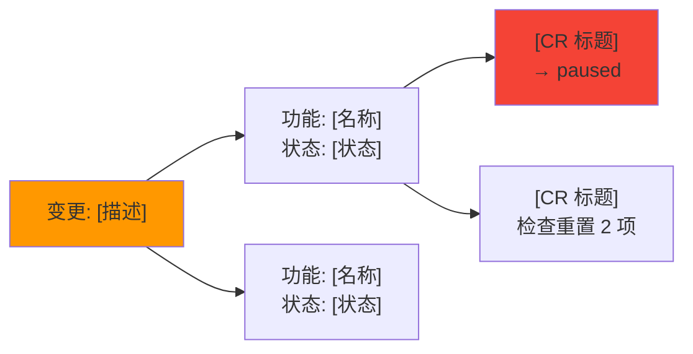

# 影响分析规程

> **职责**：Step 2 影响分析——四层追踪 + 三层分级输出 + 可视化。按 SKILL.md 路由表按需加载。

## Step 2：影响分析（正常模式）

### 加载上下文

1. 读取 `.devpace/project.md` 价值功能树
   - 无 project.md → 读取 `.devpace/state.md` 功能概览行（早期项目仅有 state.md）
   - 有 `features/` 目录 → 同时读取已溢出 PF 的独立文件（获取完整验收标准和关联 CR）
2. 读取 `.devpace/iterations/current.md` 当前迭代
   - 无迭代文件 → 跳过迭代容量评估，仅分析功能影响
3. 读取相关 `.devpace/backlog/` CR 文件
   - 无 CR 文件 → 记录"当前无进行中的变更请求"
4. 评估对成效指标（MoS）的影响（有 MoS 数据时）
5. **经验数据加载**（Step 0 预加载结果）：有同类变更 pattern 时引用历史影响数据

### Release 影响评估

如果 `.devpace/releases/` 中存在活跃 Release（staging/deployed），额外评估：

1. 变更是否涉及已纳入 Release 的 CR？
2. 涉及 → 评估对 Release 稳定性的影响：
   - **staging 中的 CR**：可修改或移出，影响范围可控
   - **deployed 中的 CR**：不可修改，需创建新 defect/hotfix CR
3. 在影响报告中附加 Release 影响段

### 按变更类型分析

各类型的详细分析逻辑见 `change-procedures-types.md`。

### 传递性依赖链分析

> OPT-17：追踪最多 3 层传递性依赖，分层展示影响。

影响分析中检测到依赖关系时，继续追踪间接依赖：

1. **直接影响**（第 1 层）：变更直接涉及的 CR 和 PF
2. **间接影响**（第 2 层）：依赖第 1 层 CR 的其他 CR（通过 CR 关联关系字段追踪）
3. **深度影响**（第 3 层）：依赖第 2 层 CR 的 CR（最多追踪到此层）

**展示规则**：
- 低风险变更：仅展示第 1 层
- 中风险变更：展示第 1-2 层
- 高风险变更：展示全部 3 层
- 每层用缩进区分：`→ 直接影响 → → 间接影响 → → → 深度影响`

### 报告格式——三层分级输出

> OPT-02：对齐 design.md §2 三层渐进透明，日常变更阅读量从 15-20 行降至 3-5 行。

用自然语言向用户报告影响范围，遵循 §3 自然语言映射规则。

**表面层**（默认输出，所有变更）：
```
这个变更影响 [N] 个功能，综合风险 [低/中/高]。[1 句话结论]
```

**中间层**（用户追问"具体呢""影响哪些"，或中风险时自动展开）：
```
影响范围：
- [功能名 1]：[状态描述]，[N] 个任务受影响
- [功能名 2]：[状态描述]，[影响说明]
风险概要：波及 [N] 模块，[M] 个任务需调整
[经验引用（如有）]
```

**深入层**（用户追问"详细分析""为什么"，或高风险时自动展开）：
- 完整四层追踪（BR→PF→CR→代码）
- 风险三维表
- BR 级影响视角（触发条件满足时）
- 传递性依赖链（中/高风险时展示）
- 变更影响 Mermaid 图（OPT-21，中/高风险或用户请求时）
- 报告末尾附加追溯说明："（影响分析覆盖了从业务目标到代码的完整链路。）"

**教学行去重**：影响报告末尾教学句利用 `taught: change` 标记——首次触发才附教学，后续静默。

### 变更影响可视化

> OPT-21：中/高风险或用户请求时生成 Mermaid 影响链路图。

**触发条件**：综合风险为中/高，或用户明确要求"画个图""可视化"。低风险不生成。

**格式**：



### BR 级影响视角

当变更影响整个 BR（如"不做用户认证了"），向上报告 BR 级影响：

```
影响分析:
- 业务层：需求"[BR 名称]"下 N 个功能全部受影响
- MoS 影响："[相关指标]"将无法达成
- 功能层：[PF-001](暂停)、[PF-002](暂停)、[PF-003](暂停)
- 任务层：[CR-001](developing→paused)、[CR-002](created→paused)
```

**触发条件**：变更涉及 BR 下 ≥50% 的 PF，或用户明确表达 BR 级变更意图（如"不做 XX 了"）。
